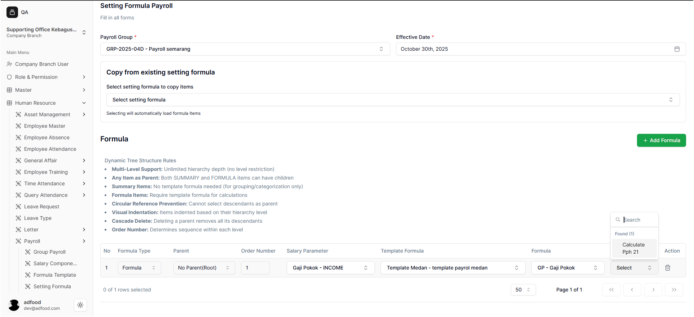
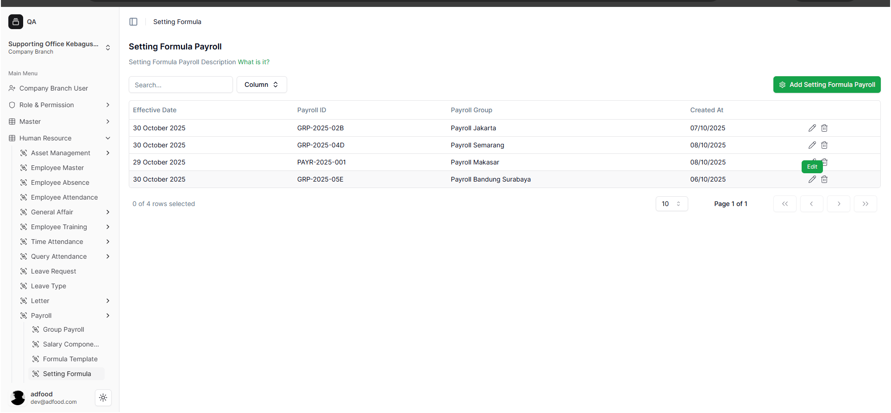
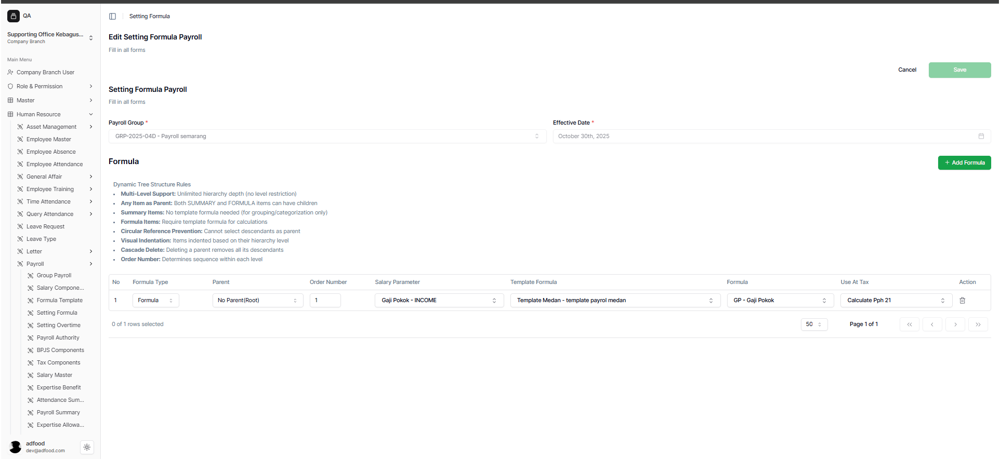
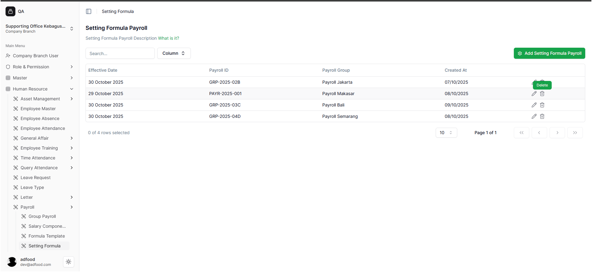
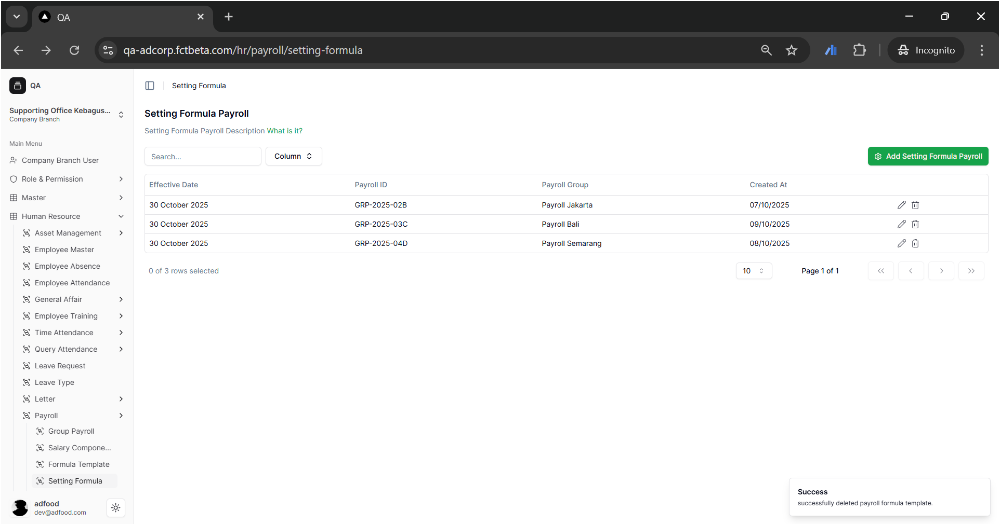

# Menyalin, Mengedit, dan Menghapus Formula

## 5.1 Menyalin Formula Lama
- Klik **Add Setting Formula Payroll**.
- Pada bagian **Copy from existing setting formula**, klik **Select**.

- Pilih formula yang ingin disalin
- Isi ulang:
  - Payroll Group
  - Effective Date

- Tambah atau edit formula sesuai kebutuhan
- Klik **Save**, akan muncul notifikasi:

✅*Success – successfully created new payroll formula template!*

## 5.2 Mengedit Formula yang Sudah Ada
- Klik ikon **Pensil (Edit)** pada tabel utama

- Catatan:

  - **Payroll Group** dan **Effective Date** tidak bisa diubah
  - Bagian **Formula** dapat diubah sepenuhnya

Klik **Save**, lalu muncul notifikasi:

✅ *“Successfully edited payroll formula template!”*

## 5.3 Menghapus Formula
- Klik ikon **Trash (Delete)**

- Tampilan konfirmasi muncul:
  - **Continue** → hapus permanen
  - **Cancel** → batal
.png>)

Jika menekan continue, user akan mendapatkan notifikasi:

✅ *“Successfully deleted payroll formula template.”*

User kemudian diarahkan kembali ke halaman daftar Setting Formula Payroll, dan formula baru akan muncul pada tabel utama.

Proses pembuatan formula selesai.
