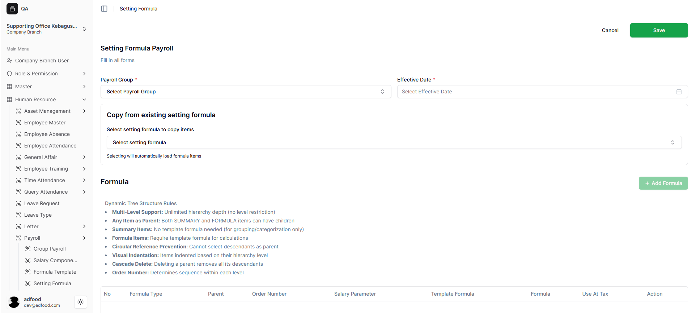
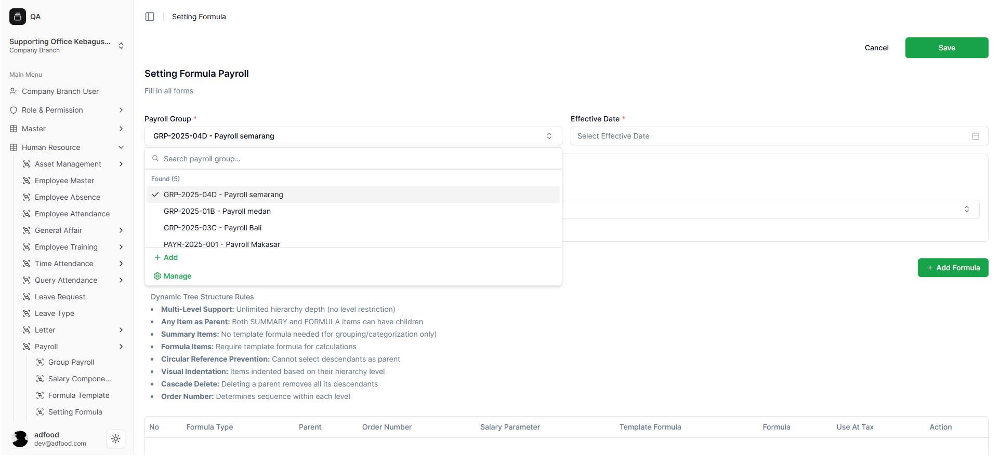
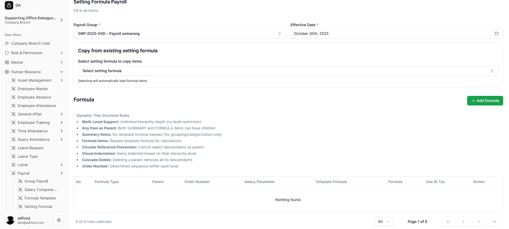

# Membuat Setting Formula Baru

## 3.1 Membuka Form Pembuatan Formula
Klik tombol:

✅ **Add Setting Formula Payroll**

User akan diarahkan ke halaman form pembuatan formula baru.

Data wajib diisi:

- **Payroll Group**
- **Effective Date**

Opsional:
- **Copy from existing setting formula**

Klik tombol **+ Add Formula** untuk membuka struktur formula.

> **Catatan:** Inputan dengan tanda bintang (*) merah bersifat wajib diisi.

## 3.2 Payroll Group
- Tekan kolom **Select Payroll Group**
- Pilih grup yang tersedia seperti:
  - Payroll Semarang
  - Payroll Medan
  - Payroll Jakarta  
- Opsi tambahan:
  - **Add** (Tambah grup)
  - **Manage** (Kelola grup)
  

## 3.3 Effective Date
- Tekan ikon kalender
- Pilih tanggal mulai berlakunya formula  
Contoh: **30 Oktober 2025**

## 3.4 Copy From Existing Setting Formula
- Digunakan untuk menyalin formula lama
- Jika belum ada, langkah ini bisa dilewati

