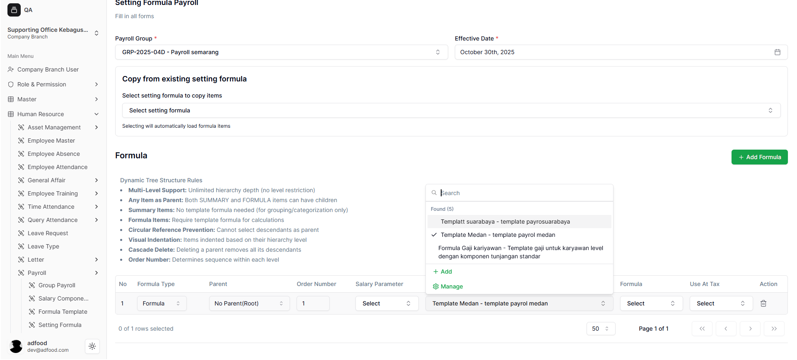
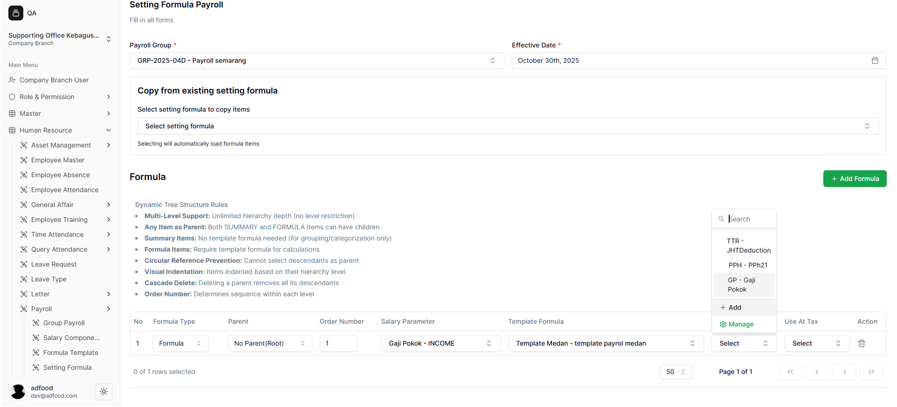

# Pengisian Detail Formula

Setelah memilih **Add Formula**, akan muncul tabel berisi kolom-kolom berikut:

---
### 4.1 Formula Type
Tipe komponen terdiri dari tiga kategori:  
- **Summary** sebagai header tanpa perhitungan  
- **Formula** untuk perhitungan gaji  
- **Tax** untuk komponen pajak seperti PPh 21  
-1.png>)
---

### 4.2 Parent
Menentukan posisi hierarki komponen.  
- **No Parent (Root)** → komponen utama  
- Pilih parent lain → komponen turunan  

---

### 4.3 Order Number
Menentukan urutan tampil pada daftar.  
Semakin kecil angkanya, semakin atas posisinya.

---

### 4.4 Salary Parameter
Digunakan untuk memilih komponen gaji.  
- Klik **Select**  
- Contoh: Gaji Pokok, Tunjangan, Lembur  
- Opsi tambahan:  
  - **Add** → tambah parameter baru  
  - **Manage** → kelola parameter  
 

---

### 4.5 Template Formula
Digunakan untuk memilih template yang telah tersedia.  
- Klik **Select**  
- Contoh: Template Medan, Template Jakarta  
- Opsi tambahan:  
  - **Add**  
  - **Manage**  

---

### 4.6 Formula
Memilih formula komponen yang digunakan dalam perhitungan.  
- Klik **Select**  
- Contoh: GP (Gaji Pokok), OT (Overtime)  
- Opsi tambahan:  
  - **Add**  
  - **Manage**  

---

### 4.7 Use At Tax
Menentukan apakah komponen digunakan dalam perhitungan pajak.  
- Opsi umum: **Calculate PPh 21**  
- Jika Formula Type = **Tax**, kolom ini otomatis aktif.

---

### 4.8 Delete Formula
Menghapus komponen formula.  
- Klik ikon **Delete (Trash)**  
- Pop-up konfirmasi:  
  - **Continue** → hapus data  
  - **Cancel** → batalkan  
  
.png>)
