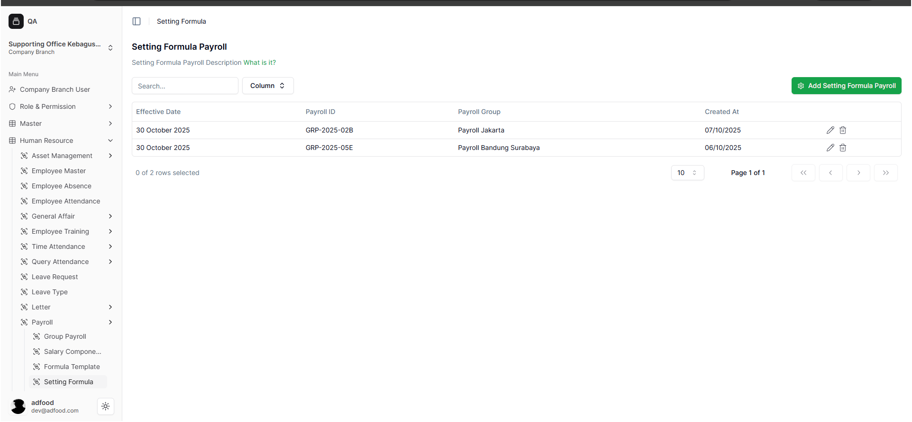

# Masuk Menu Setting Formula

Setelah user login ke sistem ERP yang ada, user dapat memilih Workspace (contoh: *Supporting Office Kebagusan Raya*), lakukan langkah berikut:

## Membuka Menu Setting Formula

1. Lihat sidebar kiri.
2. Pilih **Human Resource**.
3. Pilih submenu **Payroll**.
4. Klik **Setting Formula**.

##  jika ingin membuka setting formula user dapat masuk melalui tanda kotak berwarna biru.

## 2.2 Tampilan Halaman Setting Formula

Pada halaman ini muncul tabel berisi:

- Effective Date  
- Payroll ID  
- Payroll Group  
- Created At  

Fitur utama di halaman ini:

- Melihat daftar formula payroll
- Mengelola data formula
- Membuat formula baru menggunakan tombol **Add Setting Formula Payroll**

untuk bagian Add Setting Formula Payroll, pengguna dapat menekan kotak berwana hijau di pojok kanan atas.

