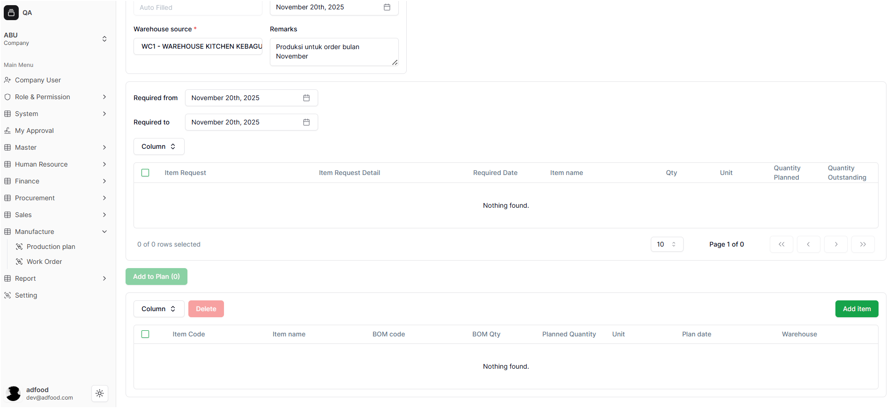
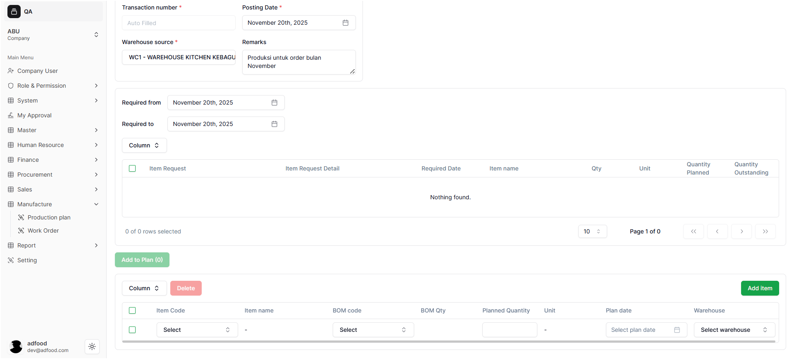
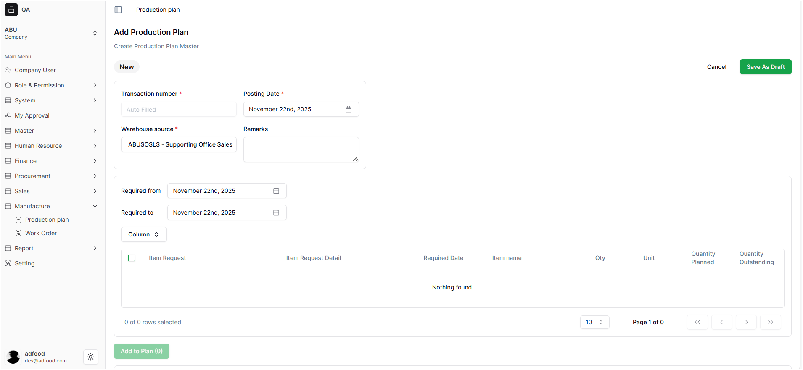
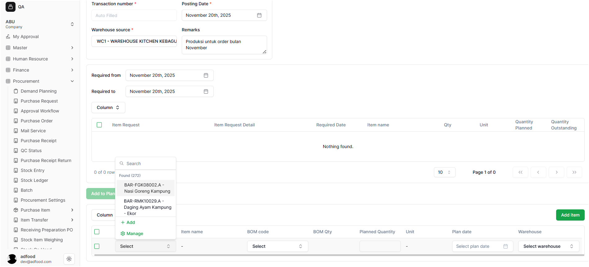
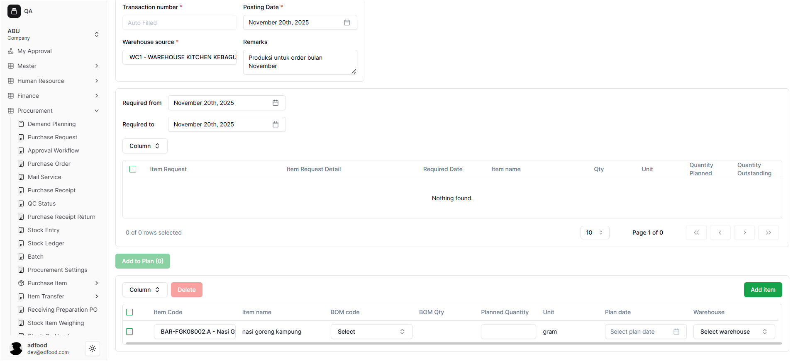
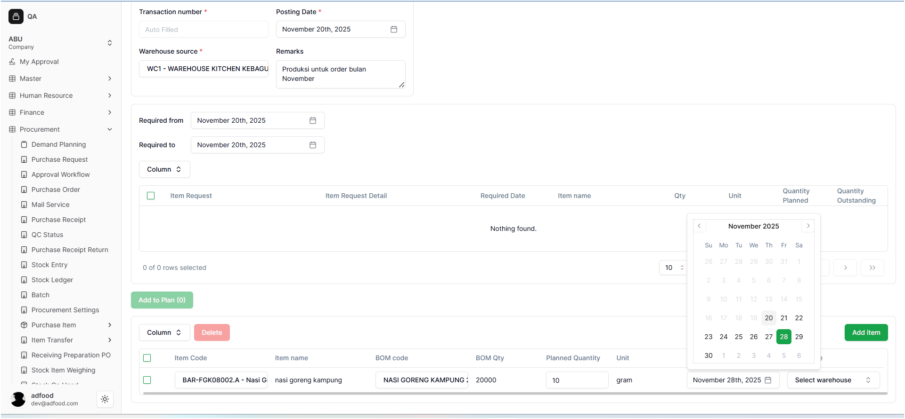
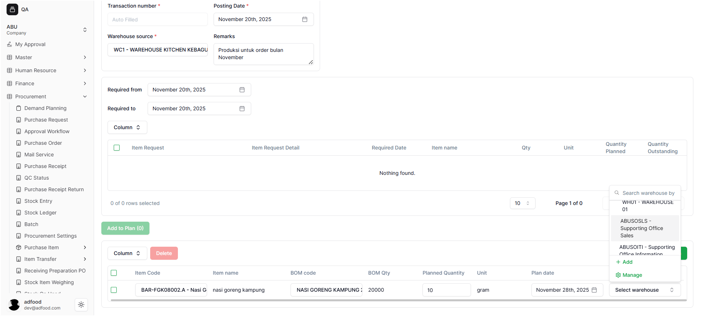
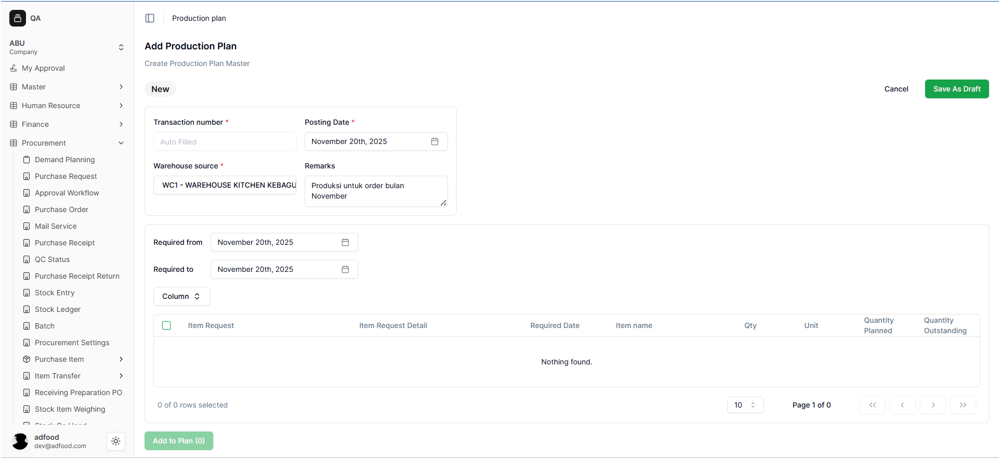
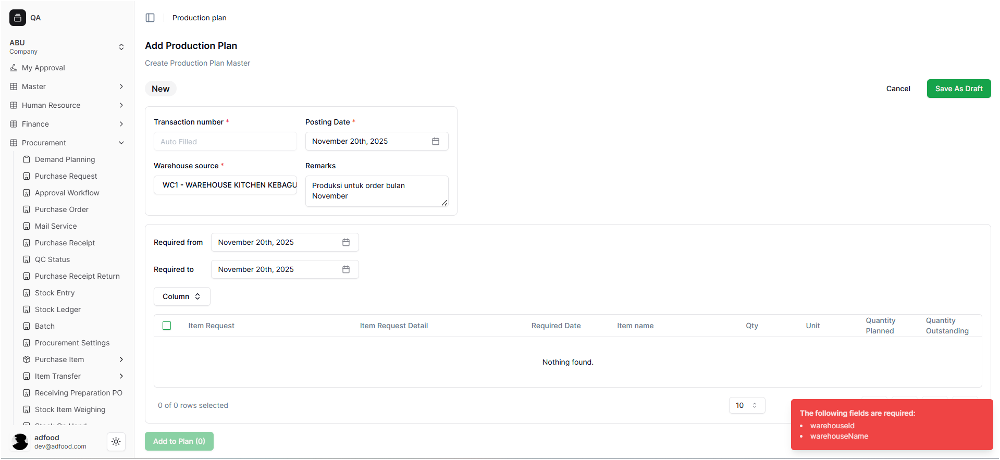

# Menambahkan Item ke Production Plan

Setelah mengisi data *header* (Transaction Number, Warehouse Source, dll.) dan meninjau Item Request, langkah berikutnya adalah menambahkan item produk akhir yang akan diproduksi ke dalam rencana. Bagian ini berfungsi untuk menentukan produk apa saja yang akan dibuat, jumlah, tanggal produksi, dan gudang tujuan.

## Menambahkan Item Baru

Untuk menambahkan item yang akan diproduksi secara manual:

1. Arahkan ke bagian bawah halaman, di bawah tabel *Item Request*.
2. Gunakan tombol **Column** untuk menyesuaikan kolom yang ditampilkan.
3. Klik tombol hijau **Add Item** pada sudut kanan atas tabel *Planned Item*.
4. Sistem akan menambahkan satu baris kosong untuk diisi.

*Alt text: Tombol Add Item untuk menambahkan produk ke Production Plan*

## Mengisi Detail Item yang Direncanakan

Setelah baris baru ditambahkan, isi detail item yang akan diproduksi. Informasi yang perlu dilengkapi meliputi:

- Item Code  
- Item Name  
- BOM Code  
- BOM Qty  
- Planned Quantity  
- Unit  
- Plan Date  
- Warehouse  

*Alt text: Tabel Planned Item untuk mengisi detail pilihan Bom yang akan diproduksi*

## Menghapus Detail Item

Untuk menghapus item dari tabel **Planned Item**, centang kotak kecil di **kolom pertama** pada baris item. Setelah dicentang, item akan ditandai dan dapat dihapus dengan tombol penghapus yang tersedia.

![Menghapus Item]

---

## Penjelasan Setiap Kolom

- 1. Item Code
Klik kolom **Item Code** yang bertuliskan `Select`. Akan muncul *pop-up* daftar produk. Gunakan kolom **Search** untuk mencari item berdasarkan kode atau nama.  
Tersedia juga opsi **+ Add** untuk menambah data baru atau **Manage** untuk mengelola data.

- 2. Item Name
Terisi otomatis berdasarkan Item Code dan tidak dapat diubah.

- 3. BOM Code
Sistem menampilkan **BOM Code** yang berstatus Default atau Active sesuai item yang dipilih.

![BOM Code Otomatis]image/(image-13.png)

- 4. BOM Qty
Jumlah kebutuhan material yang diambil dari BOM, otomatis dan tidak dapat diubah.

- 5. Planned Quantity
Masukkan jumlah produk yang direncanakan.

- 6. Unit
Menyesuaikan satuan berdasarkan BOM.

- 7. Plan Date
Pilih tanggal rencana produksi melalui kalender dengan mengklik kolom `Select plan date`.

- 8. Warehouse
Menentukan gudang tujuan penyimpanan produk akhir. Klik `Select warehouse` untuk membuka *pop-up* pemilihan gudang.  

> **Catatan:**  
> Jika user ingin menambahkan **Add Item** lagi, ikuti langkah yang sama seperti sebelumnya.

---

## Menyimpan Production Plan

Setelah seluruh item sudah diisi, klik tombol **Save As Draft** untuk menyimpan Production Plan sebagai *Draft*.  
Jika ingin batal, klik **Cancel**.

---

## A. Pesan Kesalahan (Error)

Jika menekan **Save As Draft** tetapi ada kolom wajib yang belum terisi, sistem akan menampilkan pesan kesalahan berwarna merah di bagian kanan bawah.

**Contoh pesan:**  
`The following fields are required: warehouseuid, warehousename`  
**Makna:** Field yang disebutkan belum diisi atau data tidak valid.

---

## B. Penyimpanan Berhasil (Save As Draft)

Jika semua field sudah terisi dengan benar:

1. Data akan tersimpan.
2. Status Production Plan menjadi **Draft**.
3. User dialihkan kembali ke halaman daftar Production Plan.

