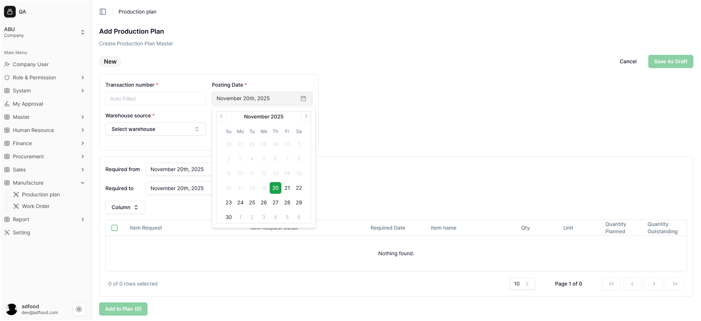
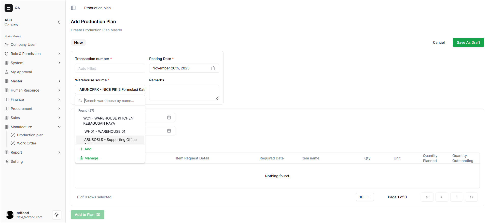
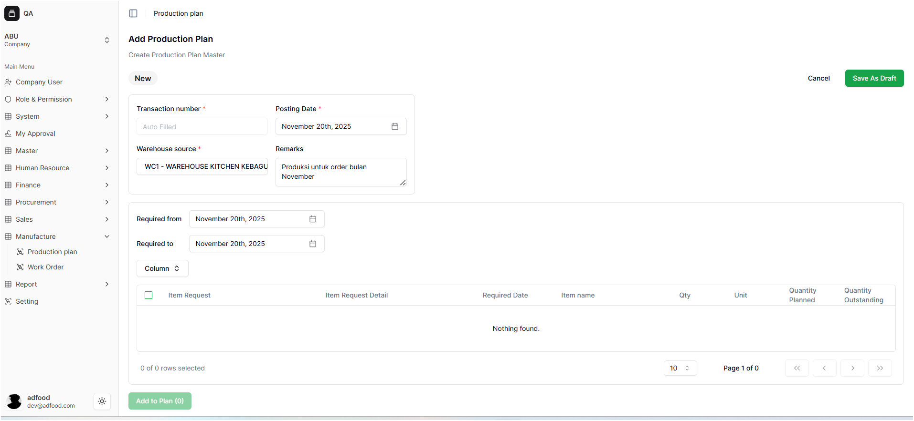

## Field yang Harus Diisi

### Transaction Number   
Nomor transaksi otomatis (*auto filled*) oleh sistem untuk menandai setiap Production Plan unik.  
- Tidak perlu diisi manual.  
- Memudahkan tracking dan audit.

### Posting Date   
Tanggal rencana produksi dibuat.  
- Default diisi dengan tanggal hari ini (contoh: November 20th, 2025).  
- Bisa diubah jika rencana produksi akan dilakukan di tanggal lain.

### Warehouse Source 

 Klik *dropdown* **Select warehouse**. Sebuah *pop-up* pencarian akan muncul (seperti yang terlihat pada gambar) menampilkan daftar gudang.
- Anda dapat menggunakan kolom **Search warehouse by name...** untuk mencari gudang.
- Pilih gudang yang sesuai dari daftar (Contoh: `WC1 - WAREHOUSE KITCHEN`, `WH01 - WAREHOUSE 01`).
- Terdapat opsi **+ Add** untuk menambahkan gudang baru atau **Manage** untuk mengelola data gudang.

### Remarks  
Field opsional untuk menambahkan catatan atau keterangan tambahan terkait rencana produksi.  
- Contoh: *“Produksi untuk order bulan November”*.  

 ### Informasi yang Ditampilkan

Kolom-kolom di bagian ini menampilkan detail permintaan yang masuk dari sistem (misalnya, dari kantor pusat):

- **Required From** & **Required To**: Menentukan rentang tanggal periode kebutuhan item tersebut.
- **Item Request**: Nomor referensi dari dokumen permintaan item.
- **Item Request Detail**: Deskripsi detail dari permintaan tersebut.
- **Required Date**: Tanggal spesifik item tersebut harus tersedia.
- **Item Name**: Nama produk atau komponen yang diminta.
- **Qty** & **Unit**: Jumlah kuantitas dan satuan unit item yang diminta.
- **Quantity Planned**: Jumlah item yang sudah dialokasikan/direncanakan untuk diproduksi (berdasarkan *plan* ini).
- **Quantity Outstanding**: Sisa jumlah item yang belum dialokasikan/direncanakan.

> **⚠️ Catatan Penting:**
> Saat ini, bagian permintaan ini **hanya berfungsi sebagai tampilan (read-only)**. User belum dapat menambahkan, mengubah, atau memproses data permintaan item langsung dari sini. Fitur interaktif untuk bagian ini direncanakan akan aktif di versi sistem mendatang.

 

---