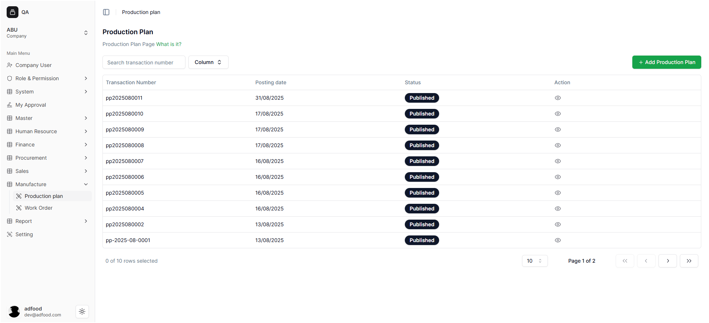
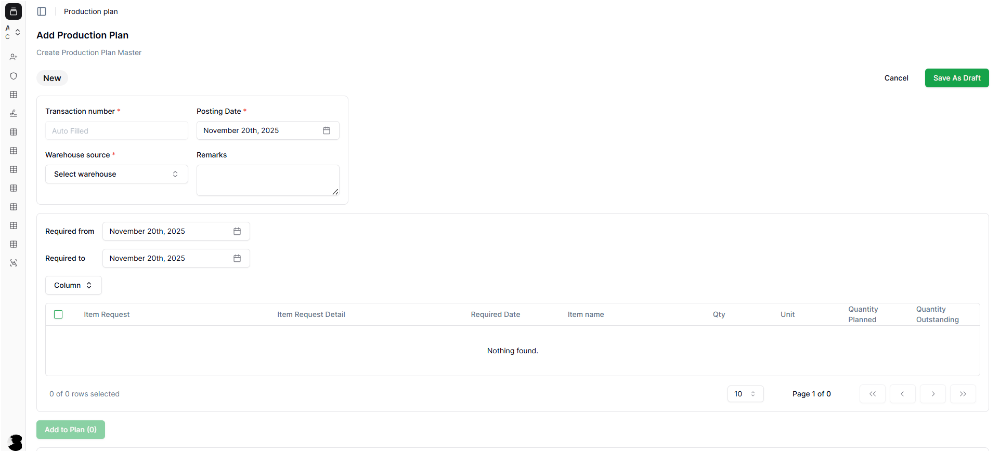
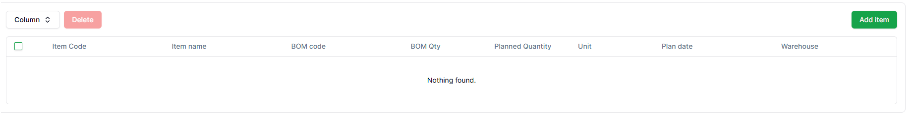

# Setting Production Plan

Dokumen ini menjelaskan cara membuka menu Production Plan, memahami tampilan halaman Production Plan, serta menggunakan fitur Export dan Add Production Plan.

---

# 1. Masuk ke Menu Production Plan

Setelah user login dan memilih Workspace (contoh: *Supporting Office Kebagusan Raya*), lakukan langkah berikut untuk membuka menu Production Plan:

### Langkah-langkah membuka menu Production Plan
1. Buka **sidebar kiri**.
2. Klik menu **Manufacture**.
3. Pilih submenu **Production Plan**.
4. Sistem akan menampilkan halaman utama Production Plan.

Fungsi menu ini adalah untuk mengatur rencana produksi, jumlah produk yang akan dibuat, dan kebutuhan bahan baku berdasarkan Bill of Material (BOM).

---

# 2. Tampilan Halaman Production Plan

Halaman **Production Plan** menampilkan semua rencana produksi yang telah dibuat dalam sistem. Halaman ini berfungsi sebagai pusat kendali untuk melihat, mengelola, dan membuat rencana produksi baru.
Di halaman ini, Anda dapat:
* Mencari rencana produksi menggunakan **Search Transaction number**.
* Menambahkan rencana baru dengan tombol **+ Add Production Plan** (kanan atas).

## Informasi yang Ditampilkan
Setiap baris di daftar Production Plan menyajikan informasi yang sudah di buat sebagai berikut:

1. Transaction Number
2. Posting Date
3. Status
4. Action
---

# 3. Masuk ke Halaman Add Production Plan

Untuk membuat rencana produksi baru, tekan tombol **+ Add Production Plan**. Sistem akan menampilkan form untuk membuat plan baru.

> ⚠️ **Catatan:**  
>  Isi semua kolom yang memiliki tanda **`*` merah** (**wajib diisi**).  
>   Kolom tanpa tanda bintang bersifat **opsional**.
