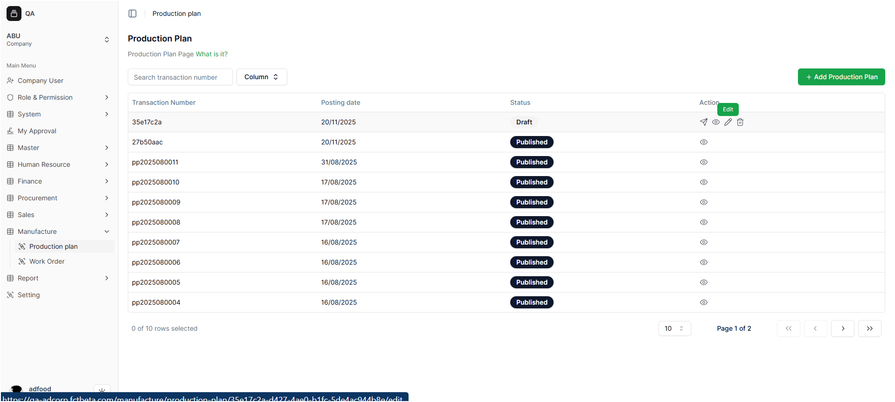
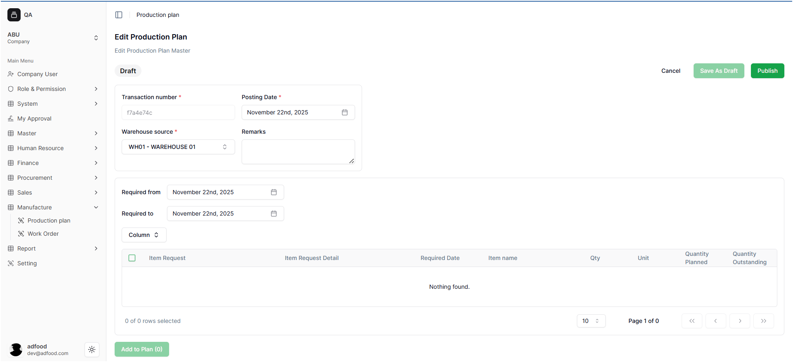
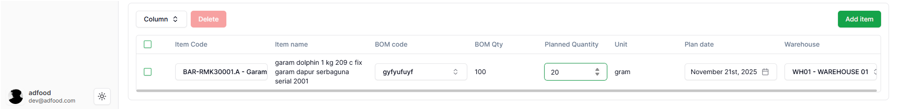
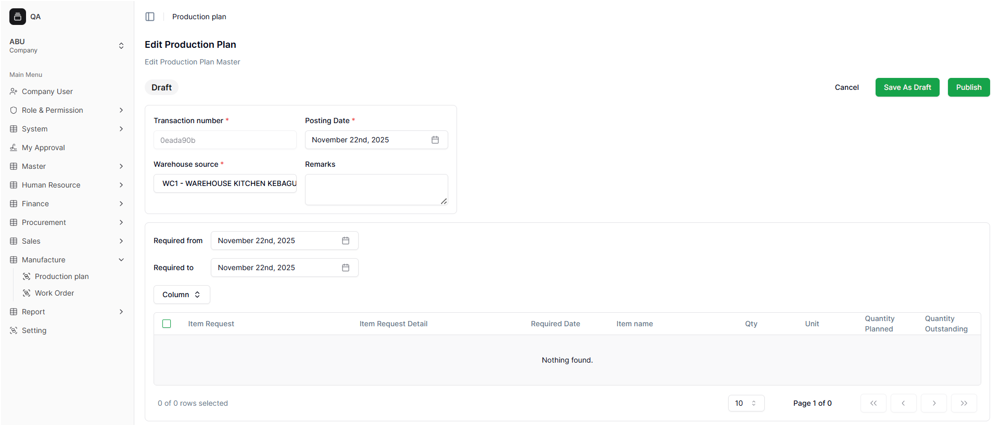
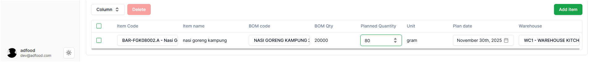
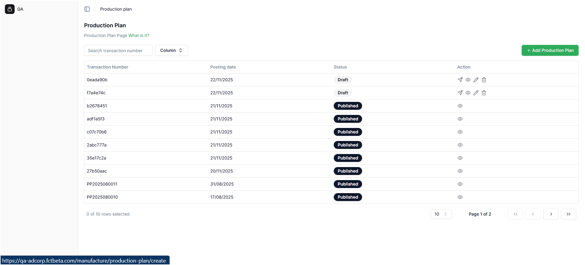
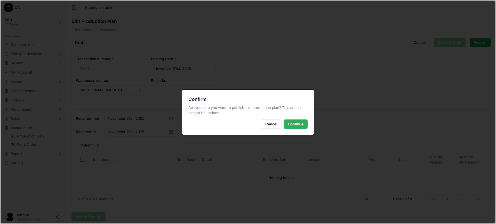
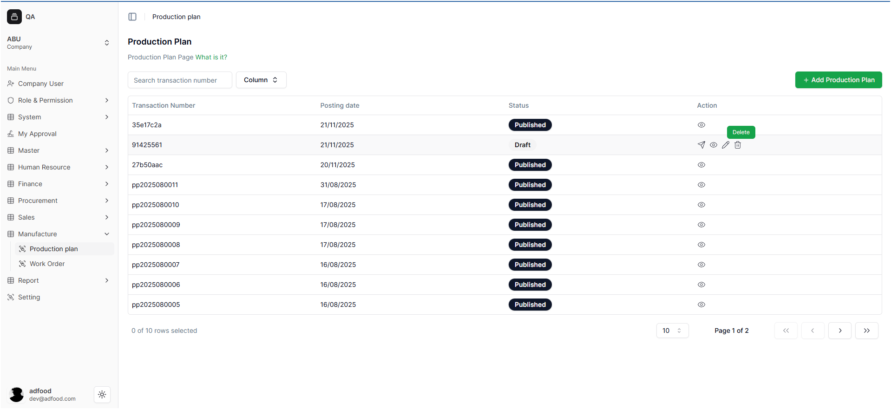
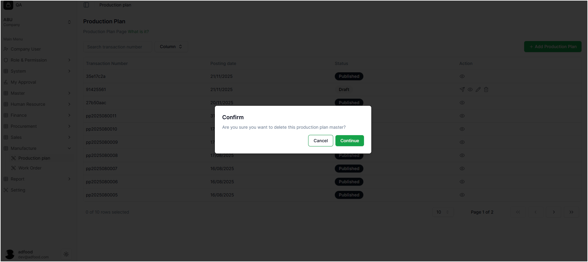
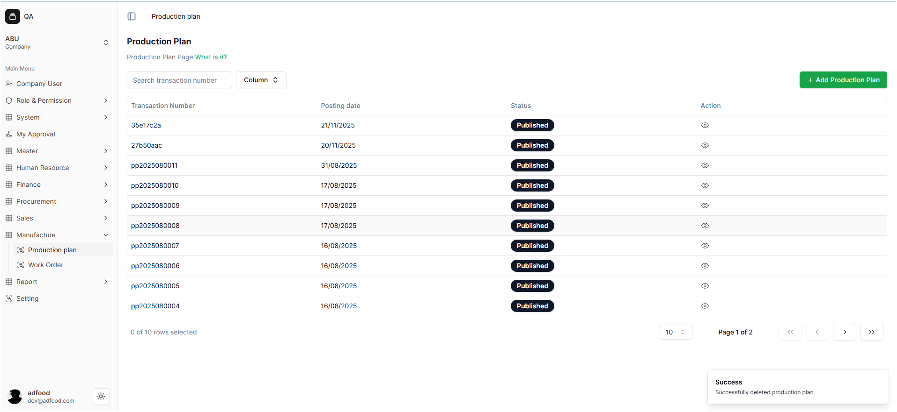

# 1. Mengelola Production Plan

Halaman ini menjelaskan cara mengedit Production Plan, mempublish dari mode edit, dan menghapus Production Plan.

---

#  2. Mengedit (Edit) Production Plan

Fitur **Edit** digunakan ketika user perlu memperbaiki informasi atau menambah material.

### A. Langkah-Langkah Edit

1. Temukan Production Plan yang ingin diubah.
2. Klik ikon **Pencil (Edit)**.  
   
3. Sistem akan membawa user ke halaman pengisian Production Plan.

### B. Perubahan yang Bisa Dilakukan

Pada halaman edit, user dapat mengubah:

- **Posting Date**
- **Warehouse Source**
- **Remarks**
- Menambah material baru menggunakan tombol **Add Item**

---

# 2. Publish dari Halaman Edit

Setelah selesai mengedit, sistem menyediakan dua tombol:

- **Save As Draft**
- **Publish**

### A. Save As Draft

Jika menekan **Save As Draft**:

- Perubahan disimpan
- User diarahkan kembali ke halaman daftar Production Plan

### B. Publish dari Mode Edit

Jika menekan **Publish**, akan muncul pop-up konfirmasi:

Pesan yang ditampilkan:

> **Are you sure you want to publish this production plan? This action cannot be undone.**

User dapat memilih:

- **Cancel** → Membatalkan publish  
- **Continue** → Melanjutkan publish  

Setelah menekan **Continue**, Production Plan akan berstatus **Published** dan tidak dapat diubah lagi.

---

# 3. Menghapus Production Plan

Fitur **Delete** digunakan untuk menghapus Production Plan secara permanen.

**Cara Menghapus**;

1. Cari Production Plan yang ingin dihapus.
2. Klik ikon **Trash (Delete)**.  

Sistem akan menampilkan pop-up konfirmasi:

User dapat memilih:

- **Cancel** → Kembali tanpa menghapus  
- **Continue** → Menghapus Production Plan secara permanen  

Jika berhasil, sistem menampilkan notifikasi:

**Successfully Deleted production**

User akan kembali ke halaman daftar Production Plan.

---
