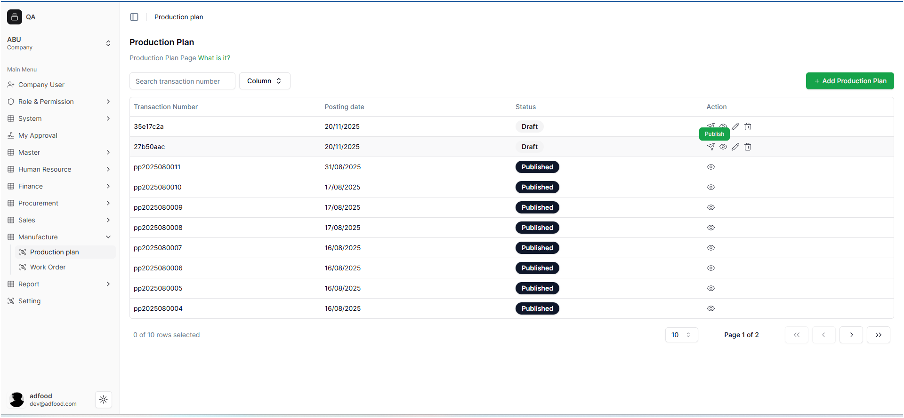
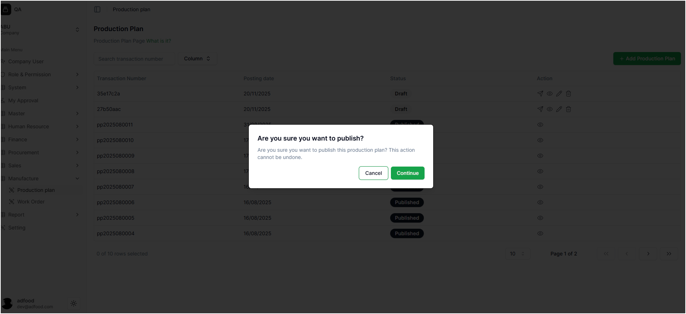
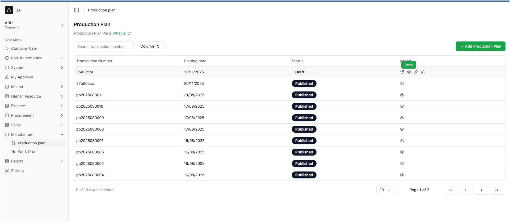
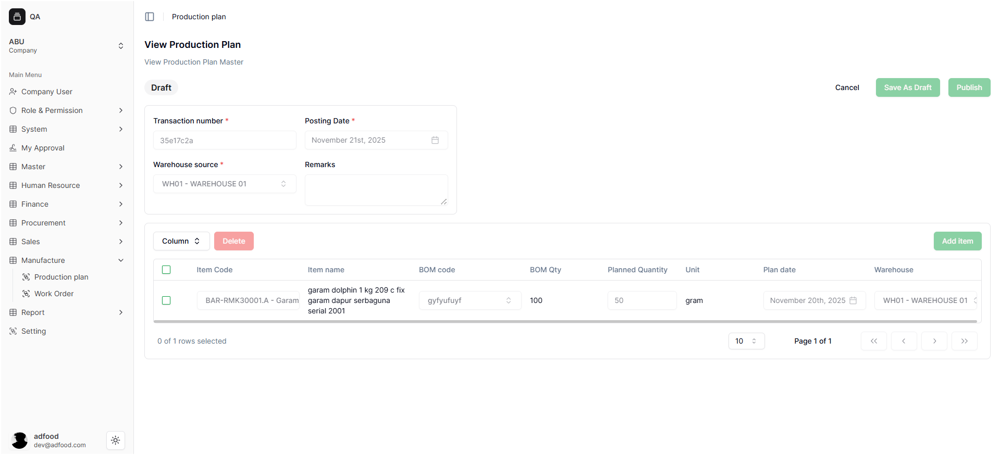

# Proses Publish Production Plan

Pada halaman **Production Plan**, user dapat melakukan proses *Publish* terhadap dokumen Production Plan yang masih berstatus **Draft**. Publish digunakan ketika rencana produksi sudah selesai disusun dan siap digunakan dalam proses manufaktur.

---

## 1. Cara Melakukan Publish Production Plan

Untuk melakukan *Publish*, ikuti langkah‐langkah berikut:

1. Cari Production Plan yang ingin dipublish.
2. Klik ikon **Pesawat (Publish)**.  
   

Setelah ikon ditekan, sistem akan menampilkan sebuah *pop-up* konfirmasi.

---

## 2. Pop-Up Konfirmasi Publish

Pop-up ini muncul untuk memastikan user benar-benar ingin melakukan *Publish*.

Terdapat dua tombol di dalam pop-up:

- **Cancel** → Membatalkan proses publish  
- **Continue** → Melanjutkan proses publish  

---

## 3. Hasil Setelah Production Plan Dipublish

Jika publish berhasil, halaman daftar akan menampilkan:

- Status berubah menjadi **Published**
- Production Plan terkunci dan **tidak bisa diedit**
- Data siap dipakai pada proses manufaktur
- Sistem menampilkan notifikasi sukses

Contoh tampilan setelah publish:

**Notifikasi:**  
**Success — Successfully published production plan.**

---

# Melihat Detail Production Plan

Fitur **Detail** digunakan untuk melihat isi Production Plan tanpa dapat melakukan perubahan.

### Cara Mengakses Detail

1. Cari Production Plan yang ingin dilihat.
2. Klik ikon **Mata (Detail)**.  
   

Mode Detail menampilkan seluruh informasi Production Plan, namun:

- **Tidak dapat melakukan edit**
- **Tidak dapat menambah atau menghapus material**
- Hanya digunakan untuk melihat data

Untuk kembali ke daftar, tekan tombol **Cancel**.

