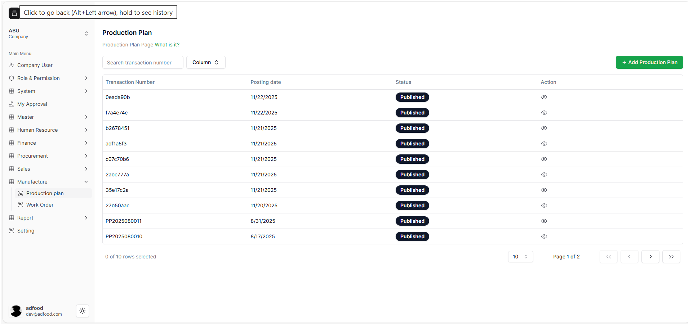
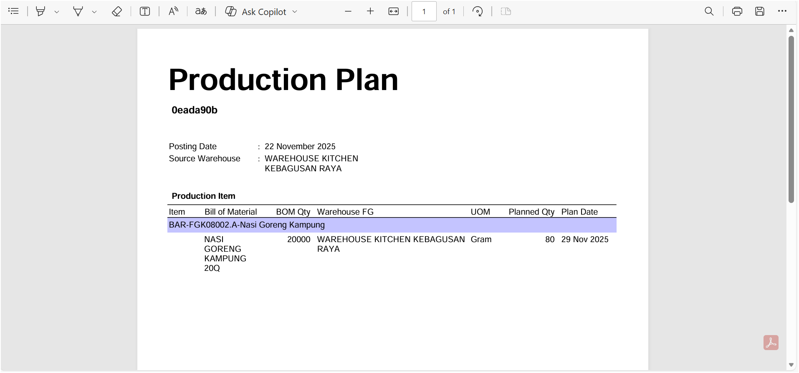

# Setelah Menyelesaikan Production Plan

Setelah user menyelesaikan proses pengisian dan melakukan *Publish* pada Production Plan, sistem akan otomatis mengarahkan kembali ke halaman **Production Plan**. Pada tahap ini, dokumen Production Plan dianggap sudah final dan siap digunakan.

---

## Status Production Plan Setelah Dipublish

- Production Plan yang telah dipublikasikan akan muncul dengan status berwarna **hitam** bertuliskan **Published**.
- Status **Published** menandakan bahwa dokumen tersebut sudah final dan **tidak dapat diedit lagi**.
- Pada setiap baris tabel terdapat ikon **mata** pada kolom **Action**, yang berfungsi untuk melihat detail Production Plan tanpa melakukan perubahan.

---

## Melihat Detail Production Plan

- Ketika ikon **mata** diklik, user akan diarahkan ke halaman **View Production Plan**.
- Pada halaman ini, user dapat melihat seluruh data Production Plan yang telah dibuat, termasuk informasi barang, kuantitas, hingga tanggal rencana produksi.
- Halaman ini bersifat **read-only**, sehingga tidak ada proses pengeditan yang dapat dilakukan.

---

## Ikon Print pada View Production Plan

- Pada halaman **View Production Plan**, terdapat ikon **print** yang digunakan untuk melihat hasil Production Plan dalam format PDF.
- Jika user menekan ikon print tersebut, sistem akan menampilkan tampilan *print preview* dalam bentuk PDF.
- File PDF ini dapat langsung didownload oleh user sebagai dokumentasi atau lampiran proses produksi.

---

## Kembali ke Halaman Production Plan

- Setelah selesai melihat atau mendownload PDF, user dapat kembali ke halaman Production Plan dengan menekan tombol **Cancel** yang tersedia pada halaman **View Production Plan**.

---

## Catatan Tambahan

Fitur ini membantu memastikan bahwa seluruh dokumen Production Plan yang sudah final mudah diakses, dibaca, dan dicetak kapan pun diperlukan. Dengan adanya halaman **View Production Plan** dan opsi **Print PDF**, proses verifikasi dan dokumentasi menjadi lebih cepat dan efisien.
