## Mengambil Item dari Production Plan

Sebelum mengisi *field* Work Order secara manual, Anda dapat mengimpor item produksi langsung dari **Production Plan**.  
Fitur ini sangat membantu mempercepat proses pembuatan Work Order tanpa perlu memasukkan data satu per satu.

---

## 1. Klik Tombol “Get Item From Production Plan”

Pada halaman **Add Work Order**, klik tombol **Get Item From Production Plan** di pojok kanan atas.

---

## 2. Pilih Production Plan

Setelah tombol diklik, sistem akan menampilkan *pop-up* berisi daftar **Production Plan** yang tersedia.  
Pilih Production Plan yang item-nya ingin digunakan dalam Work Order.

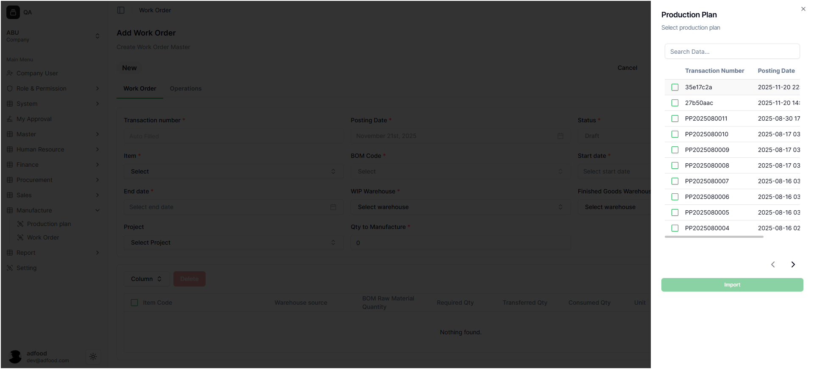

---

## 3. Pilih Item yang Akan Diproduksi

Setelah memilih Production Plan, Anda akan diarahkan ke halaman **Production Plan Item**.

Di halaman ini:

- Pilih item mana yang akan dimasukkan ke Work Order.
- Jika sudah sesuai, klik tombol **Import**.

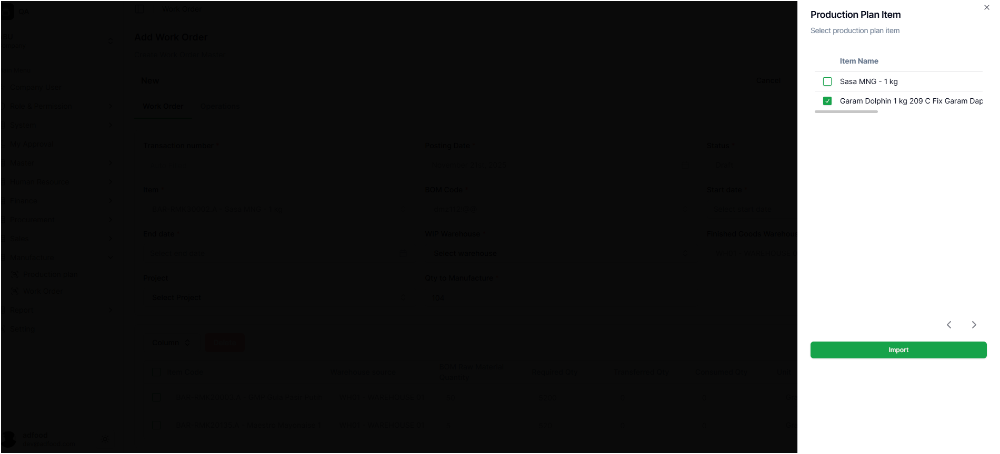

---

## 4. Lanjutkan Pengisian Work Order

Setelah proses import selesai, item yang Anda pilih akan otomatis muncul pada form **Work Order**.  
Selanjutnya, lanjutkan pengisian detail Work Order sesuai kebutuhan.

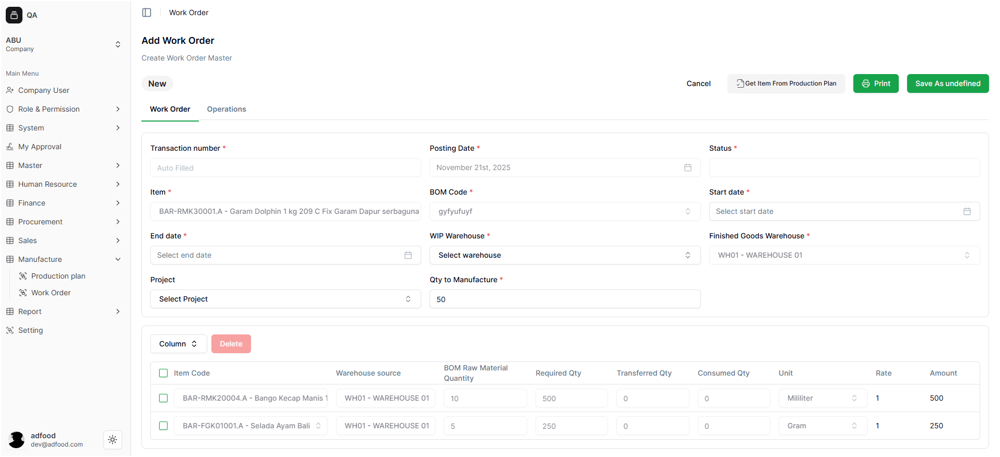

---

# Informasi Otomatis pada Work Order

Beberapa field terisi otomatis oleh sistem dan **tidak dapat diubah secara manual**:

### • Transaction Number  
Nomor transaksi dibuat otomatis oleh sistem.

### • Posting Date  
Tanggal mengikuti **Production Plan** dan tidak bisa diubah.

### • Status  
Status awal otomatis menjadi **Draft**.

### • Item & BOM Code  
Terisi berdasarkan item yang diambil dari Production Plan.

---

# Mengisi Detail Work Order

## Start Date

Field **Start Date** digunakan untuk menentukan kapan proses produksi dimulai.

- User dapat memilih tanggal dan waktu mulai produksi.  
- Pastikan tanggal mulai tidak lebih awal dari tanggal Production Plan.

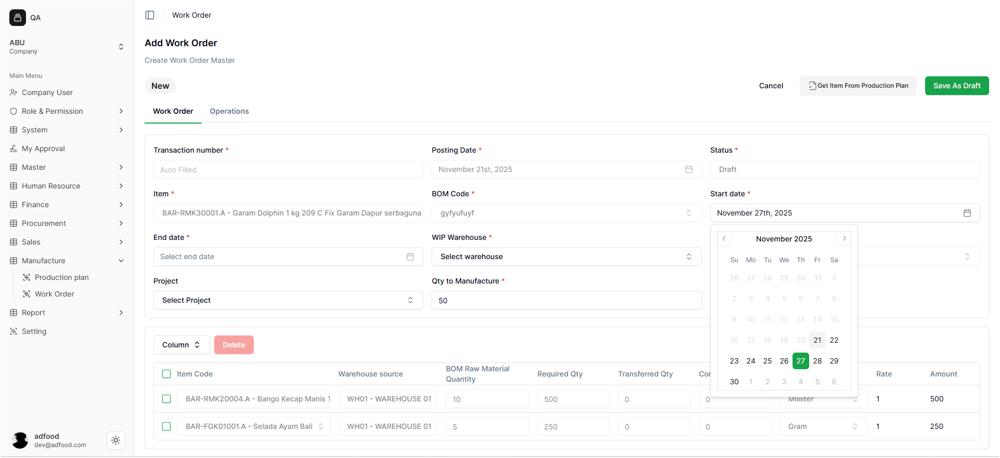

---

## End Date

Field **End Date** menentukan kapan produksi direncanakan selesai.

- Harus lebih besar dari Start Date.  
- Berguna untuk perencanaan jadwal produksi.

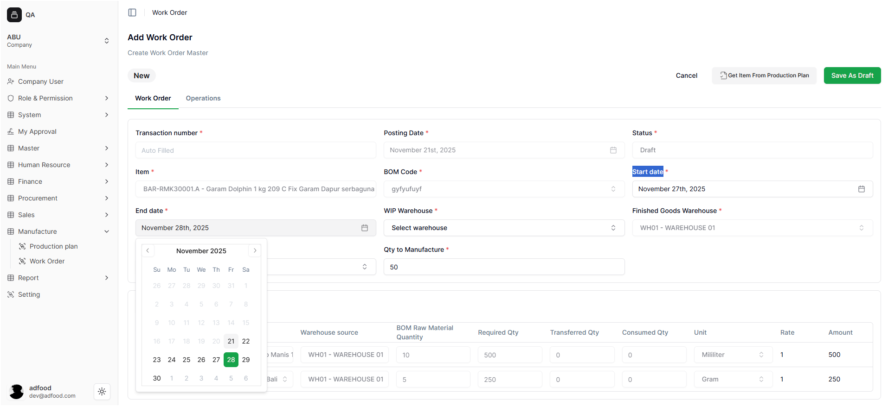

---

## WIP Warehouse

**WIP Warehouse (Work In Progress)** adalah gudang untuk menampung barang setengah jadi selama proses produksi.

- Pilih gudang WIP yang akan digunakan.  
- Bisa menambah gudang baru melalui **+ Add** atau mengelola melalui **Manage**.

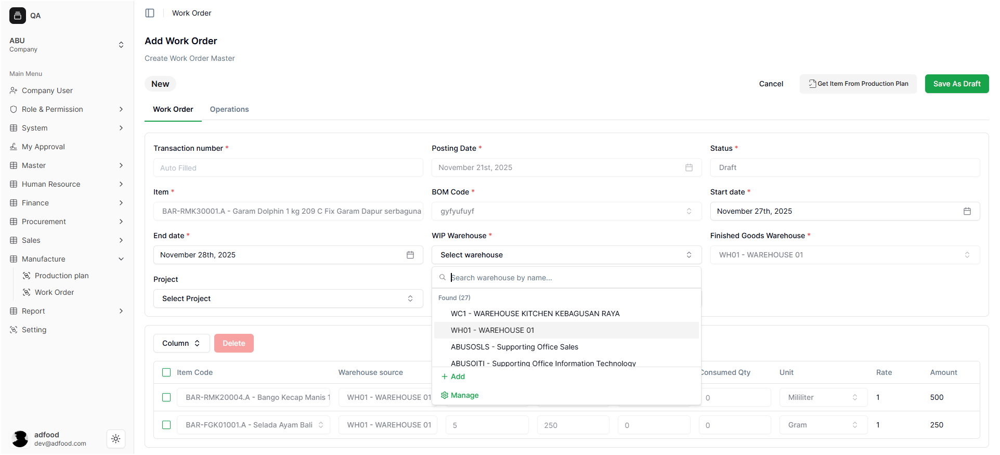

---

## Finished Goods Warehouse

Gudang tujuan produk akhir setelah produksi selesai.

- **Tidak dapat diubah secara manual.**  
- Sistem mengisi otomatis berdasarkan Production Plan.

---

## Project

Field ini digunakan untuk memilih proyek produksi yang terkait dengan Work Order.

- Membantu pelacakan pekerjaan, laporan, dan pembagian aktivitas.  
- Field ini bersifat opsional sesuai konfigurasi sistem.

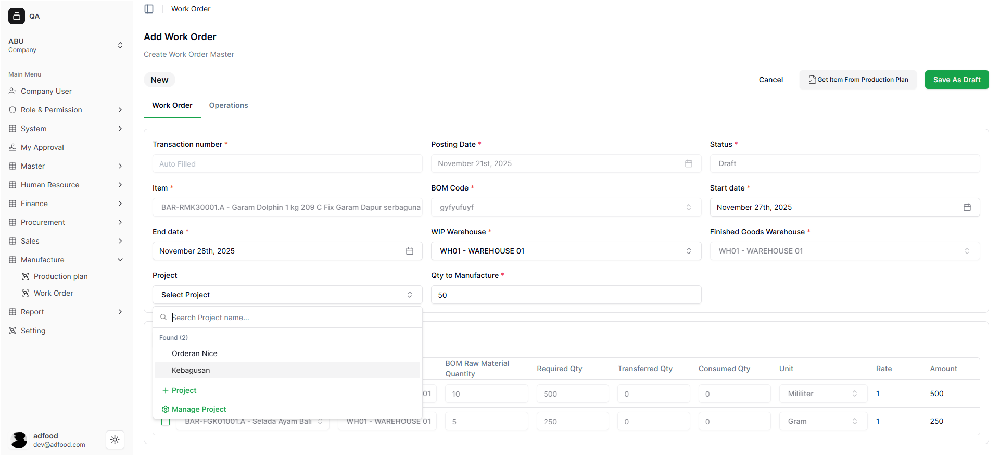

---

## Qty to Manufacture

Jumlah produk yang akan diproduksi dalam Work Order.

- User mengisi jumlah produksi sesuai kebutuhan.  
- Jumlah ini memengaruhi kebutuhan BOM dan kapasitas WIP.  
- Pastikan tidak melebihi jumlah di Production Plan (jika diambil dari sana).

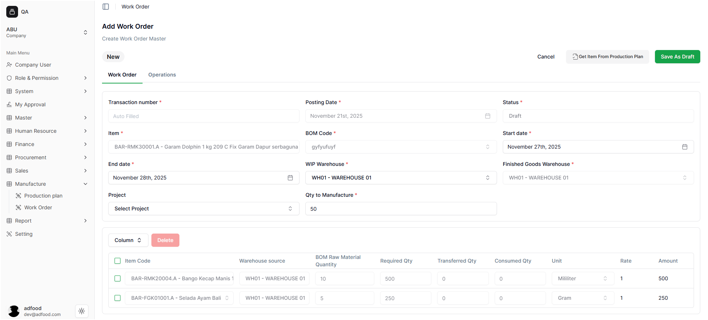

---

# Detail Kebutuhan Bahan Baku (Raw Material)

Pada bagian ini, daftar bahan baku otomatis muncul berdasarkan **BOM Code** dari item yang dipilih.

Data di kolom ini **tidak dapat diubah**, karena dihitung sistem.

### Informasi yang Ditampilkan:

- **Item Code**  
- **Warehouse Source**  
- **BOM Raw Material Quantity**  
- **Required Qty**  
- **Transferred Qty**  
- **Consumed Qty**  
- **Unit (UOM)**  
- **Rate & Amount**

---

## Menghapus Raw Material

Jika perlu menghapus bahan baku tertentu:

1. Klik tombol **Delete** pada baris item.  
2. Sistem akan menghapus data tersebut.

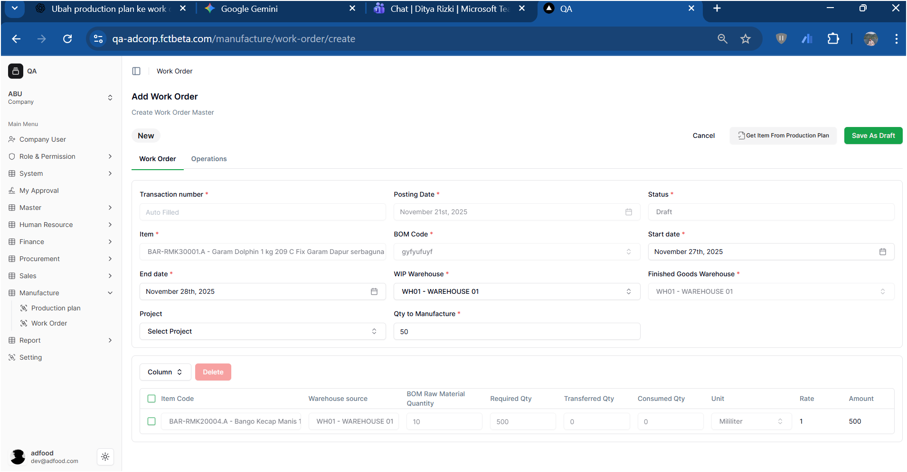

---

# Menyimpan Work Order

Jika semua data sudah sesuai, klik **Save As Draft** (tombol hijau di pojok kanan atas).

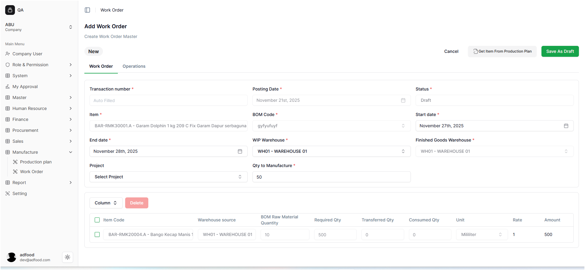

Setelah disimpan, sistem akan mengarahkan Anda kembali ke halaman **Work Order**.

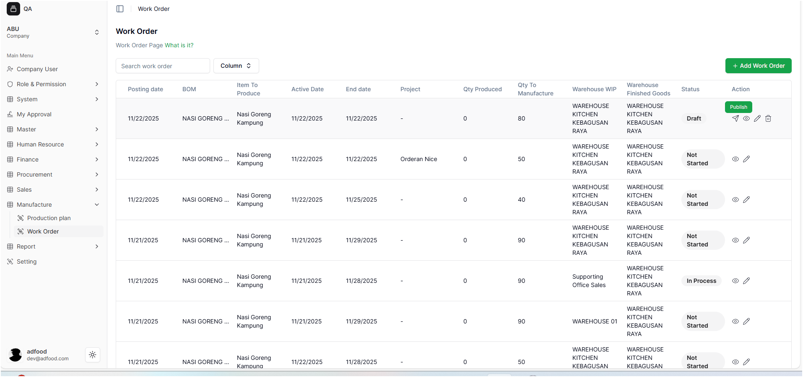
