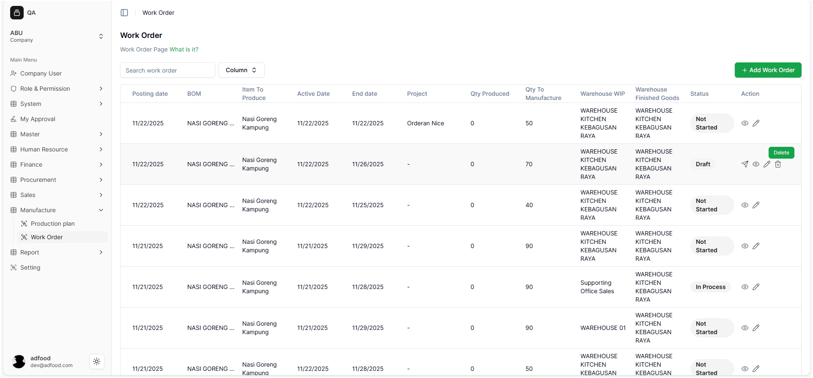
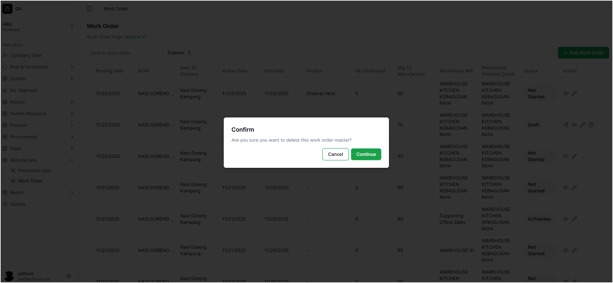
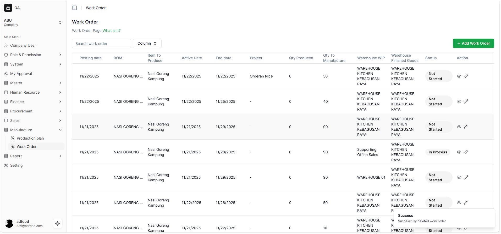

# Menghapus Work Order

Fitur ini digunakan untuk menghapus Work Order secara permanen.

---

## 1. Cara Menghapus Work Order

1. Temukan Work Order yang ingin dihapus.
2. Klik ikon **trash (Delete)**.

---

##  Pop-up Konfirmasi

User dapat memilih:

- **Cancel** → Membatalkan penghapusan  
- **Continue** → Menghapus secara permanen  

---

##  Hasil Setelah Dihapus

Jika user memilih Continue:

- Work Order terhapus
- Sistem menampilkan notifikasi:

**“Successfully deleted work order.”**

User kembali ke daftar Work Order.
