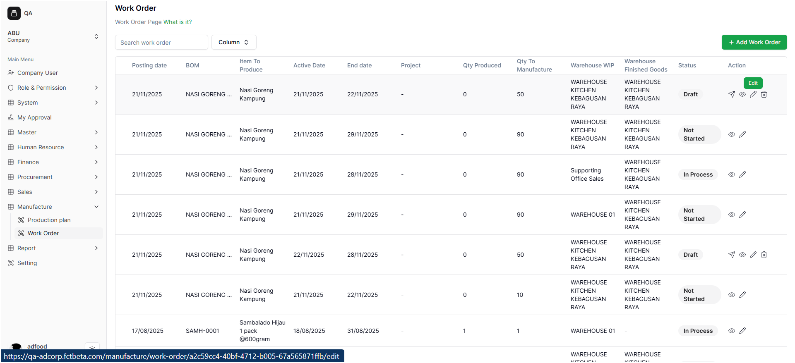
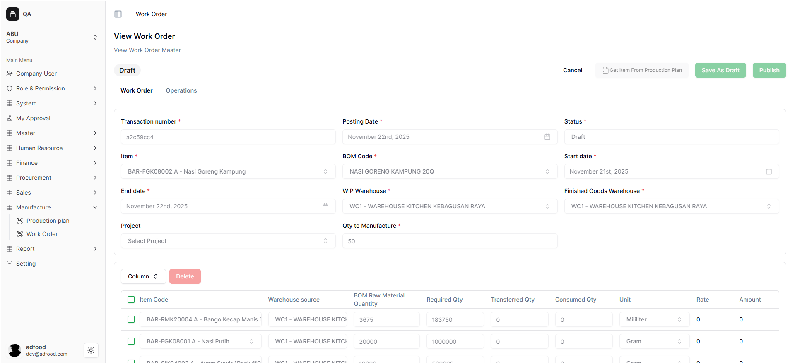
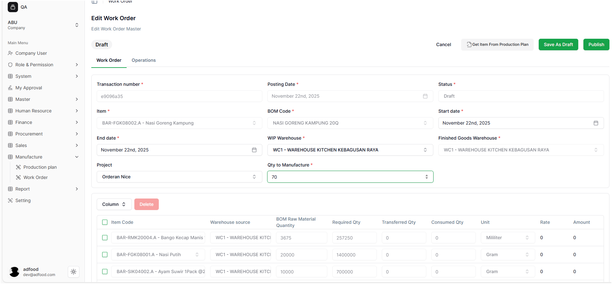
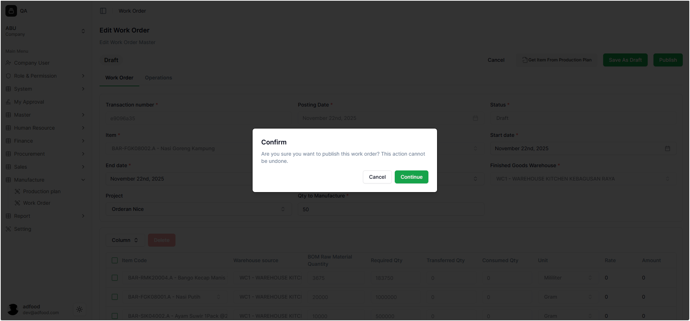
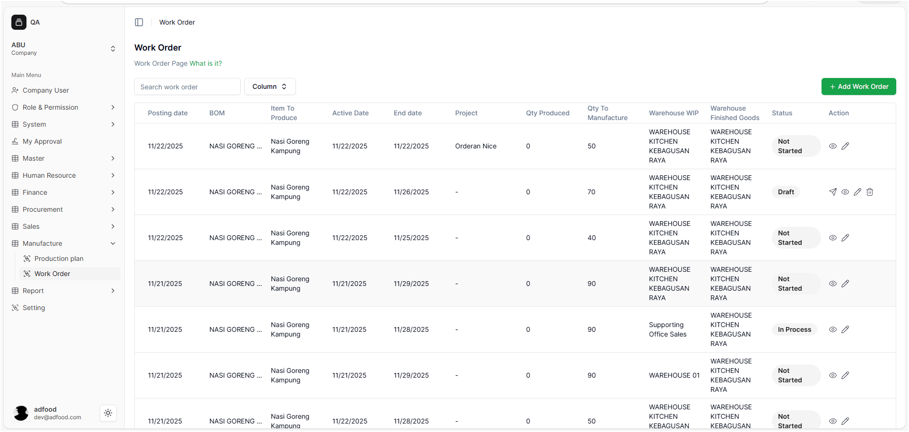

# Mengedit Work Order

User dapat melakukan perubahan selama Work Order masih berstatus **Draft**.

---

## 📝 Langkah-Langkah Edit

1. Buka halaman **Work Order List**.
2. Temukan Work Order berstatus Draft.
3. Klik ikon **pencil (Edit)**.

Sistem menampilkan halaman edit:

---

## ✏️ Data yang Bisa Diedit

User bisa mengubah:

- **Start Date**
- **End Date**
- **WIP Warehouse**
- **Project**
- **Qty to Manufacture**

⚠️ **Field yang tidak dapat diubah:**

- Transaction Number  
- Status  
- Posting Date  
- Item  
- Finished Goods Warehouse  

---

# Penyimpanan dari Mode Edit

Pada halaman Edit terdapat dua tombol:

- **Save As Draft**
- **Publish**

---

## 🟦 1. Publish dari Mode Edit

Saat menekan tombol **Publish**, muncul pop-up konfirmasi:

> **Are you sure you want to publish this work order? This action cannot be undone.**

User dapat memilih:

- **Cancel**  
- **Continue**

### Jika memilih **Continue**:

- Status berubah menjadi **Published**
- Data terkunci
- User kembali ke daftar Work Order

Setelah publish berhasil:

- Muncul notifikasi: **Success — Successfully edited work order.**
- Data ditampilkan di daftar Work Order

---

## 🟩 2. Save As Draft

Gunakan **Save As Draft** jika user ingin menyimpan tanpa publish.

Setelah ditekan:

- Sistem menampilkan pop-up konfirmasi

- User diarahkan kembali ke daftar Work Order
- Status tetap **Draft**

