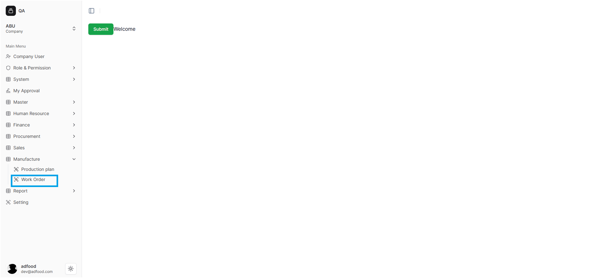
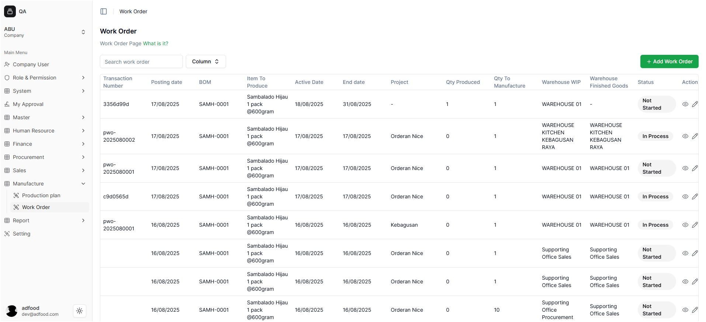
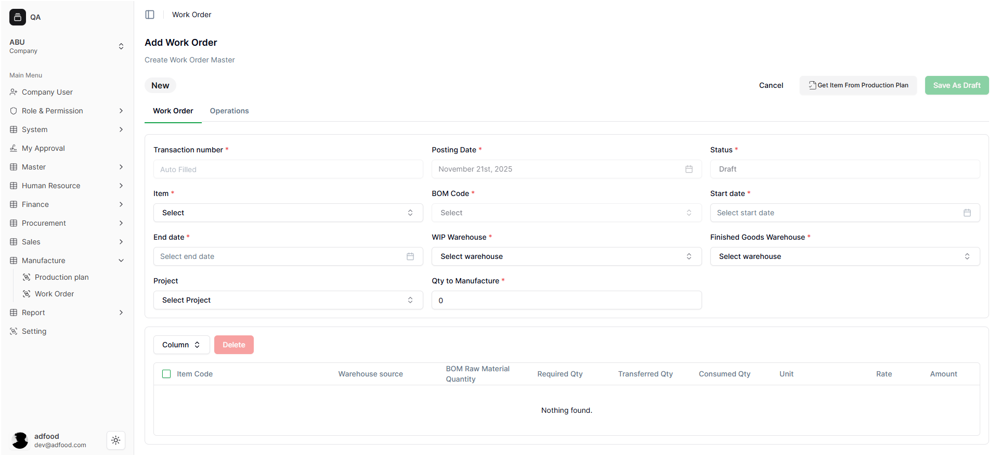

# Setting Work Order

Dokumen ini menjelaskan cara membuka menu Work Order, memahami tampilan halaman Work Order, serta menggunakan fitur Export dan Add Work Order.

---

# Masuk ke Menu Work Order

Setelah user login dan memilih Workspace, lakukan langkah berikut untuk membuka menu Work Order:

### Langkah-langkah membuka menu Work Order
1. Buka **sidebar kiri**.
2. Klik menu **Manufacture**.
3. Pilih submenu **Work Order**.
4. Sistem akan menampilkan halaman utama Work Order.

Fungsi menu ini adalah untuk mengatur perintah kerja produksi, menentukan jumlah produk yang akan dibuat, serta menetapkan kebutuhan material berdasarkan Bill of Material (BOM).

---

# 2. Tampilan Halaman Work Order

Halaman **Work Order** menampilkan seluruh perintah kerja produksi yang telah dibuat dalam sistem. Halaman ini berfungsi sebagai pusat kontrol untuk melihat, mengelola, dan membuat Work Order baru.

Di halaman ini, Anda dapat:
* Mencari Work Order menggunakan **Search Transaction Number**.
* Menambahkan perintah kerja baru dengan tombol **+ Add Work Order** (kanan atas).

## Informasi yang Ditampilkan
Setiap baris di daftar Work Order menyajikan informasi berikut:

1. Posting date
2. BOM
3. Item To Produce
4. Active Date
5. End date
6. Project
7. Qty Produced
8. Qty To Manufacture
9. Warehouse WIP
10. Warehouse Finished Goods
11. Status
12. Action

---

# 3. Masuk ke Halaman Add Work Order

Untuk membuat Work Order baru, tekan tombol **+ Add Work Order**. Sistem akan menampilkan form untuk membuat perintah kerja baru.

> ⚠️ **Catatan:**  
> Isi semua kolom yang memiliki tanda **`*` merah** (**wajib diisi**).  
> Kolom tanpa tanda bintang bersifat **opsional**.
