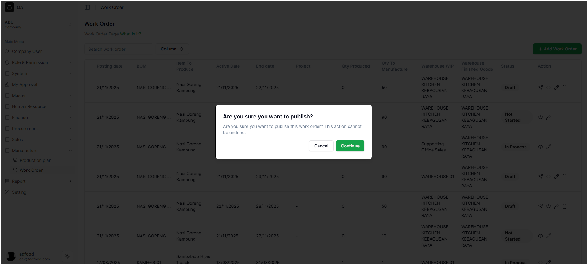
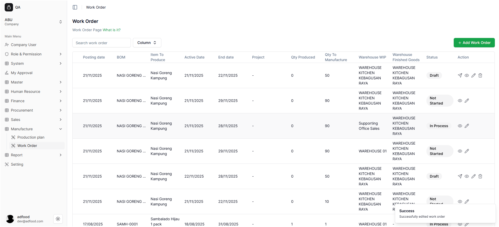

# Proses Publish Work Order

Halaman **Work Order** digunakan untuk mengelola pekerjaan produksi yang berasal dari *Production Plan*.  
Work Order yang masih berstatus **Draft** harus dipublish agar bisa dilanjutkan ke proses berikutnya seperti:

- **Material Issue** (pengeluaran material)
- **Material Receipt** (penerimaan hasil produksi)

---

##  Cara Melakukan Publish

1. Cari Work Order pada daftar.
2. Klik ikon **pesawat (Publish)**.

Sistem akan menampilkan pop-up konfirmasi.

---

## 🔔 Pop-up Konfirmasi Publish

Terdapat dua opsi:

- **Cancel** → Membatalkan publish  
- **Continue** → Melanjutkan proses publish

---

## ✅ Hasil Setelah Work Order Dipublish

Jika Work Order berhasil dipublish:

- Status berubah menjadi **Published**
- Data **tidak bisa diedit**
- Work Order siap digunakan untuk proses produksi
- Sistem menampilkan notifikasi:  
  **Success — Successfully published work order**

