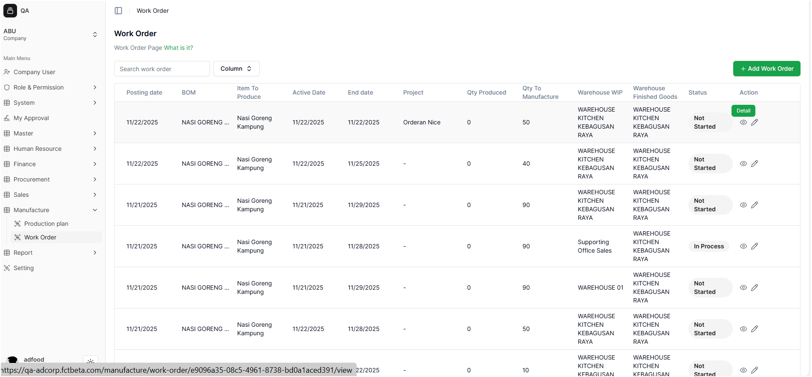
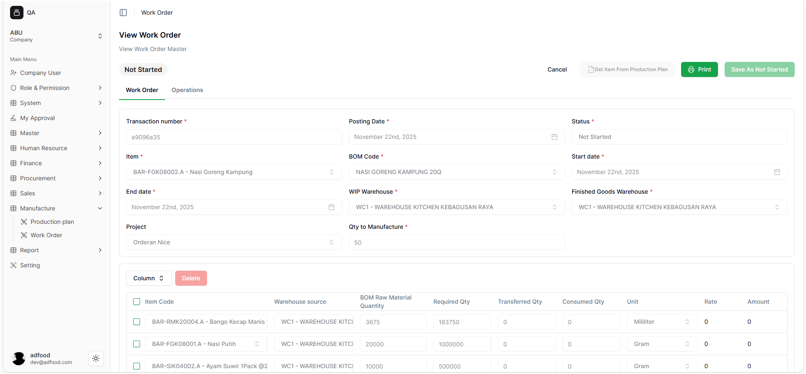
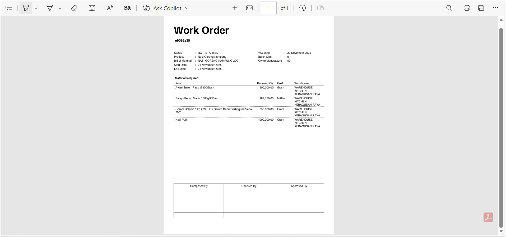
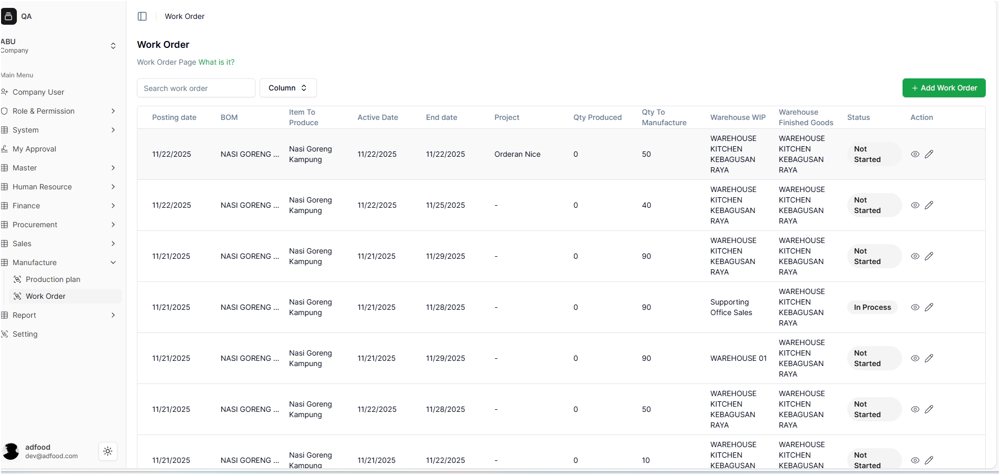
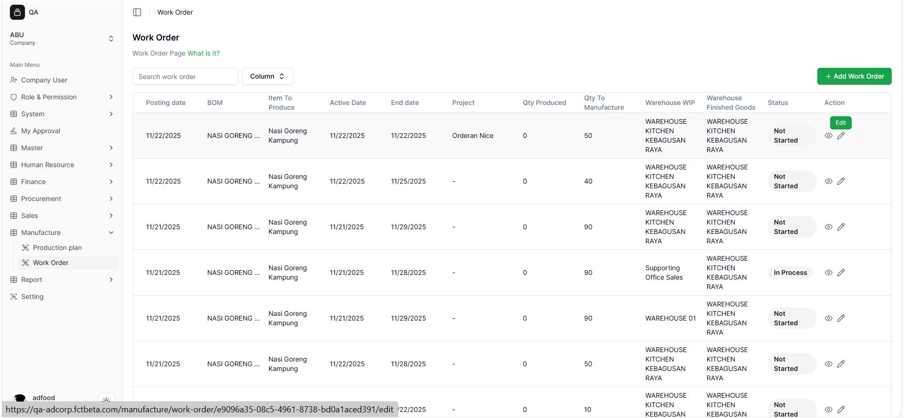
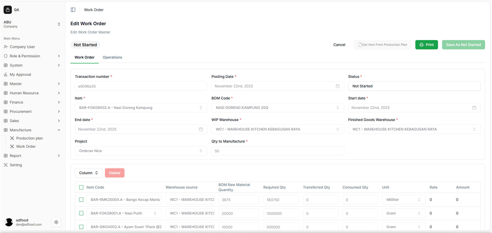
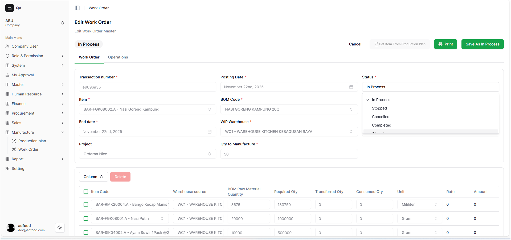
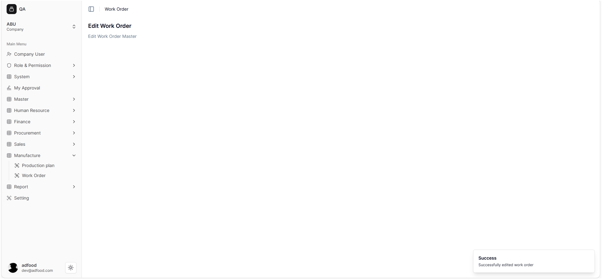
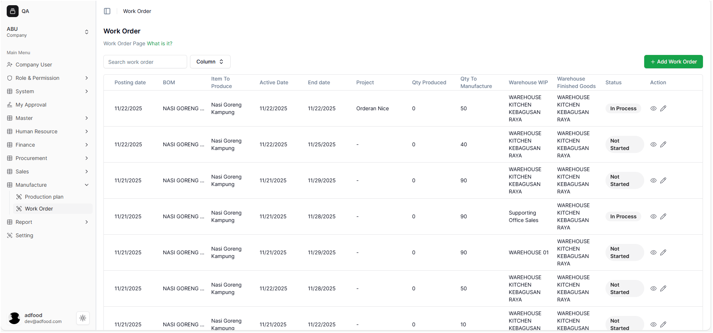

# Setelah Menyelesaikan Work Order

Setelah user menyelesaikan proses pengisian dan mengubah status Work Order dari **Not Started**, sistem akan otomatis mengarahkan kembali ke halaman **Work Order**. Pada tahap ini, Work Order dianggap sudah final dan siap digunakan untuk proses produksi berikutnya.

---

## Melihat Detail Work Order

- Ketika ikon **View (mata)** diklik, user akan diarahkan ke halaman **View Work Order**.  
  Ikon ini digunakan untuk membuka seluruh detail Work Order tanpa melakukan perubahan apa pun.

- Pada halaman ini, user dapat melihat informasi lengkap seperti:
  - Detail item
  - Kuantitas
  - Komponen dan bahan
  - Waktu, tanggal, dan jadwal produksi
  - Informasi tambahan lainnya

- Halaman **View Work Order** bersifat **read-only**, sehingga data tidak dapat diedit.

---

## Ikon Print pada View Work Order

- Pada halaman **View Work Order**, terdapat ikon **Print** yang berfungsi untuk menampilkan dokumen Work Order dalam format PDF.

- Ketika ikon ini ditekan:
  - Sistem menampilkan **print preview** dalam bentuk PDF.
  - PDF dapat langsung di-*download* sebagai dokumentasi atau arsip produksi.
  - Tampilan PDF memudahkan user dalam mencetak Work Order menggunakan format standar perusahaan.

---

## Kembali ke Halaman Work Order

- Setelah selesai melihat detail atau mengunduh PDF, user dapat kembali ke halaman daftar Work Order dengan menekan tombol **Cancel**.
- Tombol ini akan mengembalikan user ke halaman **Work Order** tanpa mengubah data apa pun.

---

## Mengubah Status Work Order

Jika user ingin memperbarui status Work Order, prosesnya dilakukan melalui fitur **Edit**.

### 1. Masuk ke Halaman Edit

- Klik ikon **Pensil (Edit)** untuk membuka halaman pengeditan Work Order.

- Setelah ikon ditekan, user akan masuk ke halaman **Edit Work Order**.

Pada halaman Edit ini, user dapat:
- Melakukan *print ulang* jika diperlukan
- Mengubah status Work Order sesuai perkembangan pekerjaan

---

### 2. Mengubah Status Work Order

- Untuk mengubah status, klik kolom **Work Order Status** pada halaman edit.  
  Sistem akan menampilkan daftar status yang tersedia, yaitu:

1. **Not Started**  
2. **In Process**  
3. **Stopped**  
4. **Cancelled**  
5. **Completed**  
6. **Closed**

User dapat memilih status sesuai kondisi terbaru di lapangan.

---

### 3. Menyimpan Perubahan Status

- Setelah memilih status yang sesuai, tekan tombol **Save As In Process** atau tombol *save* lain yang muncul sesuai status yang dipilih.
- Sistem akan menampilkan pop-up notifikasi:

**Successfully edited work order.**

- Setelah itu, user akan kembali ke halaman utama **Work Order**, dan status yang baru dipilih akan langsung terlihat.
- User dapat melanjutkan pekerjaan sesuai status terbaru (misalnya “In Process”).

---

