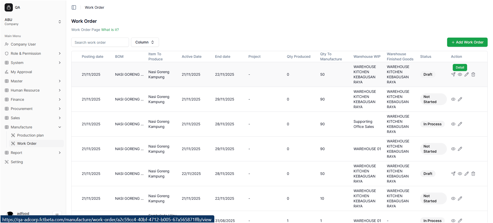

# A. Melihat Detail Work Order

Fitur **Detail** digunakan untuk melihat isi Work Order tanpa mengubah data.

---

## B.  Cara Melihat Detail

1. Temukan Work Order pada daftar.
2. Klik ikon **mata (Detail)**.

---

## C. Informasi yang Ditampilkan

Pada halaman detail, user dapat melihat:

- Informasi dasar Work Order  
- Item produksi  
- Jumlah produksi  
- Material pendukung  
- Kaitan dengan Production Plan  

Mode ini **hanya untuk melihat**, tidak bisa:

- Mengedit data  
- Menghapus material  
- Menambah data  

Tekan **Cancel** untuk kembali ke daftar.

