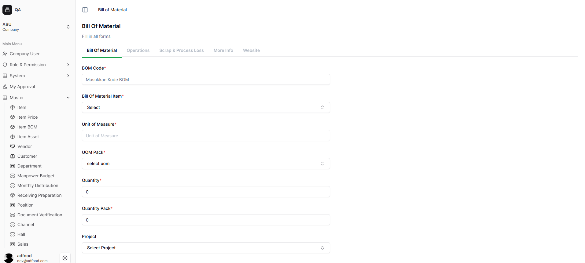
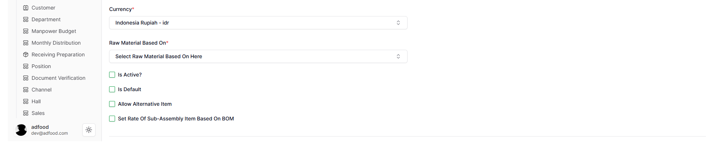

# Tampilan Form Add Bill of Material

Setelah pengguna menekan tombol **Add Bill of Material**, sistem akan menampilkan halaman form pembuatan BOM baru. Pada halaman ini terdapat beberapa tab utama yang digunakan untuk mengatur seluruh informasi mengenai pembuatan BOM. Setiap tab memiliki fungsi yang berbeda, sehingga pengguna bisa mengisi data secara lebih terstruktur sesuai kebutuhan.

Tab yang tersedia:

- **Bill of Material** → tab utama untuk mengisi identitas BOM dan komponen material
- **Operations** → untuk menambahkan aktivitas proses produksi (jika diperlukan)
- **Scrap & Process Loss** → untuk mengatur potensi susut atau material hilang dalam proses produksi
- **More Info** → untuk menambahkan informasi tambahan seperti notes dan settings lainnya
- **Website** → digunakan hanya jika terkait tampilan website (opsional)

Berikut tampilan form ketika pertama kali dibuka:

Pada gambar pertama, terlihat bagian utama seperti **BOM Code**, **Item Name**, **Project**, **Currency**, dan **Raw Material Based On** yang wajib diisi.  
Pada gambar kedua terlihat daftar tab dan area material yang nantinya digunakan untuk mengisi komponen-komponen BOM.

---

# 2. Cara Mengisi Tab Bill of Material

Pada tab ini, pengguna harus mengisi seluruh field yang tersedia untuk mendefinisikan BOM dengan benar.  
Tab ini merupakan bagian yang paling penting karena seluruh identitas BOM dan komponen material diinput pada bagian ini.

Field seperti **BOM Name**, **Item**, **Quantity**, **UOM**, **Project**, hingga **Raw Material Based On** wajib diisi sebelum melanjutkan ke tab lain.  
Penjelasan detail fungsi setiap field ada pada file berikutnya.
