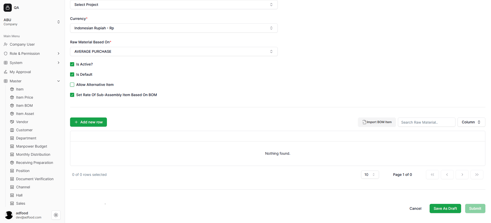
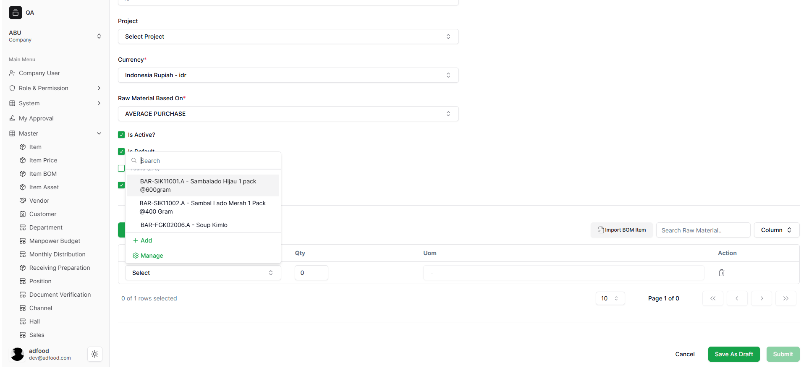
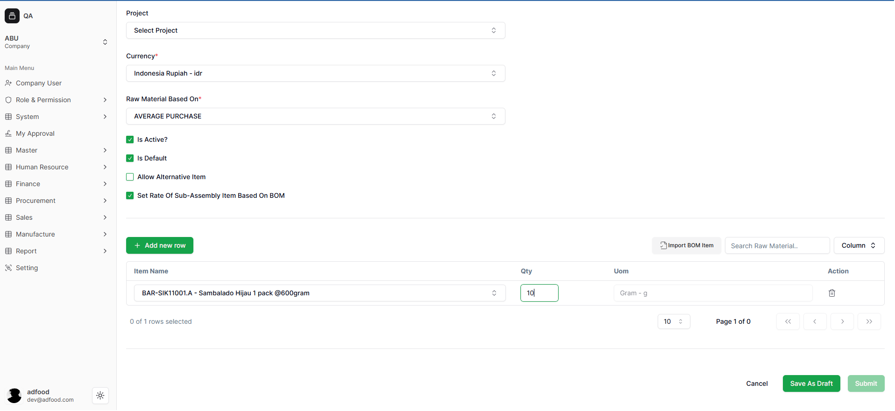
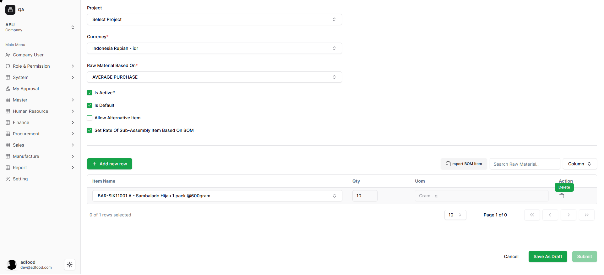
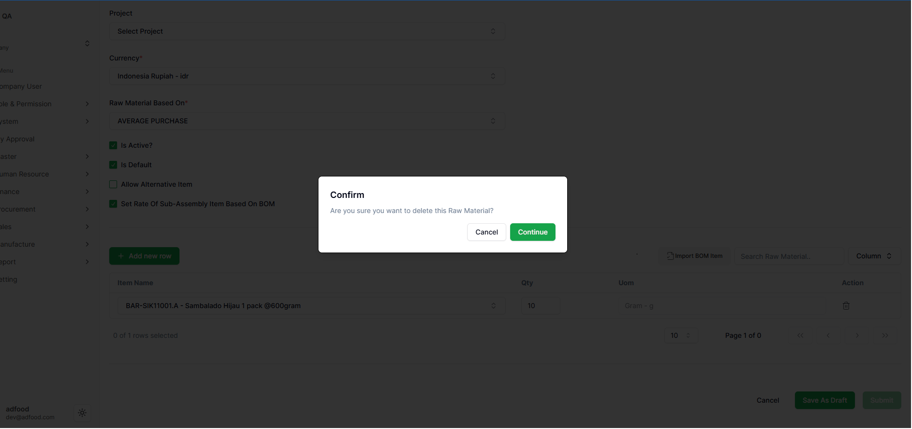

# Cara Mengisi Material dalam Item BOM

Setelah pengguna masuk ke halaman **Item BOM**, langkah berikutnya adalah mengisi daftar material yang akan digunakan dalam pembuatan Bill of Material. Bagian ini berfungsi untuk menambahkan komponen-komponen penyusun produk secara manual.

---

## 1. Menambahkan Material Baru Secara Manual

Untuk mulai menambahkan komponen, klik tombol **+ Add New Row**.  
Tombol ini digunakan untuk membuat baris material baru di tabel BOM.

---

## 2. Memilih Item Name

Setelah baris baru dibuat, pilih material dengan cara:

1. Klik tombol **Select** pada kolom Item Name  
2. Ketik nama material pada kolom pencarian  
3. Pilih material dari daftar  
4. Klik **Add** untuk menambahkan material ke BOM  
5. Tombol **Manage** digunakan jika ingin membuka pengaturan master item

Proses ini memastikan material yang dipilih berasal dari master item yang sudah tersedia.

---

## 3. Mengisi Qty dan UOM

Setelah memilih material, lengkapi bagian jumlah dan satuan:

- **Qty** → jumlah material yang diperlukan
- **UOM** → terisi otomatis berdasarkan pengaturan master item

Pengguna hanya perlu memastikan jumlahnya sesuai kebutuhan produksi.

---

## 4. Menghapus Material

Jika ada material yang salah atau tidak jadi digunakan, pengguna bisa menghapusnya dengan menekan ikon **Delete** di baris material tersebut.

Setelah itu muncul pop-up konfirmasi untuk memastikan bahwa material benar-benar ingin dihapus.

