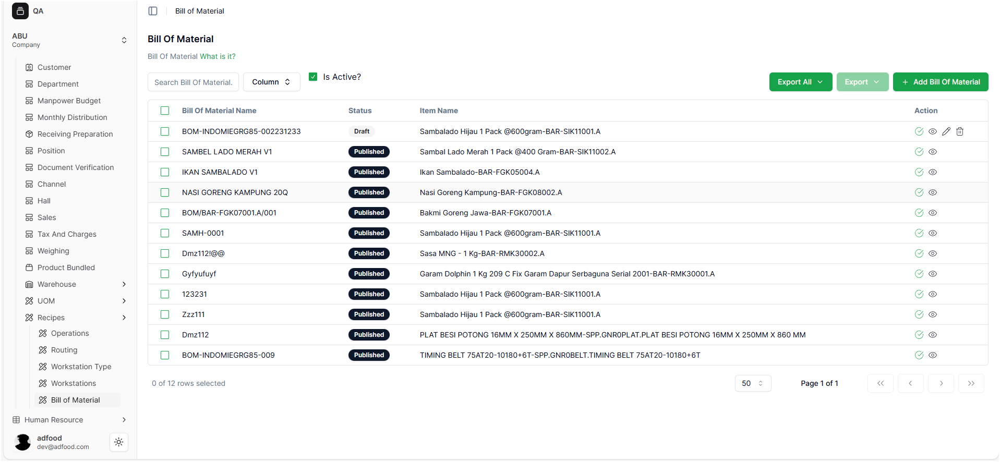
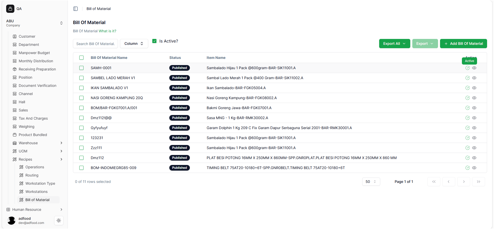
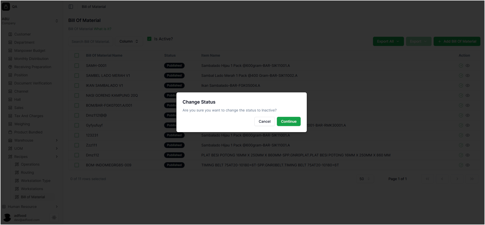
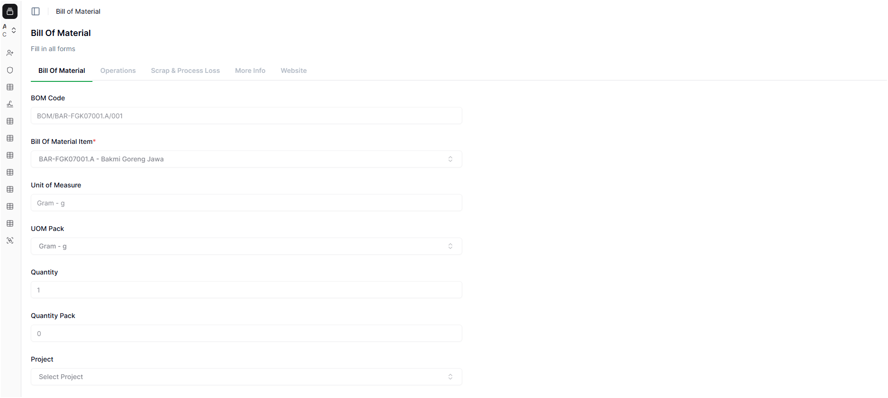
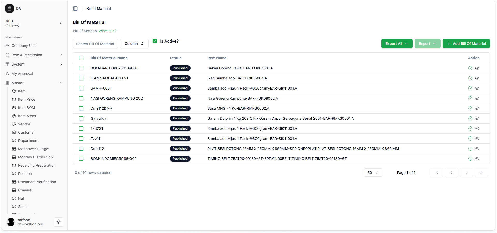

# Setelah BOM di Publish

Setelah sebuah **Bill of Material (BOM)** dipublish dan berstatus **Published**, user tetap dapat melihat dan memeriksa detail BOM tersebut. Pada tahap ini, BOM dianggap final dan siap digunakan dalam proses produksi, costing, atau pembuatan dokumen lain seperti Work Order.

---
# Mengubah Status Bill of Material (BOM)

Fitur ini digunakan untuk mengubah status **Bill of Material (BOM)** dari **Aktif** menjadi **Inaktif**, atau sebaliknya.

> **Penting:**  
> Ketika sebuah BOM diubah menjadi **Inaktif**, BOM tersebut **tidak dapat digunakan** dalam proses produksi, perhitungan biaya, maupun transaksi lain di dalam sistem.

---

##  Langkah-langkah Mengubah Status BOM

1. Buka menu **Item BOM** untuk melihat daftar Bill of Material.
2. Cari baris BOM yang ingin Anda ubah statusnya.
3. Pada kolom **Is Active?**, klik ikon status:
   - Jika ikon berwarna **hijau**, klik untuk mengubah BOM menjadi **Inaktif**.
   - Jika ikon berwarna **merah**, klik untuk mengubah BOM menjadi **Aktif**.
4. Sistem akan menampilkan pop-up konfirmasi seperti berikut:

   **Change Status**  
   *Are you sure you want to change the status to Inactive?*

5. Pilih salah satu opsi:
   - **Continue** → Mengonfirmasi perubahan status.
   - **Cancel** → Membatalkan dan membiarkan status tetap seperti semula.

---

- Hasil Aksi Perubahan Status

Jika user menekan tombol **Continue** pada pop-up konfirmasi:

* Status **Bill of Material (BOM)** akan berubah sesuai aksi yang dipilih  
  (contoh: dari **Aktif → Inaktif** atau sebaliknya).
* Sistem akan menampilkan notifikasi sukses di pojok kanan bawah layar.
* muncul notifikasi berikut:

**Success**  
*Successfully updated status*

Notifikasi ini menandakan bahwa perubahan status telah disimpan dengan sukses.

---

## Melihat Detail Bill of Material (BOM)

- Ketika ikon **View (mata)** diklik, user akan diarahkan ke halaman **View Bill of Material**.  
  Ikon ini digunakan untuk membuka seluruh detail BOM tanpa melakukan perubahan apa pun.

- Pada halaman ini, user dapat melihat informasi lengkap seperti:
  - Detail Item Utama
  - Versi BOM
  - Komponen dan material penyusun
  - Kuantitas dan satuan
  - Perhitungan cost
  - Keterangan tambahan

- Halaman **View Bill of Material** bersifat **read-only**, sehingga data tidak dapat diedit.

---

## Kembali ke Halaman BOM

- Setelah selesai melihat detail, user dapat kembali ke halaman daftar BOM dengan menekan tombol **Cancel**.
- Tombol ini akan mengembalikan user ke halaman **Bill of Material** tanpa mengubah data apa pun.

---
