# Mengelola Bill Of Material (BOM) yang Sudah Tersimpan

Setelah BOM berhasil disimpan dan muncul di halaman **Bill Of Material**, Anda dapat melakukan beberapa tindakan seperti melihat detail BOM, mengedit isi BOM, hingga menghapusnya jika sudah tidak digunakan. Fitur-fitur ini dibuat agar user dapat mengelola BOM dengan mudah dan cepat tanpa perlu membuat ulang.

---

## Mengakses Halaman Daftar BOM

Pada halaman **Bill Of Material**, seluruh daftar BOM akan tampil lengkap beserta statusnya (**Draft** atau **Published**).  
Tersedia beberapa fitur pendukung seperti:

- **Search Bill Of Material Name** → untuk mencari BOM berdasarkan nama  
- **Is Active?** → untuk memfilter apakah BOM tersebut aktif atau tidak

Fitur-fitur ini memudahkan user menemukan BOM yang ingin dikelola tanpa perlu scroll panjang.

---

## Mengubah Status Active

Status **Active / Inactive** digunakan untuk menentukan apakah BOM boleh dipakai dalam proses produksi.

Untuk mengubah status:

- Klik ikon centang biru pada kolom **Active**.  
  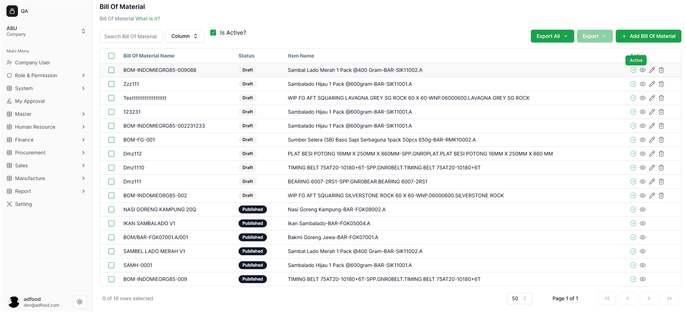

Saat tombol ditekan, sistem menampilkan pop-up konfirmasi:

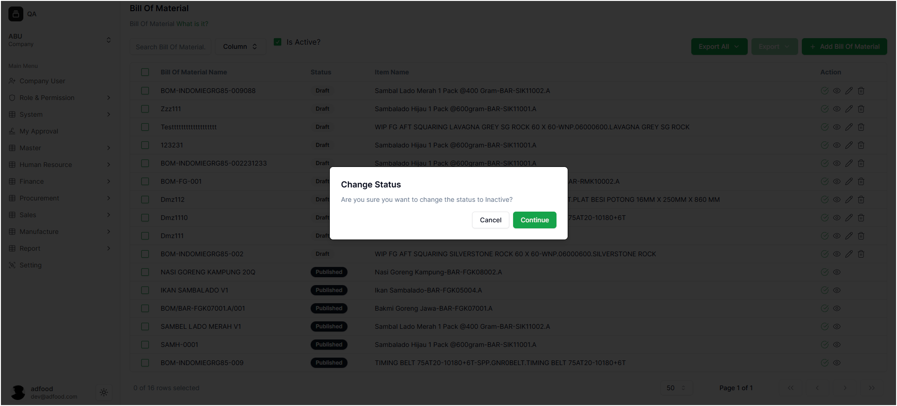

Jika Anda menekan **Continue**, sistem akan menampilkan notifikasi:

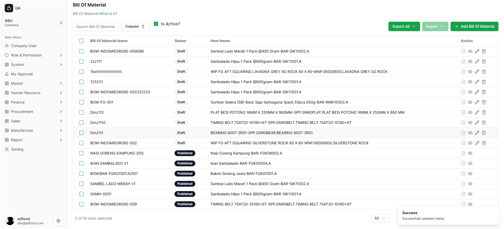

Setelah itu, user diarahkan kembali ke halaman BOM, dan status pada baris yang dipilih akan berubah menjadi tidak aktif.

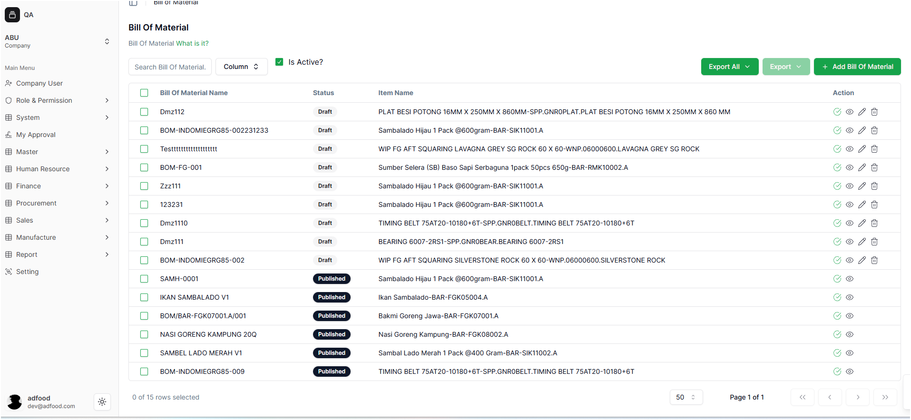

---

## Melihat Detail BOM

Fitur ini digunakan untuk melihat isi BOM tanpa melakukan perubahan.

1. Cari BOM yang ingin dilihat.
2. Klik ikon **Detail** (ikon mata).  
   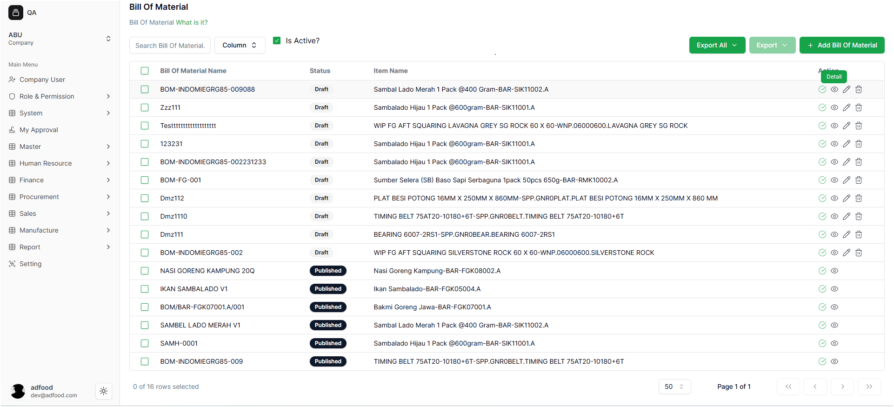

Anda akan diarahkan ke tampilan informasi lengkap BOM.

Pada mode ini:
- **Tidak bisa edit data**
- **Tidak bisa menambah atau menghapus material**
- Hanya untuk melihat informasi saja

Untuk kembali, tekan tombol **Cancel**.

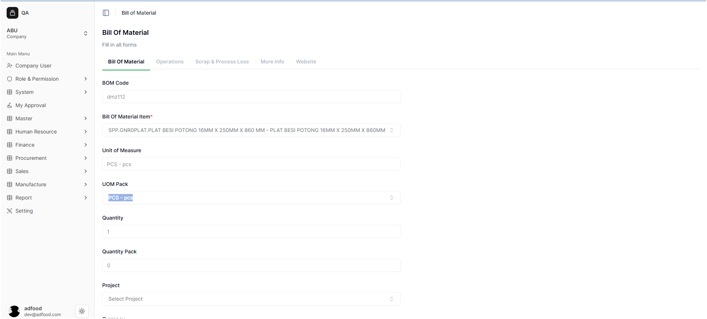  
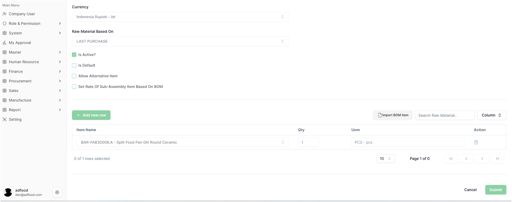

---

## B. Mengedit (Edit) BOM

Fitur Edit digunakan ketika Anda perlu memperbaiki atau mengubah data BOM.

Langkah-langkah:

1. Temukan BOM yang ingin diubah.
2. Klik ikon **Edit** (ikon pensil).
3. Sistem membawa Anda kembali ke halaman pengisian BOM.

Pada halaman edit, user bisa mengubah:
- Bagian **Bill Of Material** seperti BOM Code, Quantity, Project, Currency, Raw Material Based On  
- Catatan tambahan pada BOM  
- Material (menambah material baru, mengubah Qty, atau menghapus material)

Catatan penting:  
Beberapa field pada **Bill Of Material Item** tidak bisa diubah karena mengikuti struktur awal BOM.

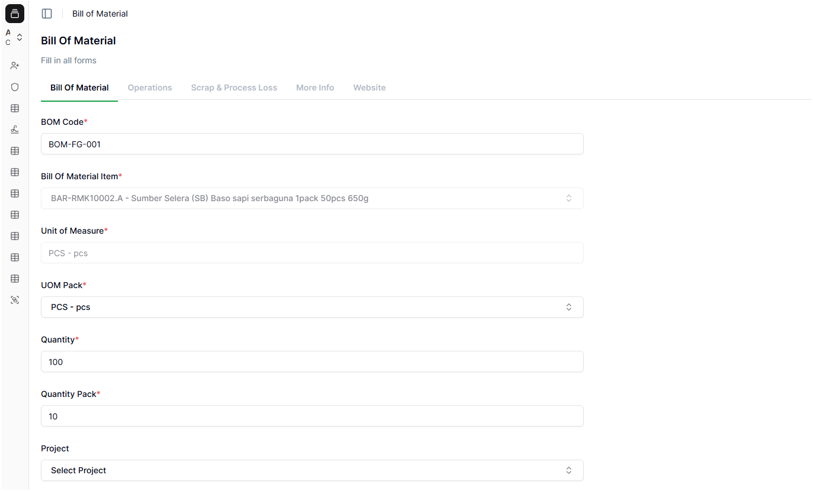  
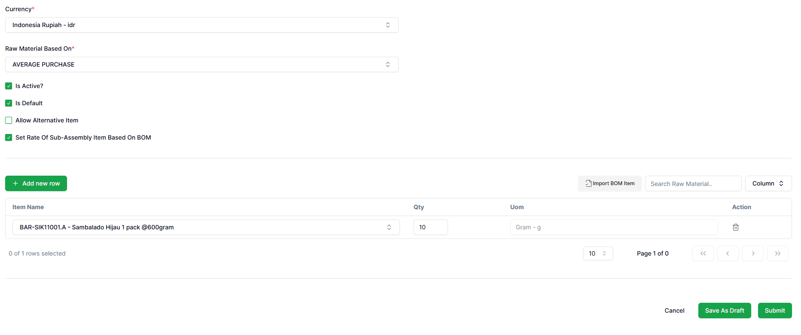

---

## C. Proses Menyimpan Hasil Edit

Setelah selesai mengedit, terdapat dua pilihan penyimpanan:

### 1. Save As Draft
Gunakan ini jika perubahan masih dalam tahap penyusunan.  
BOM akan tetap berstatus **Draft**.

Notifikasi yang muncul:  
**Success: Bill Of Material Update Successfully**

### 2. Submit
Gunakan jika perubahan sudah final dan siap dipublikasikan.  
Status BOM akan berubah menjadi **Published**.

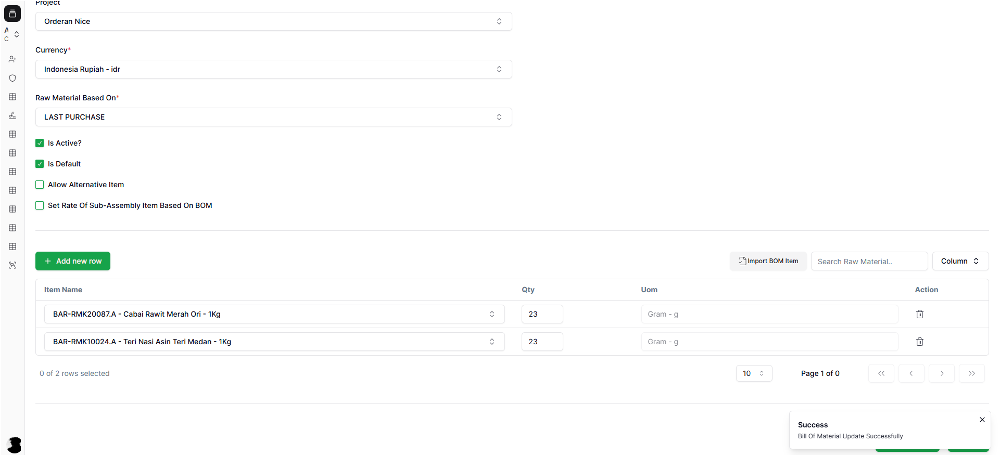

---

## D. Menghapus (Delete) BOM

Gunakan fitur ini untuk menghapus BOM secara permanen.

1. Cari BOM yang ingin dihapus.
2. Klik ikon **Delete** (ikon tempat sampah).  
   

Sistem akan menampilkan pop-up konfirmasi:

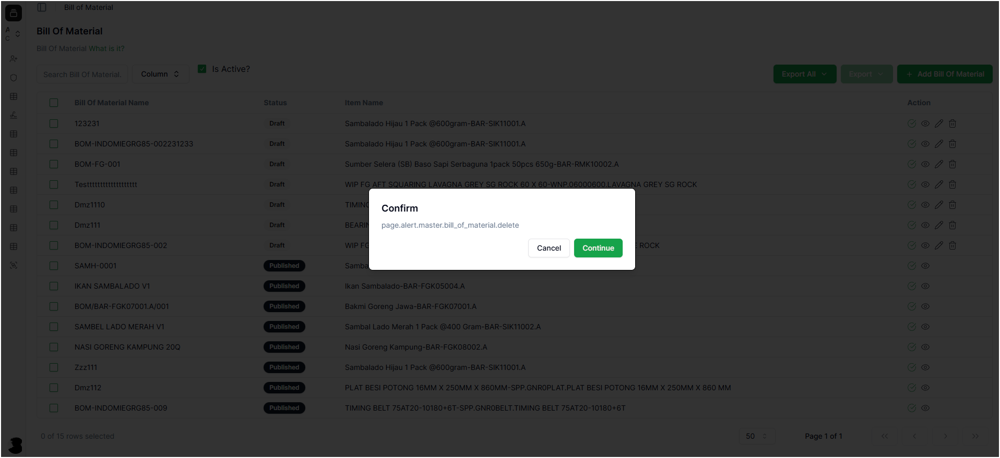

Tekan **Continue** jika yakin ingin menghapus.

Setelah berhasil, sistem menampilkan notifikasi:  
**Operation Deleted Successfully**

User akan kembali ke halaman daftar BOM setelah penghapusan selesai.

---
