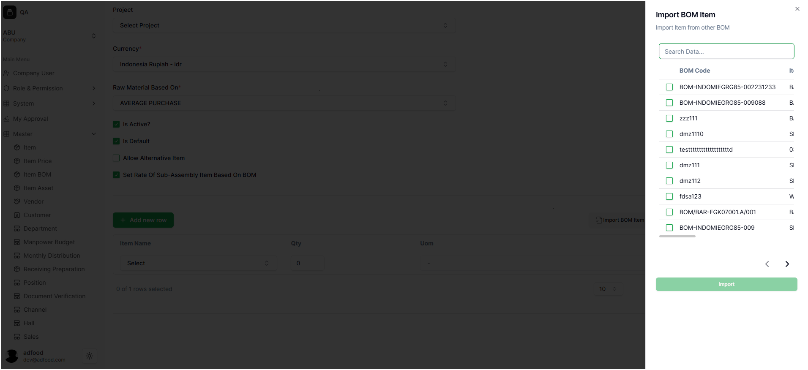
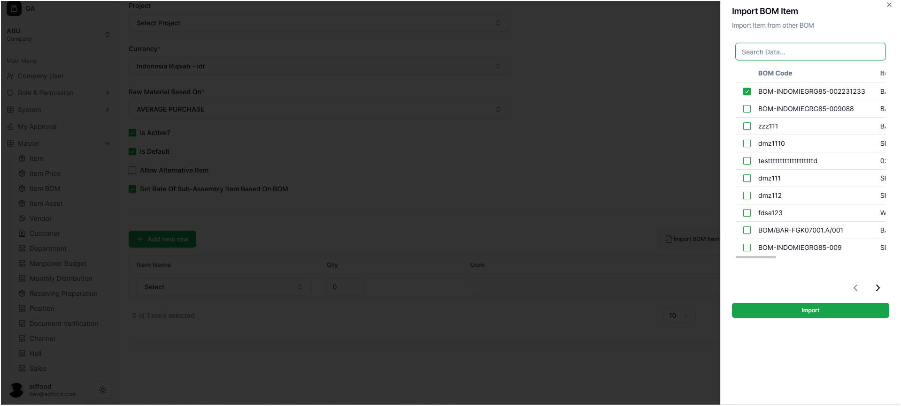

# Menggunakan Fitur Import BOM Item

1. Fitur **Import BOM Item** digunakan untuk menyalin seluruh komponen dari BOM lain agar Anda tidak perlu menginput material satu per satu. Fitur ini sangat membantu jika BOM yang dibuat memiliki komponen yang sama atau mirip dengan BOM sebelumnya.

Untuk menggunakannya, klik tombol **Import BOM Item** seperti terlihat pada gambar berikut:

2. Setelah ditekan, muncul pop-up berisi daftar BOM yang bisa dipilih. Anda dapat menggunakan kolom **Search Data...** untuk mencari BOM dengan cepat. Ketik nama atau kode BOM yang ingin digunakan, lalu centang BOM yang sesuai dan klik **Import**.

3. Setelah proses import berhasil, seluruh material dari BOM yang dipilih akan otomatis muncul pada tabel material. Anda dapat langsung melihat bahwa semua komponen seperti nama material, qty, dan UoM sudah terisi.

Dengan langkah singkat ini, pembuatan BOM menjadi lebih cepat dan mengurangi risiko kesalahan input manual.
