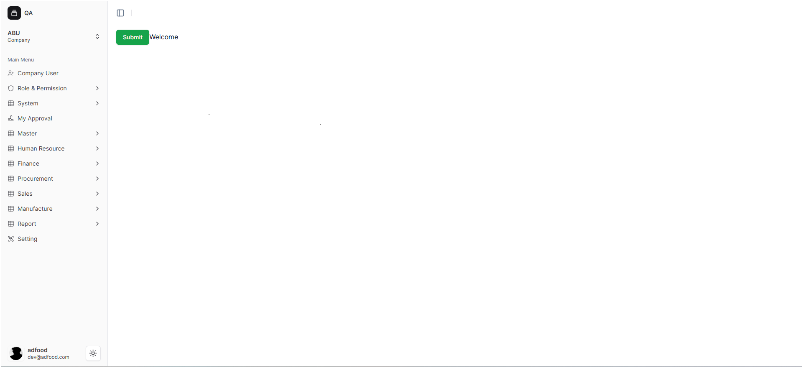
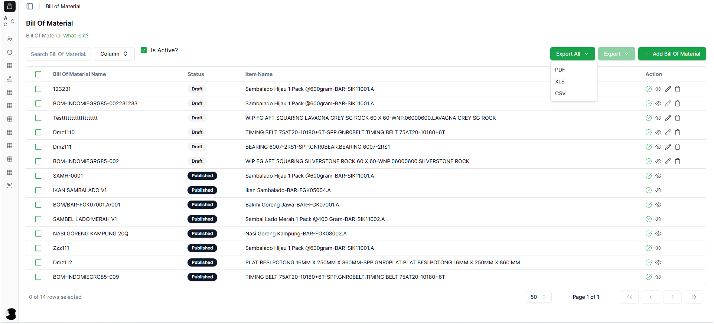
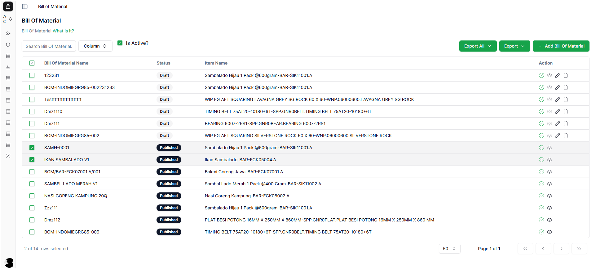
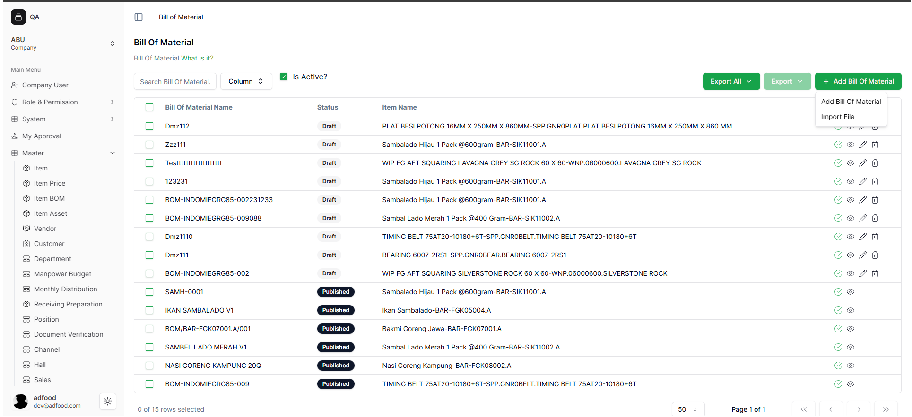

# Setting Master Bill of Material (BOM)

Dokumen ini menjelaskan cara membuka menu Bill of Material di ERP ADFood, memahami tampilan halaman BOM, serta menggunakan fitur Export dan Add Bill of Material.

---

# 1. Masuk ke Menu Bill of Material

Setelah user login dan memilih Workspace (contoh: *Supporting Office Kebagusan Raya*), lakukan langkah berikut untuk membuka menu BOM:

### Langkah-langkah membuka menu BOM
1. Buka **sidebar kiri**.
2. Klik menu **Master**.
3. Pilih submenu **Recipes**
4. Pilih sub-sub-menu **Item BOM**.
5. Sistem akan menampilkan halaman utama Bill of Material.

Fungsi menu ini adalah untuk mengelola seluruh daftar Bill of Material yang digunakan dalam proses produksi.

---

# 2. Akses Cepat Menu Bill of Material

Selain lewat sidebar, user juga dapat membuka menu BOM melalui ikon shortcut di halaman utama aplikasi.

Shortcut ini bertujuan mempercepat akses tanpa harus membuka menu Master → Item BOM.

---

# 3. Tampilan Halaman Bill of Material (BOM)

Pada halaman BOM, user dapat melihat daftar lengkap Bill of Material yang telah dibuat.

### Informasi yang ditampilkan:
- **Bill of Material Name** – Nama BOM yang telah dibuat.
- **Status** – Menunjukkan apakah BOM masih Draft, Published, atau Inactive.
- **Item Name** – Nama produk utama yang memiliki BOM.
- **Action** – Untuk melihat detail, mengedit, atau menghapus BOM.

### Fitur-fitur penting:
- **Search Bill Of Material** → Untuk mempermudah pencarian data BOM.
- **Column** → Untuk mengatur kolom mana yang ingin ditampilkan.
- **Is Active?** → Menampilkan hanya BOM yang masih aktif dipakai.
- **Export All / Export** → Untuk mengunduh data BOM sesuai kebutuhan.
- **Add Bill Of Material** → Untuk membuat BOM baru.

Semua fitur ini berfungsi untuk memudahkan proses monitoring, pencarian, dan administrasi data BOM.

---

# 4. Cara Menggunakan Export All dan Export

## 4.1 Export All – Mengunduh Seluruh Data BOM

Fitur ini digunakan ketika user ingin mendapatkan **seluruh** data Bill of Material tanpa memperhatikan filter yang sedang aktif.

### Cara menggunakan:
1. Klik tombol hijau **Export All**.
2. Pilih format file:
   - PDF  
   - XLS  
   - CSV  
3. Sistem akan mengunduh *semua* data BOM.

Fitur ini berguna untuk backup data lengkap atau kebutuhan laporan menyeluruh.

---

## 4.2 Export – Mengunduh Data Sesuai Filter

Berbeda dengan Export All, tombol **Export** hanya mengunduh data yang sedang tampil pada layar atau sesuai filter yang Anda terapkan.

### Cara menggunakan:
1. (Opsional) Gunakan filter pada kolom atau search.
2. Klik **Export**.
3. Pilih format file.
4. Sistem mengunduh data berdasarkan tampilan saat ini.

Fitur ini berguna ketika user hanya membutuhkan sebagian data tertentu, misalnya data BOM aktif saja.

---

# 5. Masuk ke Halaman Add Bill of Material

Jika user ingin membuat BOM baru, tekan tombol **+ Add Bill Of Material**. Sistem akan menampilkan menu untuk memilih metode pembuatan BOM.

### Opsi yang tersedia:
- **Add Bill Of Material** → Untuk membuat BOM secara manual.
- **Import File** → Untuk mengunggah BOM dalam jumlah banyak menggunakan file template.

Kedua fitur ini mempermudah proses pembuatan BOM baik secara manual maupun massal.

---
