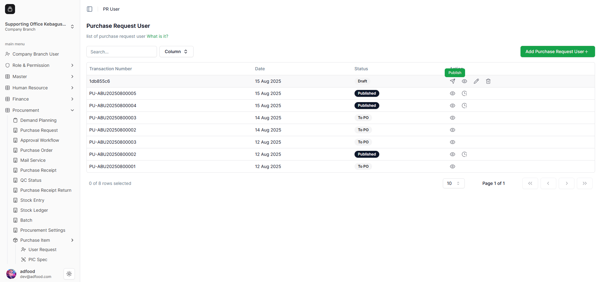
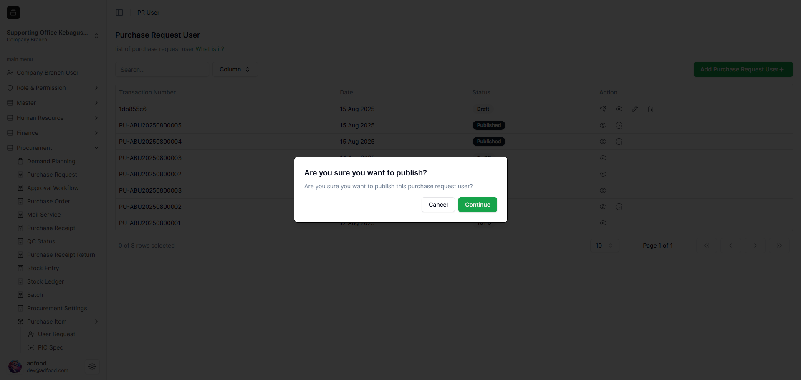
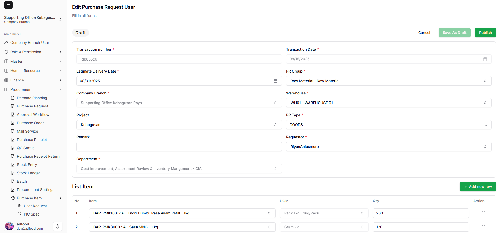
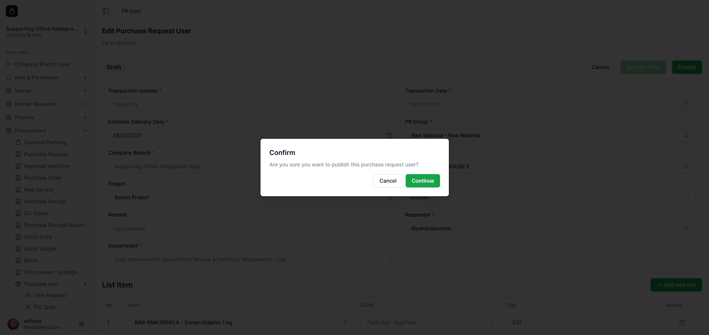
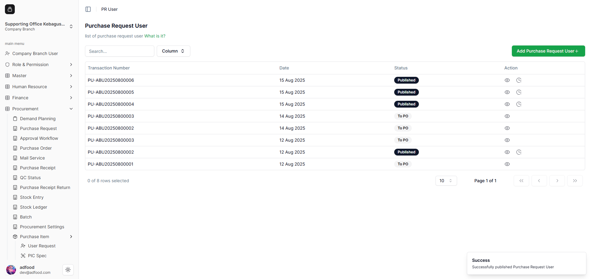

# Cara Publish Transaksi PR User

1. Pada kolom **Action**, terdapat ikon **pesawat (Publish)**, **mata (View)**, **pensil (Edit)**, dan **tong sampah (Delete)**.  
   Klik ikon **pesawat** untuk melakukan publish.

   

2. Akan muncul pop-up konfirmasi publish. Klik **Confirm** untuk melanjutkan.

   

3. Jika Anda memilih ikon **pensil**, Anda masuk ke halaman Edit.  
   Anda juga bisa melakukan publish melalui tombol **Publish** berwarna hijau.

   

4. Pop-up konfirmasi publish akan muncul kembali.

   

5. Setelah berhasil dipublish, **Transaction Number** berubah menjadi format final, misalnya:  
   `PU-ABU20250800006`

   Status berubah menjadi **Published**, dan action yang tersedia hanya **View** dan **Activity**.

   
