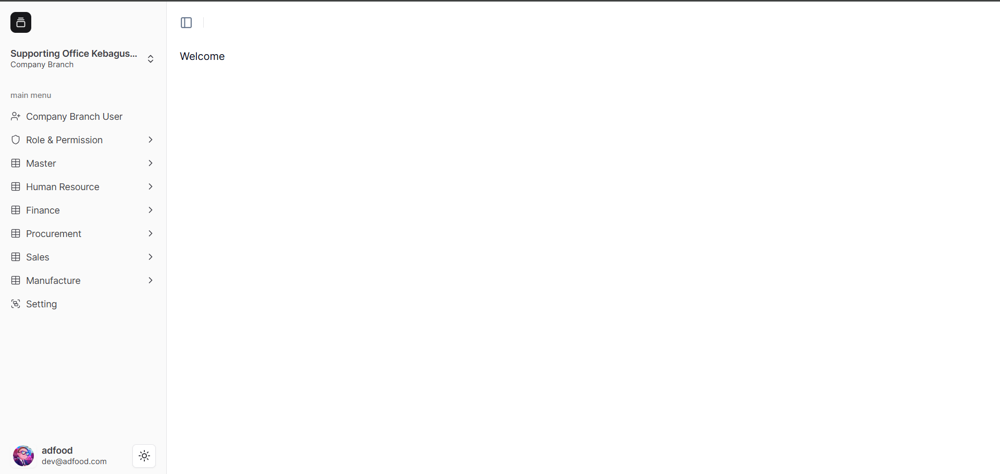
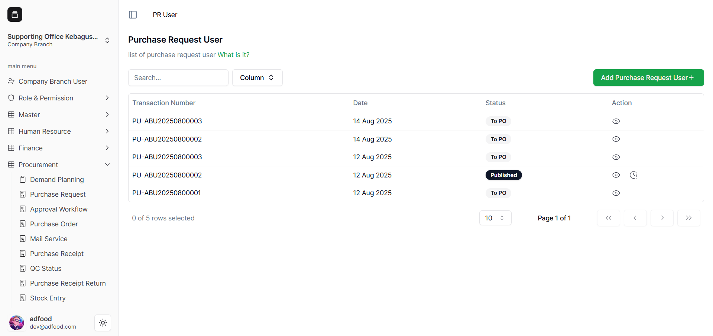
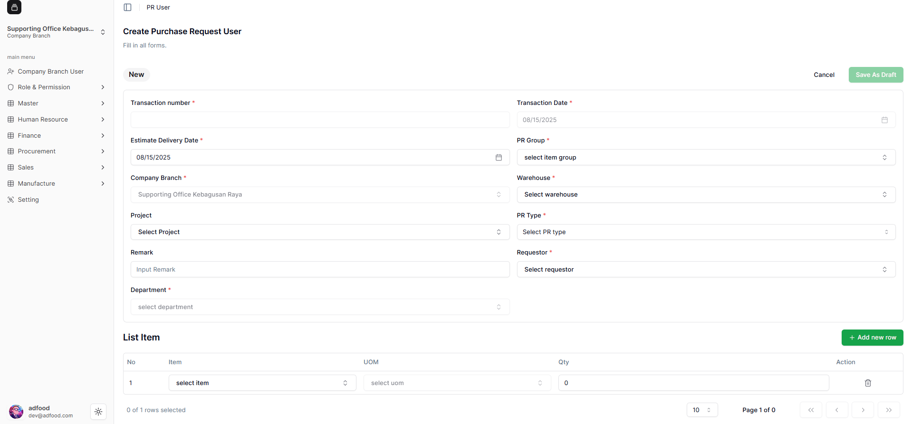

# Cara Melakukan Transaksi PR User

**Purchase Request User** digunakan untuk mengajukan permintaan barang atau jasa di dalam sistem ERP.

---

1. Masuk ke Workspace

Pastikan Anda sudah login ke sistem ERP, lalu pilih **Workspace**.  
Berikut tampilan awal setelah workspace dipilih:

2. Membuka Menu PR User

Pada **Menu Navigasi Sidebar**, pilih **Procurement** → **Purchase Item** → **PR User**.

---

3. Halaman List PR User

Anda akan melihat daftar transaksi PR yang pernah dibuat sebelumnya.  
Klik **Add Purchase Request User** untuk membuat PR baru.

---

4. Masuk ke Halaman Create PR User

Anda akan diarahkan ke halaman **Create Purchase Request User**.  
Field yang memiliki tanda `(*)` merah adalah **wajib diisi**.

