# Pengisian Field pada Create Purchase Request User

## 1. Transaction Number & Date
- **Transaction Number** bersifat otomatis (auto-generated).
- **Transaction Date** otomatis sesuai tanggal pembuatan transaksi.

## 2. Estimate Delivery Date
Pilih **Estimate Delivery Date**.  
Tanggal hanya dapat dipilih setelah tanggal hari ini.

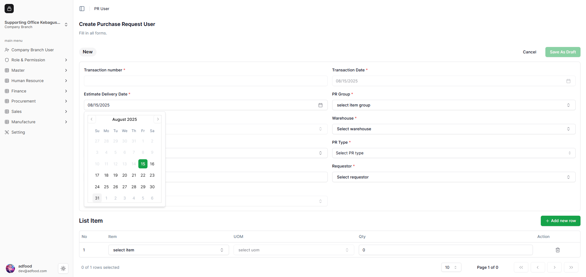

Setelah dipilih, tanggal tampil dengan format **MM/DD/YYYY**.

## 3. PR Group
Pilih **PR Group**.  
Fitur **Add** dan **Manage** tersedia untuk menambah/mengelola data PR Group.

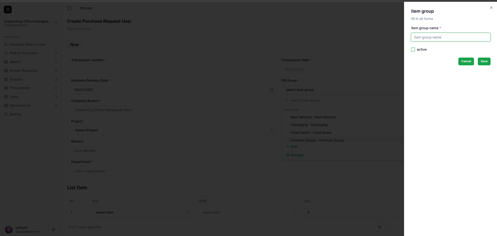

- Tampilan **Add PR Group**:

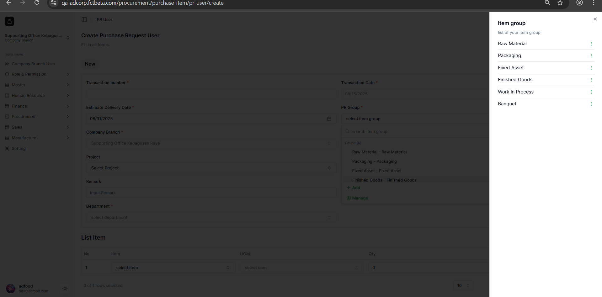

- Tampilan **Manage PR Group**:

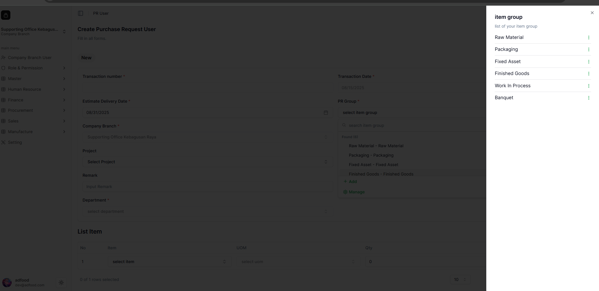

- Tampilan ketika **Edit**:

- Tampilan saat **Delete**:

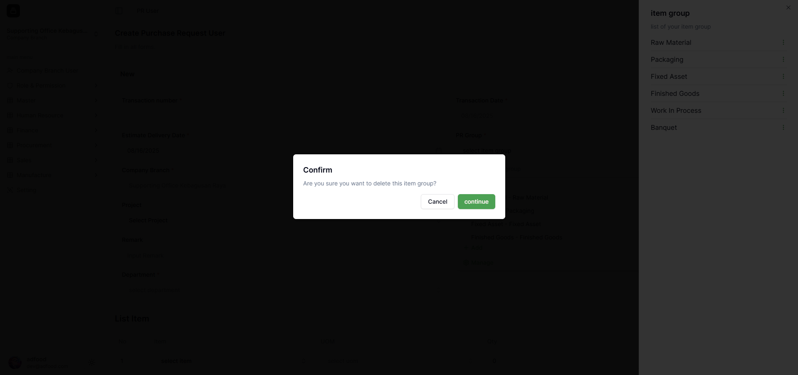

- Setelah PR Group dipilih, sistem otomatis menampilkan item sesuai group tersebut.

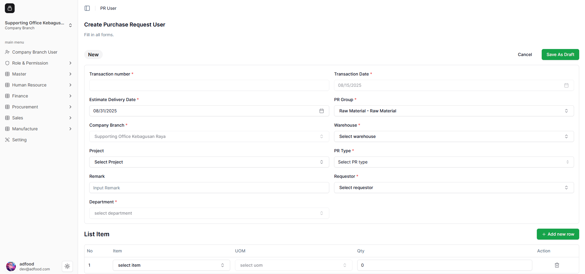

4. Company Branch
**Company Branch** otomatis mengikuti Workspace yang digunakan.

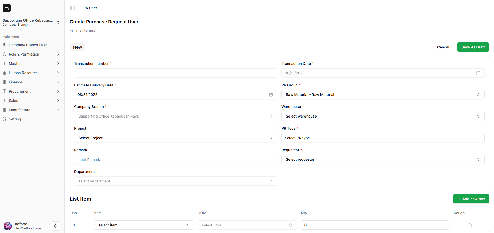

5. Warehouse
Pilih **Warehouse**.  
Beberapa dropdown memiliki fitur Add/Manage, namun tidak semuanya.

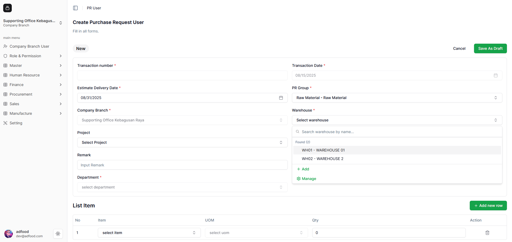

6. Project (Opsional)
Field **Project** tidak wajib.  
Klik **Add Project** jika ingin menambah project baru.

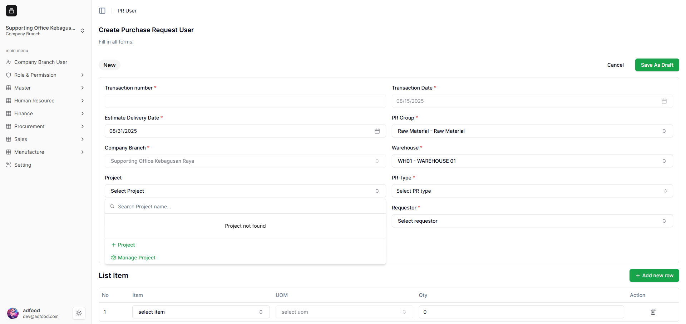

Contoh pembuatan project baru:

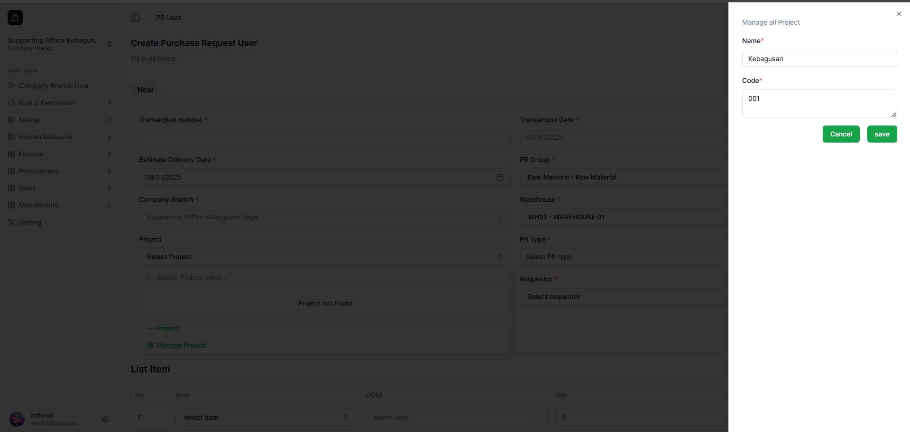

Setelah disimpan, project muncul pada dropdown:

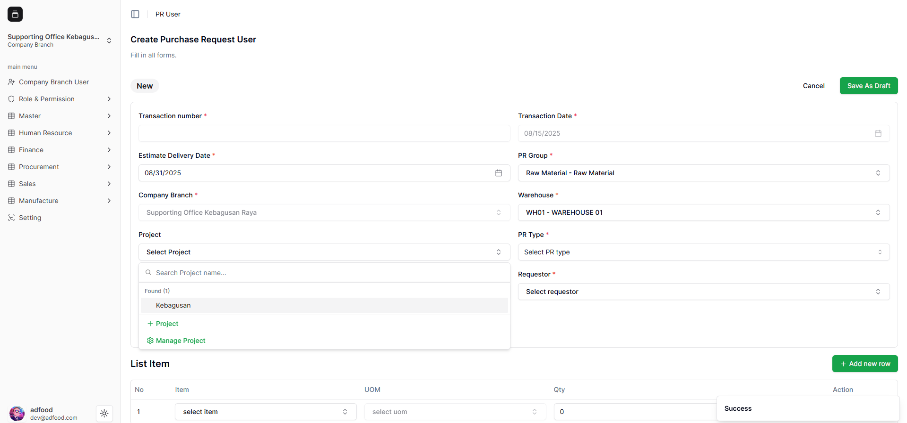

---

7. PR Type
Pilih **PR Type** (ENUM): **GOODS** atau **SERVICE**.

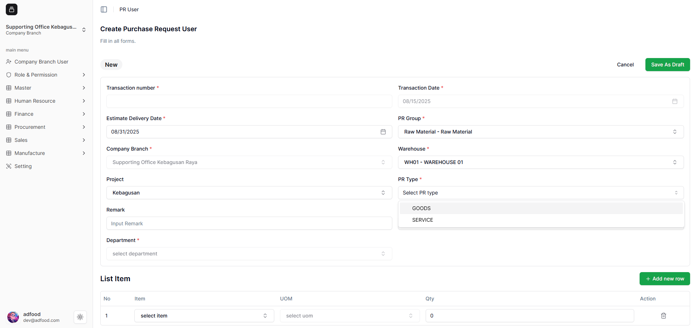

---

8. Remark
Field **Remark** bersifat opsional.

---

9. Requestor
Pilih **Requestor**.  
Field **Department** akan otomatis mengikuti data requestor.

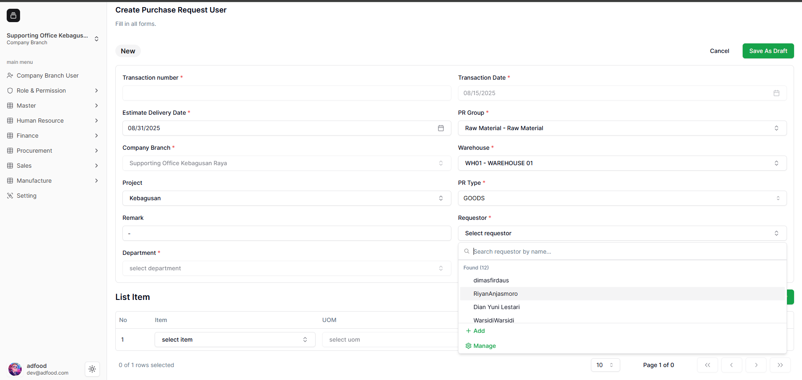

Berikut tampilan data bagian atas yang sudah terisi lengkap:

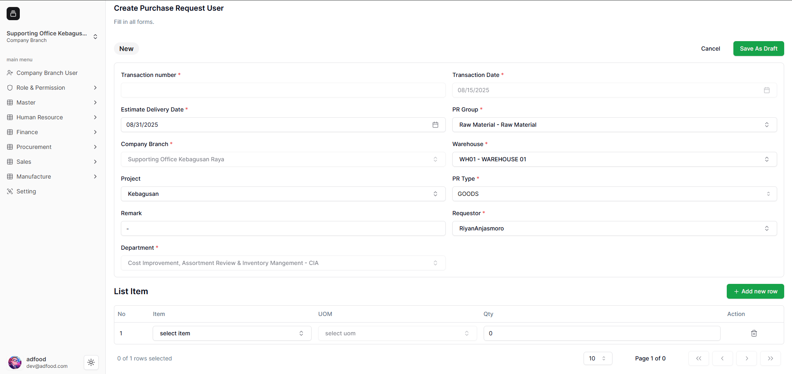

---

10. List Item
Klik **Select** untuk memilih item.  
- Item yang muncul menyesuaikan PR Group.

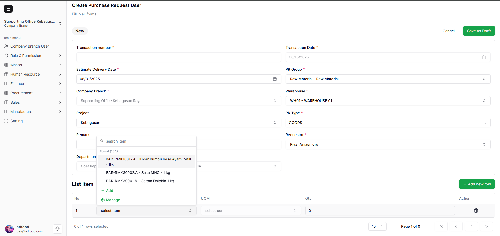

- Masukkan dua item sesuai kebutuhan.

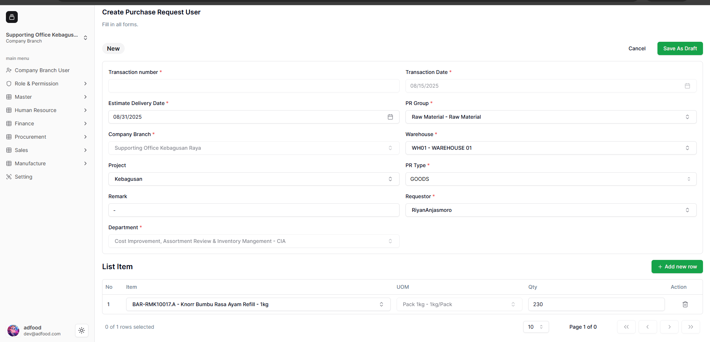

- Klik **Add New Row** untuk menambah baris item baru.

- Isi item kedua lalu klik **Save As Draft**.

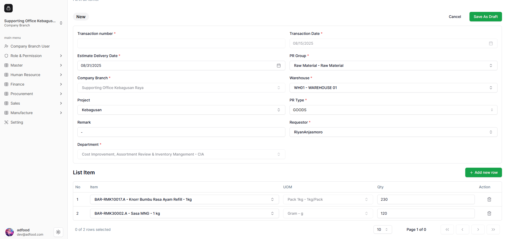

---

11 Draft Berhasil Dibuat
Transaksi PR Anda tersimpan dengan status **Draft**.

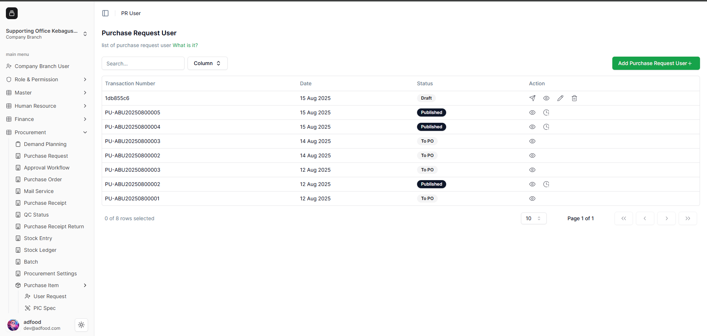
