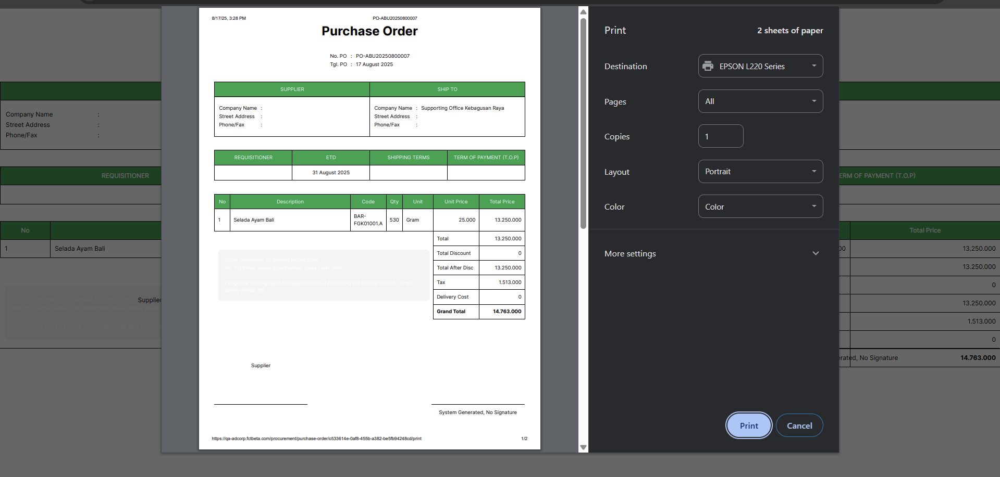
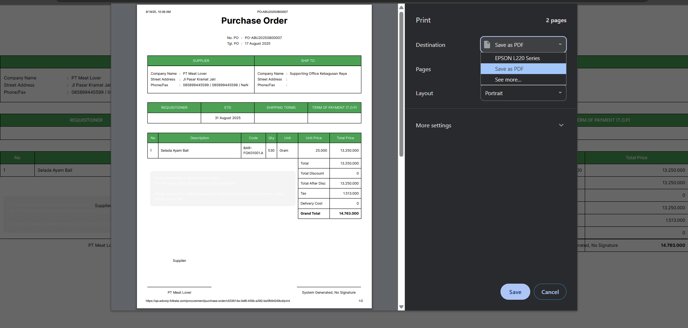
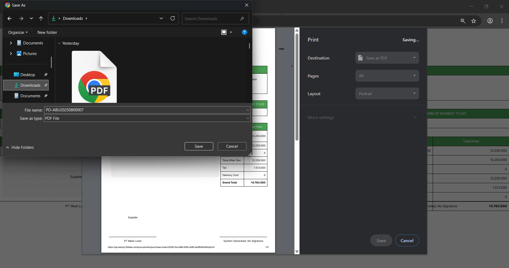

##  Cara Print Transaksi Purchase Order

1. Untuk mencetak **Purchase Order**, klik ikon **View** (mata) pada kolom Action. Lalu klik tombol **Print** di halaman **See Purchase Order**.

2. Muncul halaman **Preview Print Purchase Order**, Anda bisa mencetak atau menyimpannya sebagai PDF.

3. Ubah **Destination** menjadi **Save as PDF**, lalu klik **Save**.

4. Masukkan nama file sesuai Transaction Number, lalu simpan.

