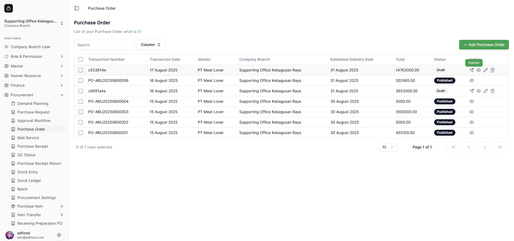
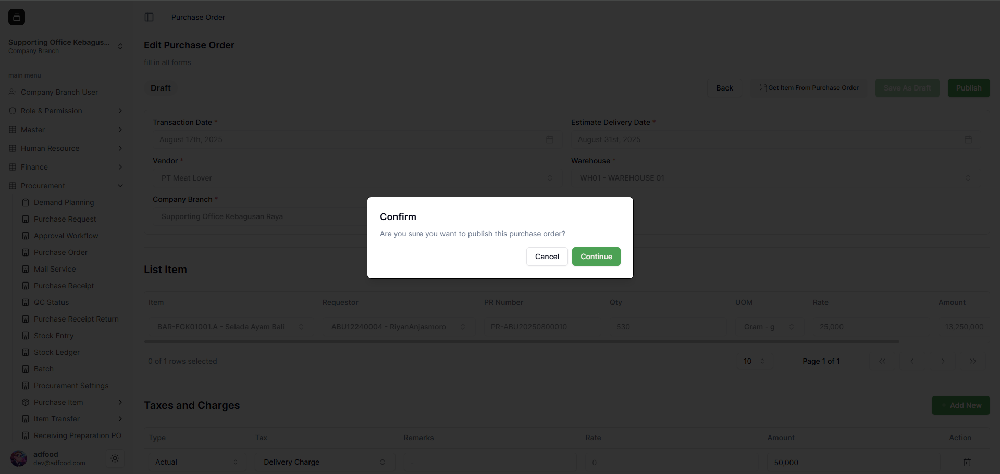

## Cara Publish Transaksi Purchase Order

Untuk melakukan **Publish** pada Purchase Order, terdapat dua cara.

1. Pada kolom **Action**, tersedia ikon **Publish, View, Edit, Delete**.  
   Cara pertama: klik ikon **pesawat kertas (Publish)**.  
   Cara kedua: klik ikon **pensil (Edit)** untuk masuk ke halaman edit.

2. Klik ikon Publish → muncul pop-up konfirmasi → klik **Continue** untuk melanjutkan.

3. Jika memilih **Edit**, Anda dapat memperbaiki data sebelum publish. Klik **Publish** di pojok kanan atas.

4. Pop-up konfirmasi akan muncul kembali.

5. Jika dilanjutkan, status berubah menjadi **Published**, dan nomor transaksi menjadi **PO-ABU20250800007**.

