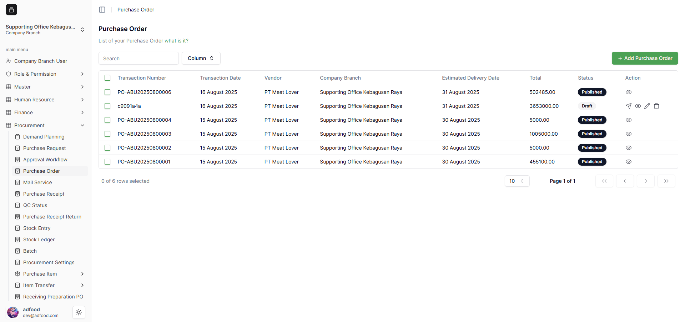
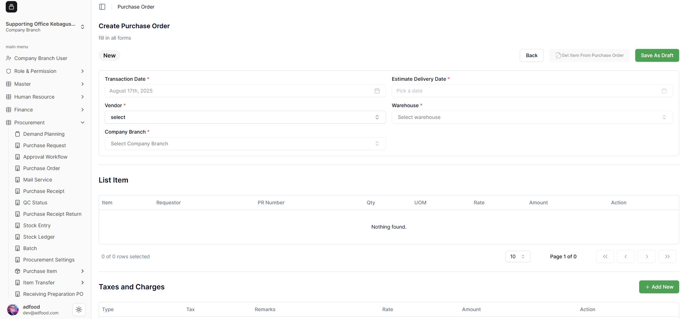
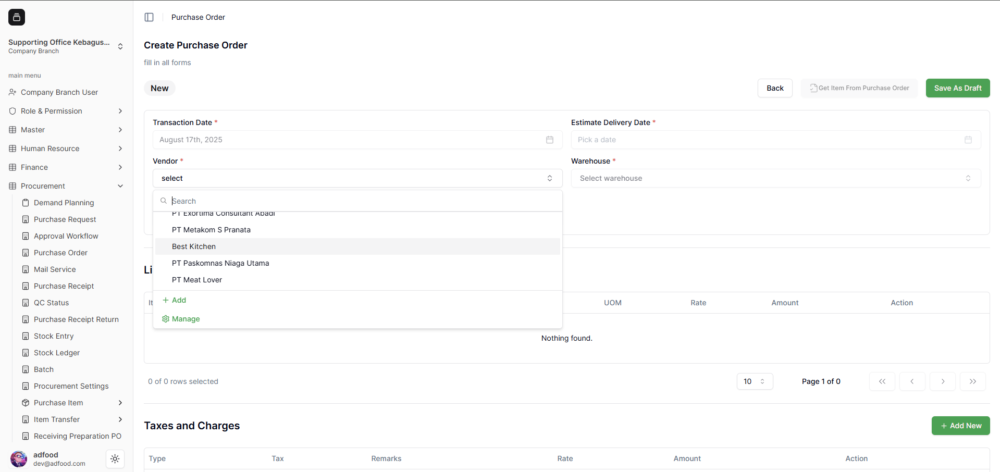
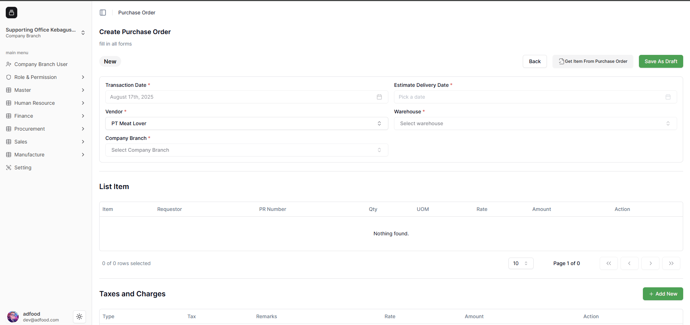
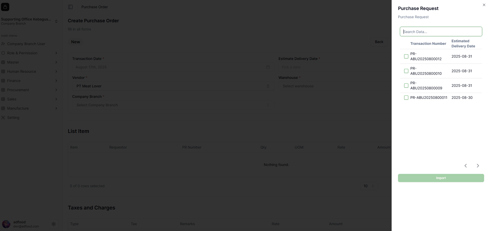
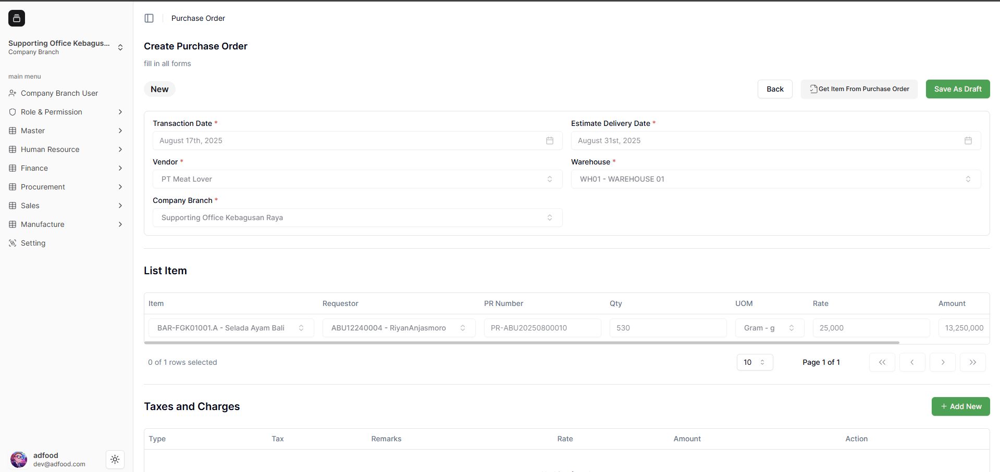
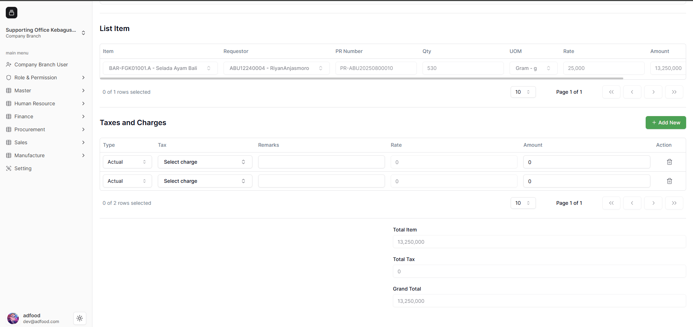
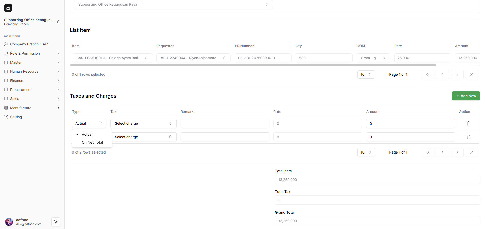
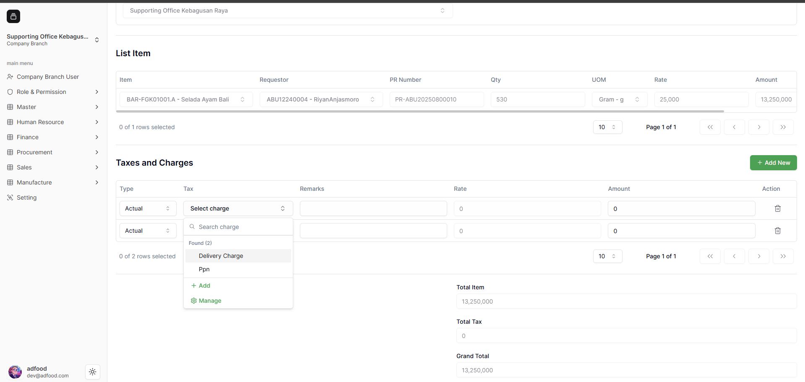
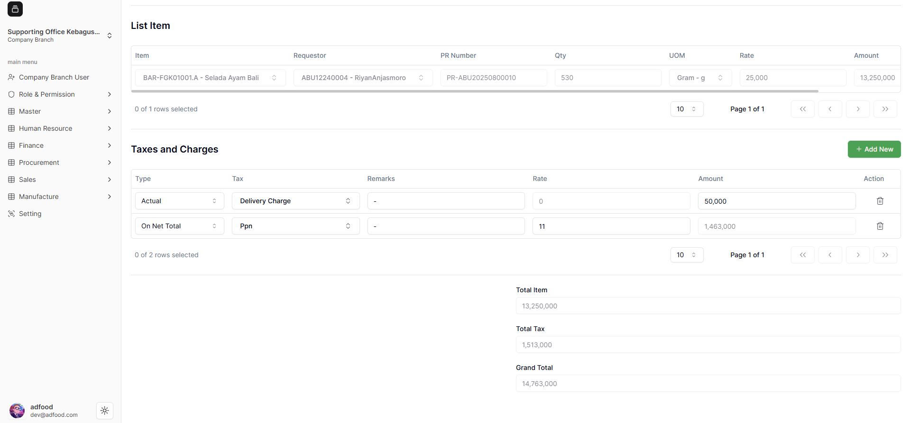

## Cara Melakukan Transaksi Purchase Order

Berikut ini akan dijelaskan langkah demi langkah cara melakukan transaksi **Purchase Order** di sistem ERP ADFood. Pada contoh ini, Workspace yang digunakan adalah **Company Branch** dengan nama *Supporting Office Kebagusan Raya*. Pastikan Anda sudah login ke sistem ERP ADFood, kemudian pilih **Workspace** yang sesuai.

1. Buka menu navigasi sidebar di sebelah kiri, pilih modul **Procurement**, lalu klik menu **Purchase Order**. Sistem akan menampilkan halaman **List Purchase Order** seperti pada gambar. Pada halaman ini, Anda dapat melihat daftar transaksi **Purchase Order** yang telah dibuat sebelumnya. Data ditampilkan dalam bentuk tabel (datatable) berisi informasi seperti *Transaction Number, Transaction Date, Vendor, Company Branch, Estimate Delivery Date, Total, Status,* dan *Action*. Untuk membuat transaksi baru, klik tombol **Add Purchase Order**.

2. Berikut adalah tampilan halaman **Create Purchase Order**, di mana Anda dapat membuat transaksi berdasarkan Purchase Request yang telah dibuat sebelumnya.

3. Transaksi **Purchase Order** hanya dapat dilakukan dengan mengambil item dari **Purchase Request**. Agar tombol **Get Item From Purchase Request** aktif, Anda harus memilih **Vendor** terlebih dahulu.

4. Contoh vendor **PT Meat Lover** dipilih, setelah itu tombol **Get Item From Purchase Request** akan aktif.

5. Sistem akan menampilkan daftar **Purchase Request** berstatus **Published**. Pilih data yang ingin diproses.

6. Checklist **Transaction Number**, kemudian klik **Import**.

7. Data dari PR akan otomatis terisi pada halaman PO.

8. Isi bagian **Taxes and Charges** jika diperlukan. Klik **Add Row** untuk menambah data.

9. Pilih **Type**:  
   - **Actual** → isi **Amount**  
   - **On Net Total** → isi **Rate** (%)

10. Pilih **Tax Name** dari dropdown.

11. Contoh pengisian:
- Actual → Delivery Charge → Amount: 50.000  
- On Net Total → PPN → Rate: 11  

Setelah selesai, klik **Save As Draft**.
