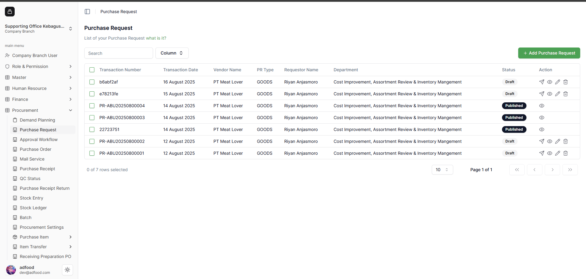
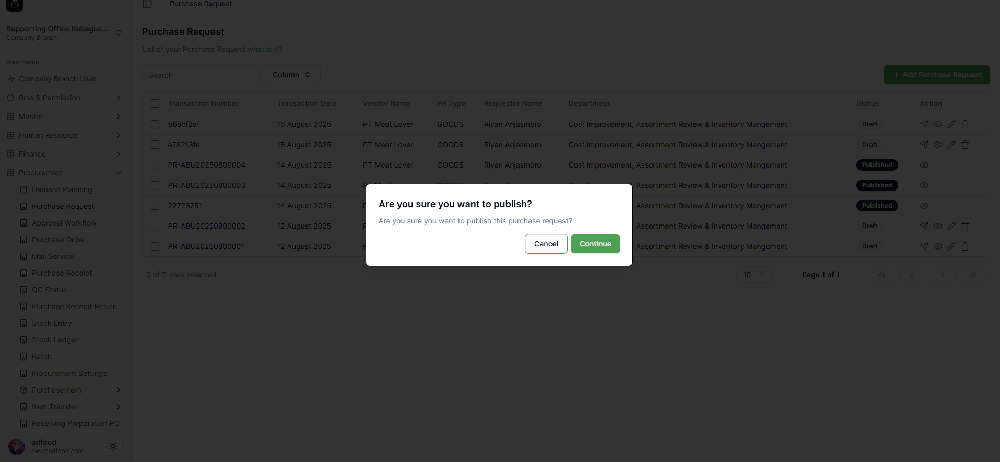
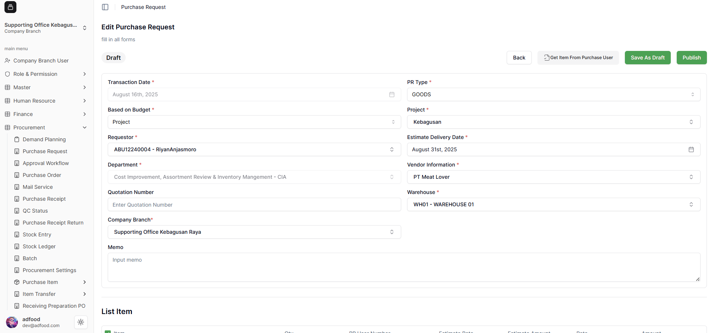
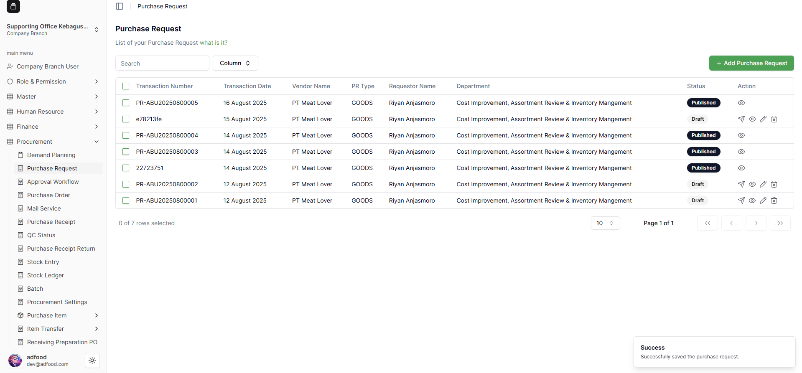

## Cara Melakukan Publish Purchase Request

Untuk melakukan **Publish** pada Purchase Request yang telah dibuat, terdapat dua cara yang dapat dilakukan. Kedua cara tersebut dijelaskan pada bagian berikut.

---

### 1. Publish Melalui Ikon Pesawat Kertas

Pada kolom **Action**, terdapat beberapa ikon, yaitu:

- **Pesawat kertas** (Publish)  
- **Mata** (View)  
- **Pensil** (Edit)  
- **Tong sampah** (Delete)

Cara pertama untuk melakukan publish adalah dengan mengklik ikon **pesawat kertas**.  
Jika kursor diarahkan pada ikon tersebut, akan muncul keterangan **Publish**, dan Anda dapat mem-publish Purchase Request langsung melalui ikon ini.

Cara kedua adalah dengan mengklik ikon **pensil** untuk masuk ke halaman **Edit Purchase Request**.

---

### 2. Konfirmasi Publish Melalui Ikon Pesawat Kertas

Setelah mengklik ikon pesawat kertas untuk melakukan **Publish**, akan muncul pop-up konfirmasi dengan pesan:

> “Apakah Anda yakin ingin mem-publish Purchase Request ini?”

- Jika memilih **Cancel**, proses publish akan dibatalkan.  
- Jika memilih **Confirm**, maka Purchase Request dengan **Transaction Number `b6abf2af`** akan berhasil dipublish dan statusnya berubah menjadi **Published**.

---

### 3. Publish Melalui Halaman Edit Purchase Request

Jika Anda mengklik ikon **pensil**, sistem akan mengarahkan ke halaman **Edit Purchase Request**.  
Pada halaman ini Anda dapat:

- Melakukan perubahan apabila terdapat kesalahan input  
- Menyimpannya kembali sebagai **Draft**  
- Atau melakukan **Publish** jika data sudah benar

Untuk publish, klik tombol **Publish** berwarna hijau di bagian kanan atas.  
Setelah itu, akan muncul pop-up konfirmasi untuk memastikan proses publish.

---

### 4. Konfirmasi Publish dari Halaman Edit

Setelah tombol **Publish** diklik, akan muncul pop-up konfirmasi dengan pesan:

> “Apakah Anda yakin ingin mem-publish Purchase Request ini?”

- Jika memilih **Cancel**, proses publish dibatalkan  
- Jika memilih **Confirm**, maka Purchase Request dengan **Transaction Number `b6abf2af`** akan berhasil dipublish  
- Setelah berhasil dipublish, Transaction Number akan berubah menjadi **`PR-ABU20250800005`**

