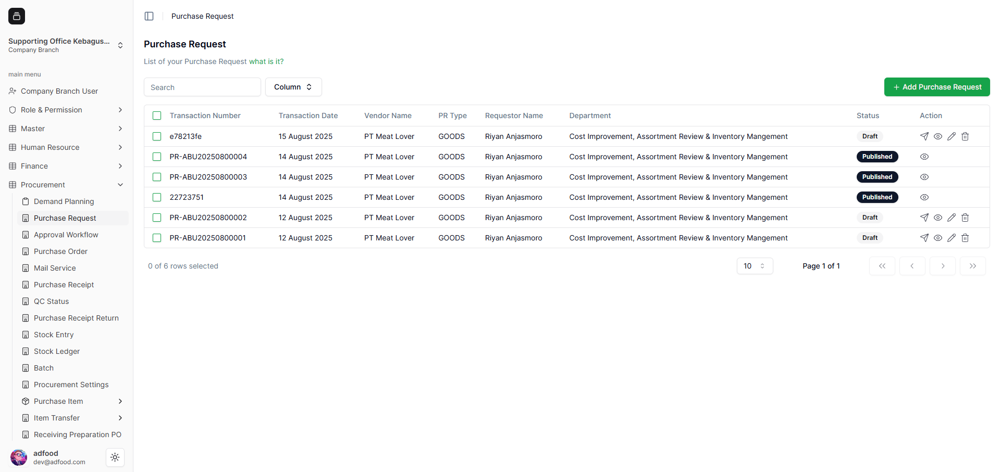
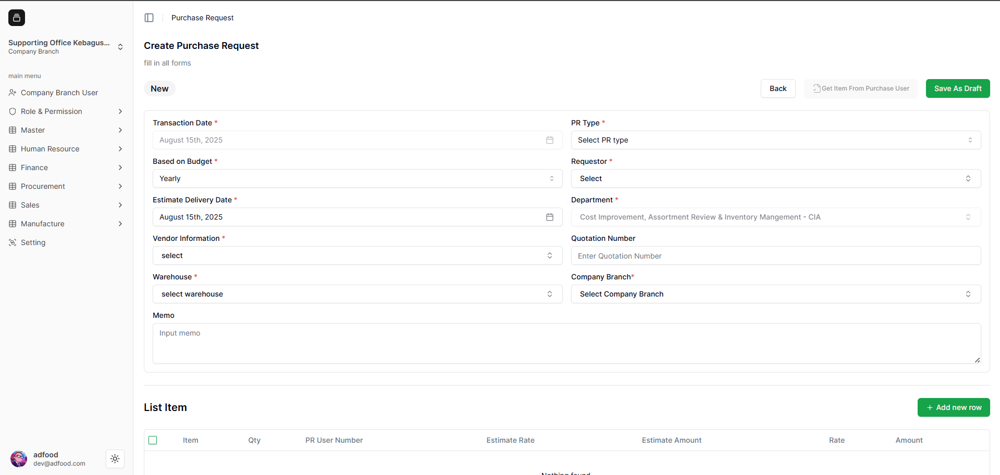
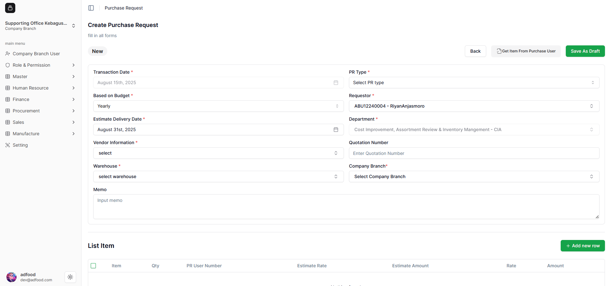
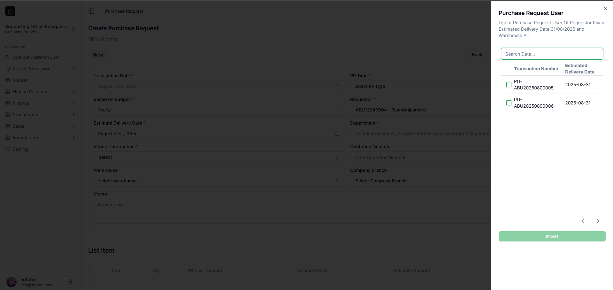
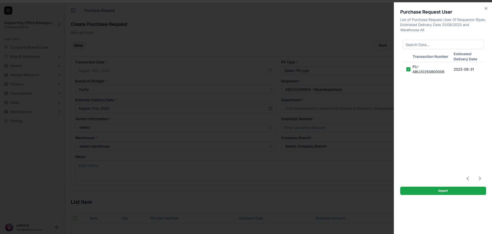
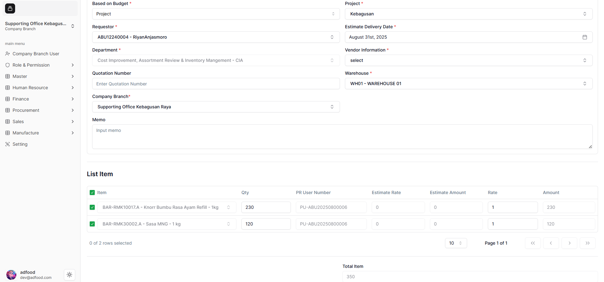
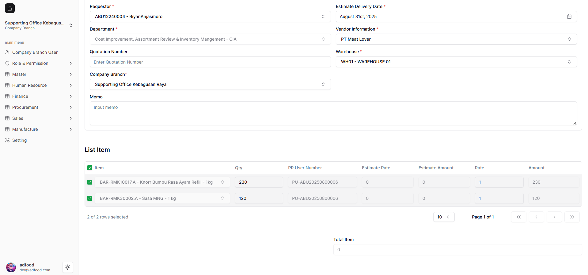
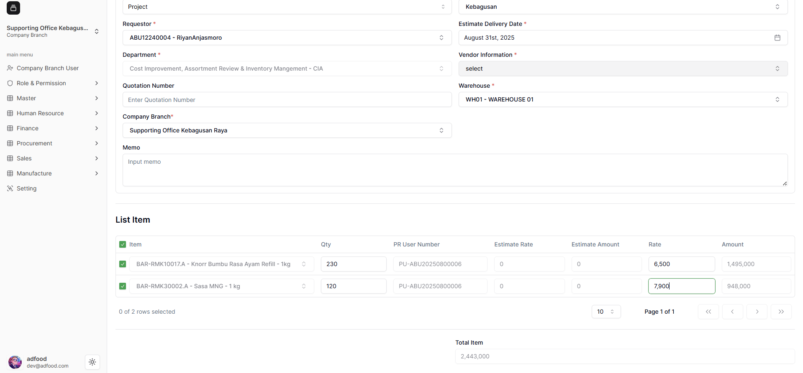
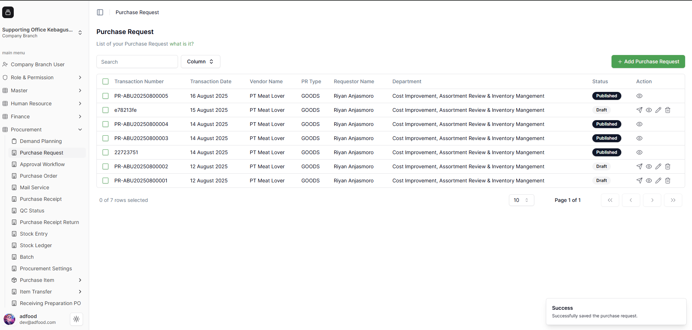

1. Buka menu navigasi sidebar di sebelah kiri, pilih modul **Procurement**, lalu klik menu **Purchase Request**.  
   Sistem akan menampilkan halaman **List Purchase Request** seperti pada gambar di bawah.  
   Pada halaman ini, Anda dapat melihat daftar transaksi Purchase Request yang telah dibuat sebelumnya.  
   Data ditampilkan dalam bentuk tabel (datatable) yang berisi informasi seperti **Transaction Number, Date, Vendor, PR Type, Requestor Name, Department, Status, dan Action**.  
   Untuk membuat transaksi baru, klik tombol **Add Purchase Request** berwarna hijau di sisi kanan atas halaman.

   

2. Berikut adalah tampilan halaman **Create Purchase Request**, di mana Anda dapat membuat transaksi berdasarkan PR User yang telah dibuat sebelumnya.  
   Secara keseluruhan, tampilan halaman ini dapat dilihat pada gambar di bawah.  
   Pada halaman ini, Anda perlu mengisi data untuk membuat transaksi baru.  
   Selain itu, terlihat juga label/tag **New** yang menandakan bahwa transaksi tersebut merupakan transaksi baru yang sedang dibuat.

   

3. Terdapat perbedaan dalam cara pembuatan transaksi di halaman **Create Purchase Request**.  
   Anda harus melakukan **Get Item** atau mengambil data dari **PR User**.  
   Caranya, klik tombol **`Get Item From Purchase User`** yang berada di samping tombol **Save As Draft**.

   Agar tombol tersebut aktif, Anda harus memilih terlebih dahulu siapa **Requestor**-nya.  
   Pada contoh ini, Requestor yang digunakan adalah *Riyan Anjasmoro*.  
   Anda juga harus teliti dalam mengisi bagian **Estimate Delivery Date**, karena pencarian data PR User yang telah dipublish bergantung pada kombinasi **Requestor** dan **Estimate Delivery Date**.

   

4. Sebagai contoh, pilih **Estimate Delivery Date** pada tanggal **31 Agustus 2025**.  
   Setelah itu, klik tombol **Get Item From Purchase User**, maka sistem akan menampilkan data PR User dengan tanggal tersebut.  
   Untuk memilih data, beri tanda checklist pada **Transaction Number** yang sesuai.

   

5. Pada contoh ini, digunakan **Transaction Number PU-ABU20250800006**.  
   Jika data berhasil dipilih, maka muncul tanda checklist di depan Transaction Number tersebut.  
   Data yang dapat dipilih hanya satu, dan tombol **Import** akan otomatis aktif.  
   Klik tombol **Import** untuk melanjutkan proses.

   

6. Data dari PR User yang Anda pilih akan otomatis terbaca di halaman ini.  
   Sebagian besar field sudah terisi, dan List Item tampil sesuai dengan PR User yang dipilih.  
   Selanjutnya, isi **Qty** dan **Rate** pada setiap item.  
   Pada contoh ini terdapat 2 item, sehingga Anda harus mengisi Qty dan Rate untuk keduanya.  
   Sistem akan otomatis menghitung **Total Amount**.

   

7. Jangan lupa mengisi **Vendor Name**, karena field ini wajib diisi (mandatory).

   

8. Berikut tampilan ketika Qty dan Rate sudah diisi.  
   Sistem otomatis menghitung nilai **Amount** setiap item dan **Total Amount** keseluruhan.

   

9. Jika semua data pada halaman **Create Purchase Request** telah terisi, langkah terakhir adalah menyimpannya dengan mengklik tombol **Save As Draft** berwarna hijau di bagian kanan atas.

   
