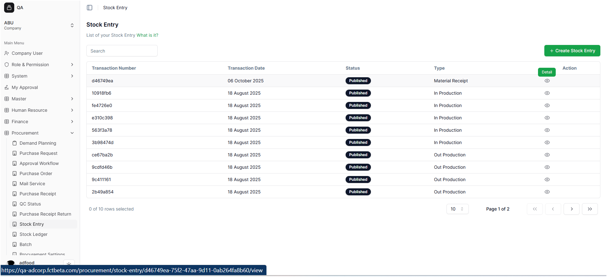
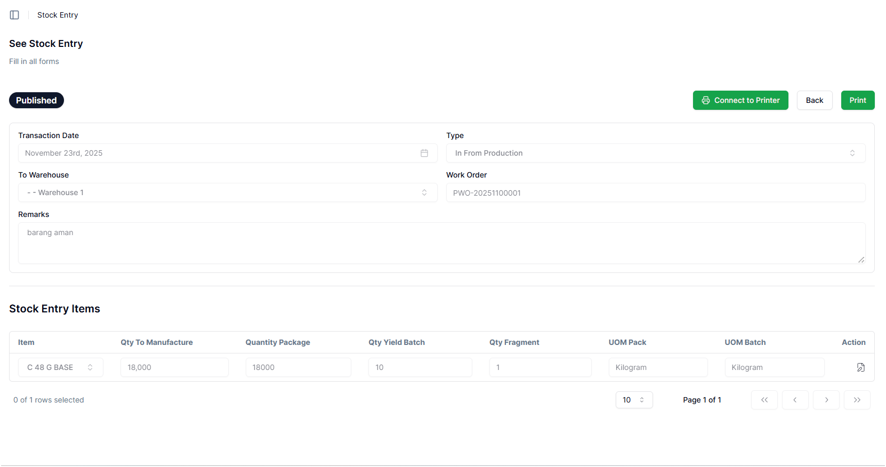
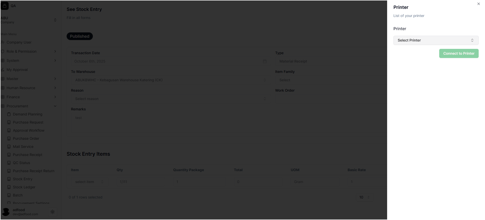
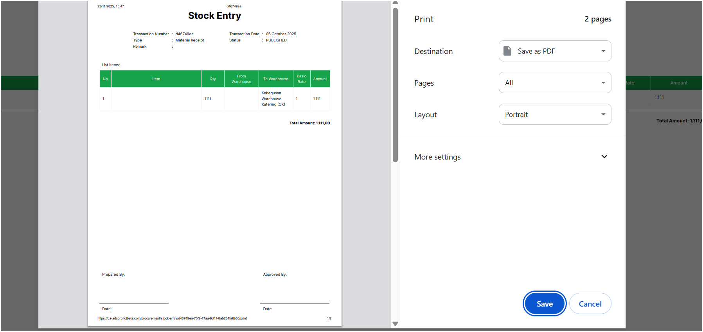
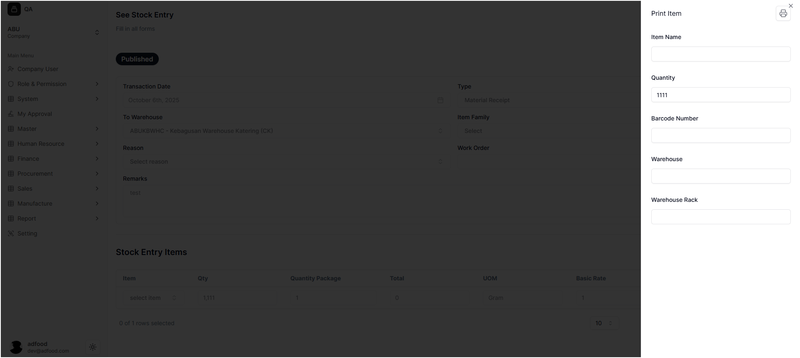
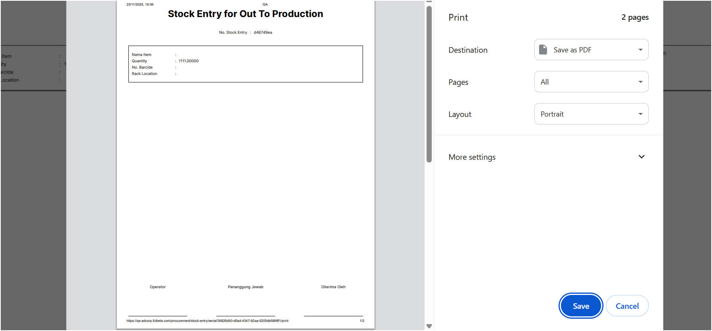
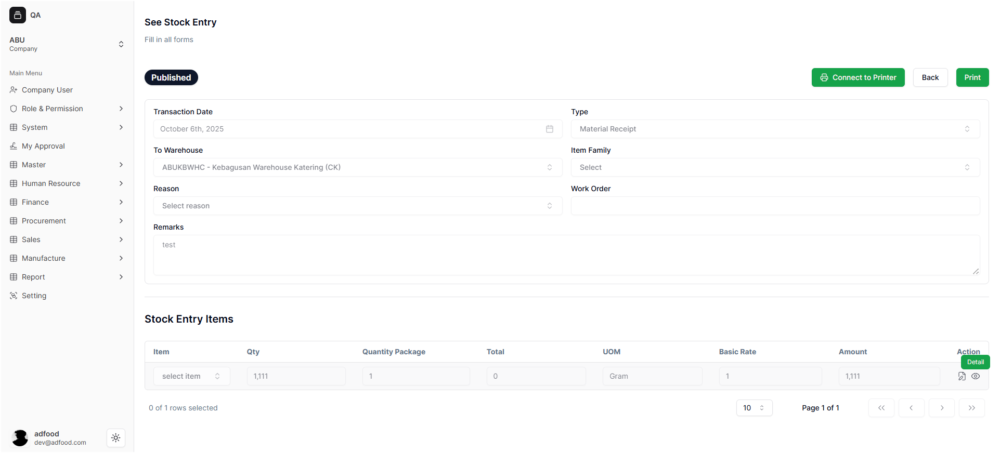
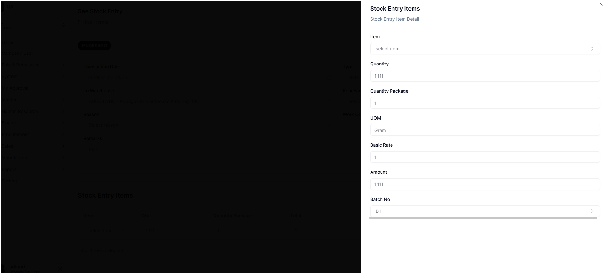

# Setelah Menyelesaikan Stock Entry

Setelah user menyelesaikan proses pengisian dan melakukan **Publish** pada Stock Entry, sistem akan otomatis mengarahkan kembali ke halaman **Stock Entry**.  
Pada tahap ini, dokumen Stock Entry dianggap **sudah final** dan siap digunakan untuk proses berikutnya seperti pengecekan gudang, pencetakan dokumen, dan verifikasi.

---

## 1. Cara Melihat View atau Detail

- Setelah kembali ke halaman **Stock Entry**, user akan menemukan ikon **mata (detail)** pada baris transaksi.  
  Ikon ini digunakan untuk melihat detail dokumen Stock Entry yang sudah dibuat sebelumnya.

  

---

### Masuk ke Halaman See Stock Entry

- Setelah menekan ikon mata, user akan diarahkan ke halaman **See Stock Entry**.  
  Pada halaman ini:
  - Status dokumen otomatis **Published**.
  - User **tidak dapat mengedit atau menambah data** lagi.
  - User hanya dapat:
    - **Connect to Printer** → mencetak langsung tanpa download  
    - **Print** → menampilkan tampilan dokumen untuk di-download  
    - **Cancel** → kembali ke halaman Stock Entry  

  

---

## 2. Fitur **Connect to Printer**

- Jika user menekan **Connect to Printer**, sistem akan menampilkan pilihan untuk menghubungkan perangkat printer.
- User dapat langsung mencetak Stock Entry tanpa harus mendownload file-nya.

Jika tidak jadi mencetak, user dapat menekan tombol **X (close)** untuk kembali.

---

## 3. Fitur **Print (Download & Preview)**

- Jika user menekan **Print**, sistem akan memunculkan notifikasi bahwa file siap untuk ditampilkan dan bisa di-download.
- Setelah proses preview selesai, user akan kembali ke halaman **See Stock Entry**.

---

## 4. Melihat & Mencetak *Stock Entry Items*

Pada bagian **Stock Entry Items**, user akan melihat:

- Ikon **kertas + mata** → untuk melihat item yang aktif  
- Ikon **printer** → untuk mencetak item secara langsung  
- Ikon **mata (detail)** → untuk melihat detail per item  

### 4.1 Mencetak Stock Entry Items

- Jika user menekan ikon **printer** pada baris item, sistem akan menampilkan pop-up untuk mencetak **Stock Entry Items**.

- Setelah menekan ikon print pada pop-up tersebut, sistem akan menampilkan tampilan print.  
  Jika ingin kembali ke halaman **See Stock Entry**, tekan **Cancel**.

---

### 4.2 Melihat Detail Stock Entry Items

- Pada bagian sebelah kanan, terdapat ikon **mata (detail)** untuk membuka rincian lengkap dari item.

- Jika ikon tersebut ditekan, sistem akan menampilkan pop-up berisi detail lengkap dari **Stock Entry Items** yang sudah dibuat.

Pop-up ini berguna untuk melihat informasi item secara rinci tanpa harus mencetaknya.

---

