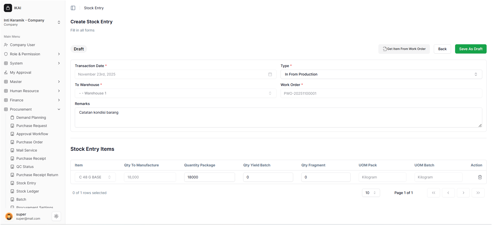
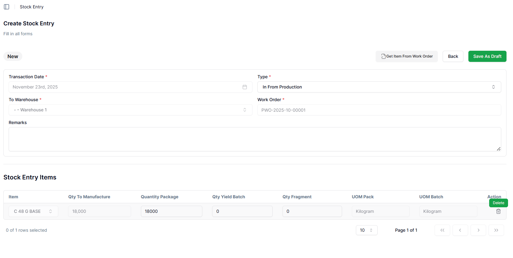
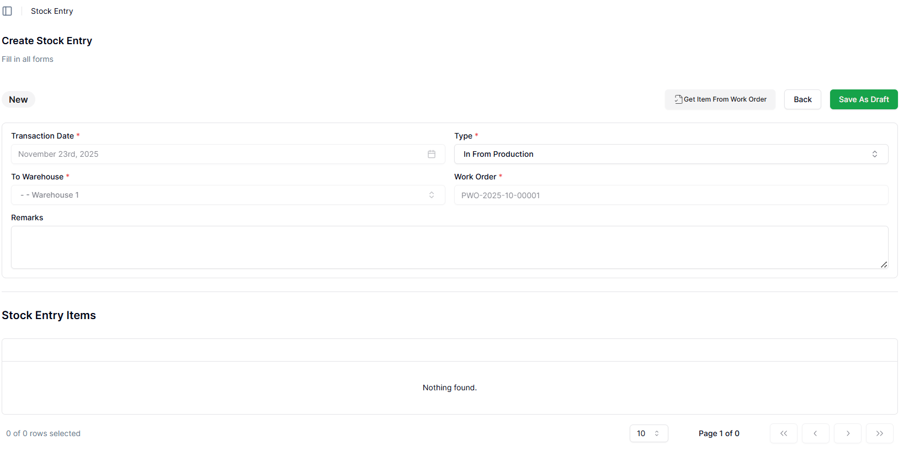
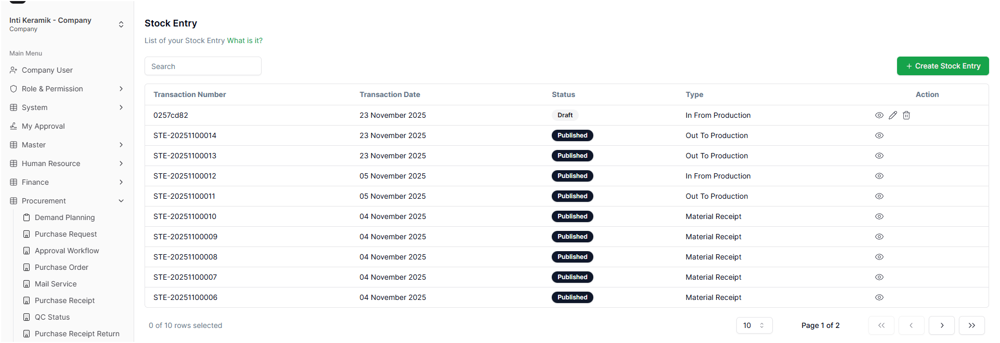

# Proses In From Production

Pada halaman **Create Stock Entry**, user dapat melakukan proses pemasukan material atau hasil produksi (*In From Production*) berdasarkan Work Order yang telah diselesaikan. Panduan berikut memberikan langkah-langkah lengkap agar proses dapat dilakukan dengan tepat dan mudah dipahami.

---

## 1. Transaction Date

- Bagian **Transaction Date** **tidak dapat diedit** oleh user.
- Sistem otomatis mengisi tanggal sesuai hari saat dokumen dibuat.
- Fitur ini memastikan pencatatan transaksi tetap akurat dan sesuai waktu barang masuk ke gudang, sehingga setiap pencatatan memiliki *timestamp* yang benar.

---

## 2. Memilih Jenis Transaksi (Type)

- Pada bagian **Type**, user harus memilih **In From Production**.
- Jenis transaksi ini digunakan untuk mencatat material atau barang jadi yang kembali ke gudang setelah proses produksi selesai.
- Pemilihan tipe transaksi yang tepat sangat penting agar data perpindahan barang terekam sesuai alur produksi.

---

## 3. Mengambil Item dari Work Order

Setelah memilih *In From Production*, user perlu menekan tombol:

### **Get Item From Work Order**

Tombol ini ditandai dengan **kotak biru** pada gambar berikut:

Ketika tombol diklik, sistem akan menampilkan pop-up berisi daftar Work Order yang sudah melewati proses produksi dan siap diproses sebagai pemasukan barang ke gudang.

---

## 4. Memilih Work Order yang Ingin Digunakan

Pada pop-up tersebut, user akan melihat daftar Work Order yang telah diproses pada tahap produksi.

### Langkah-langkah:

1. Beri centang pada Work Order yang ingin digunakan.  
2. Tekan tombol **Import** untuk memuat data Work Order ke dokumen Stock Entry.

---

## 5. Data Stock Entry Terisi Otomatis

Setelah menekan **Import**, user akan kembali ke halaman **Create Stock Entry** dan sistem akan otomatis mengisi beberapa data sesuai Work Order yang dipilih. Hal ini bertujuan untuk menghindari kesalahan input manual.

Data yang terisi otomatis meliputi:

- **Transaction Date** → tidak dapat diubah  
- **Type** → otomatis menjadi *In From Production*  
- **To Warehouse** → terisi sesuai pengaturan produksi pada Work Order  
- **Work Order** → otomatis sesuai pilihan user  
- **Remarks** → dapat diubah atau ditambah sesuai kebutuhan  
- **Stock Entry Items** → dapat diubah jika diperlukan  

### Contoh penggunaan **Remarks**:

- Catatan kondisi barang yang masuk  
- Nomor batch atau lot produksi  
- Informasi operator produksi  
- Catatan QC (Quality Control)  
- Catatan internal untuk divisi produksi atau gudang  

---

## 6. Pengisian Bagian *Stock Entry Items*

Pada bagian **Stock Entry Items**, user dapat mengisi atau menyesuaikan beberapa data berikut sesuai kebutuhan:

1. **Qty To Manufacture**  
   Jumlah yang direncanakan untuk diproduksi pada Work Order.

2. **Quantity Package**  
   Jumlah kemasan yang diterima dalam bentuk paket/box/bundle.

3. **Qty Yield Batch**  
   Jumlah hasil produksi yang dihasilkan per batch.

4. **Qty Fragment**  
   Jumlah pecahan/fragment hasil produksi, jika proses menghasilkan potongan barang.

Penyesuaian data ini penting untuk memastikan sistem mencatat jumlah aktual yang masuk ke gudang.

---

### Menghapus Item pada *Stock Entry Items*

- Jika terdapat item yang tidak diperlukan, user dapat menekan ikon **Delete (tempat sampah)** pada baris item tersebut.

- Setelah menekan ikon delete, akan muncul pop-up konfirmasi:

  **Stock Entry Items**  
  *Confirm*  
  *Are you sure you want to delete this stock entry item?*

  - **Cancel** → kembali ke halaman Stock Entry Items  
  - **Continue** → menghapus item tersebut  

Setelah menekan **Continue**, item akan terhapus secara otomatis.

---

## 7. Menyelesaikan Stock Entry

Jika seluruh data sudah benar dan sesuai kondisi produksi, user dapat melakukan **Submit** dokumen.

Setelah proses submit selesai, sistem akan mengarahkan user kembali ke halaman **Stock Entry List** sebagai tanda bahwa dokumen berhasil dibuat dan tercatat di sistem.

Dokumen Stock Entry kini resmi tersimpan dan barang hasil produksi telah tercatat masuk ke gudang sesuai dengan Work Order terkait.

---
