# Melakukan Perubahan Proses In From Production

Halaman ini menjelaskan bagaimana user dapat melihat detail, mengedit, dan menghapus transaksi **In From Production** pada modul **Stock Entry**. Seluruh proses dijelaskan langkah demi langkah agar user dapat memahami alur dengan mudah.

---

## 1. Cara Melihat View atau Detail

- Setelah kembali ke halaman **Stock Entry**, terdapat ikon **mata (detail)**.  
  Pada bagian ini, user dapat melihat detail transaksi **In From Production** yang telah dibuat.  
  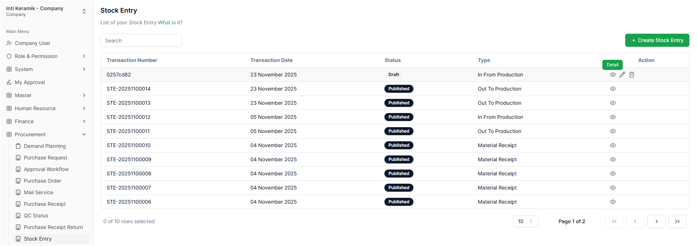

- Setelah menekan ikon tersebut, user akan masuk ke halaman **See Stock Entry**.  
  Pada halaman ini, user **tidak dapat mengisi atau mengedit** data yang sudah ada. User hanya dapat:
  - menekan **Cancel** untuk kembali  
  - atau **Publish** untuk menyimpan transaksi In From Production  
  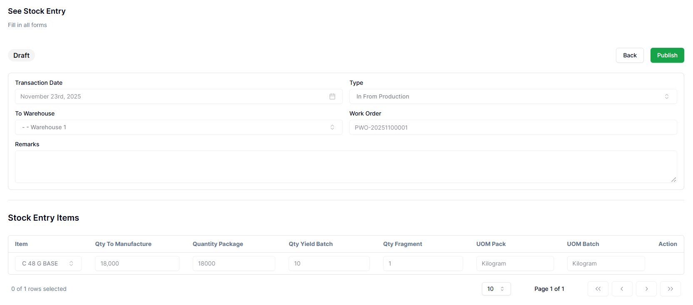

- Setelah menekan tombol **Publish**, user akan diarahkan ke pop-up konfirmasi yang berisi:

  **Confirm**  
  *Are you sure you want to submit this stock entry?*

  - **Cancel** → kembali ke halaman **See Stock Entry**  
  - **Continue** → data yang disimpan akan otomatis tersimpan sesuai yang dibuat  
  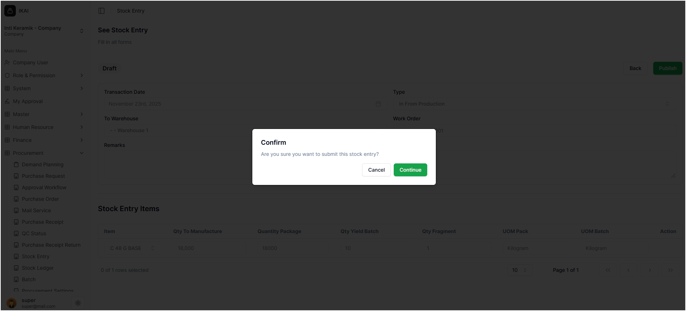

- Setelah proses selesai, user akan kembali ke halaman **Stock Entry**.  
  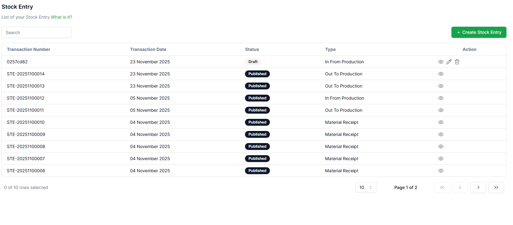

---

## 2. Mengubah dengan Edit

- Untuk melakukan perubahan, setelah kembali ke halaman **Stock Entry**, user dapat mengubah proses **In From Production** dengan menekan ikon **pensil (edit)**.  
  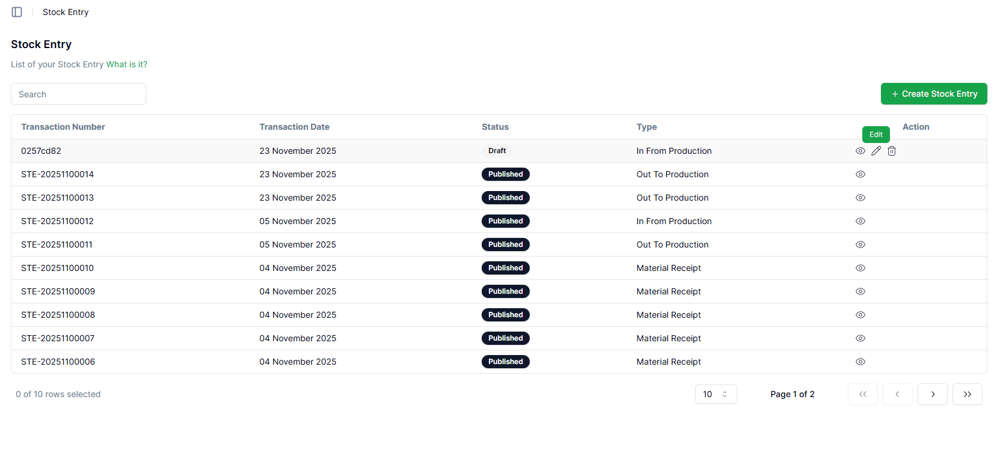

- Setelah itu, user akan diarahkan ke halaman **Edit Stock Entry**.  
  Pada halaman ini, user dapat:
  - menekan tombol **Save As Draft**  
  - menekan tombol **Publish**  
  - mengisi atau memperbarui bagian **Remarks** sesuai kebutuhan  
  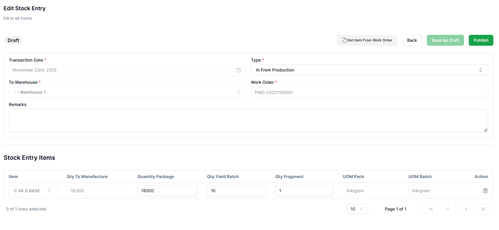

- Setelah mengubah atau mengisi bagian **Remarks**, user dapat menyimpan perubahan dengan:
  - **Save As Draft** → jika ingin menyimpan sementara  
  - **Publish** → jika ingin menyimpan dan menerapkan perubahan  
  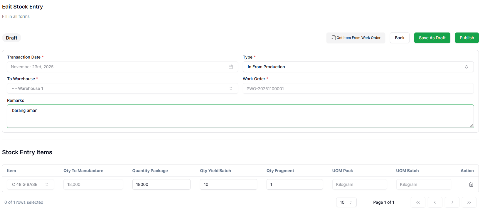

- Jika memilih **Publish**, user akan mendapatkan pop-up konfirmasi:

  **Confirm**  
  *Are you sure you want to submit this stock entry?*

  - **Cancel** → kembali tanpa melakukan publish  
  - **Continue** → melakukan publish perubahan  
  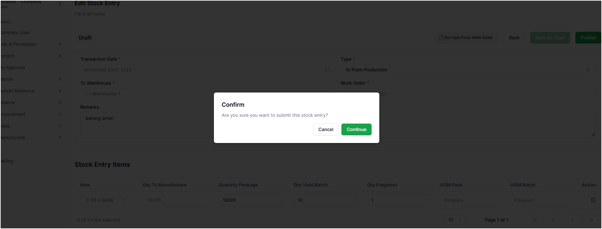

- Setelah publish selesai, user akan kembali ke halaman **Stock Entry**.  
  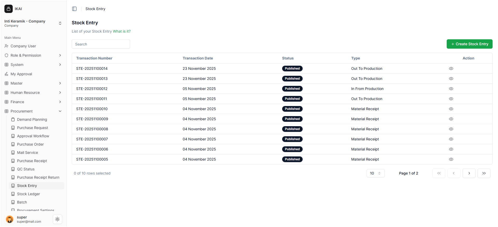

---

## 3. Menghapus In From Production

- Untuk menghapus transaksi **In From Production**, user dapat menekan ikon **tempat sampah (delete)** pada halaman **Stock Entry**.  
  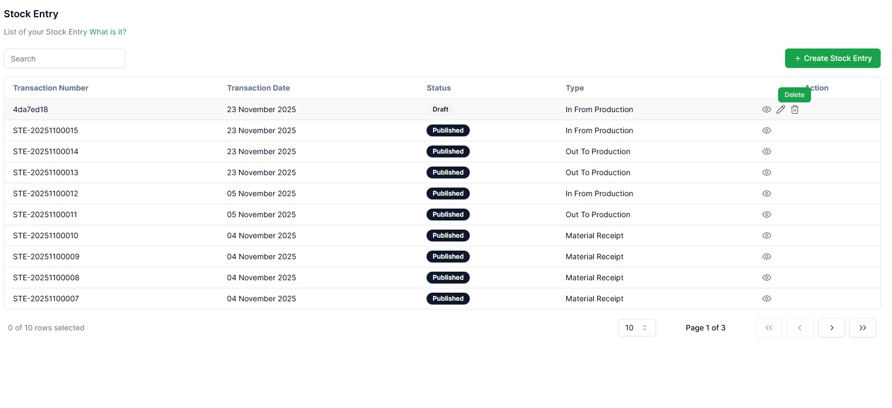

- Setelah menekan ikon delete, akan muncul pop-up informasi:

  **Confirm**  
  *Are you sure you want to delete this stock entry?*

  - **Cancel** → kembali ke halaman awal  
  - **Continue** → menghapus transaksi In From Production  
  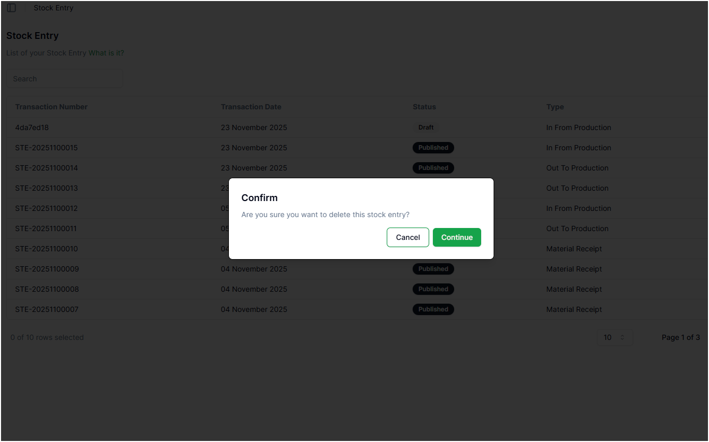

- Setelah menekan **Continue**, user akan diarahkan kembali ke halaman utama dan akan muncul notifikasi:

  **successful deleted stock entry**

  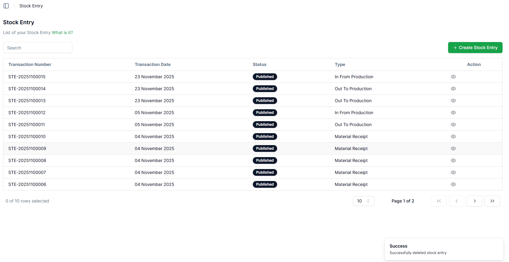

- Setelah proses selesai, sistem mengarahkan user kembali ke halaman **Stock Entry**.  
  

---

