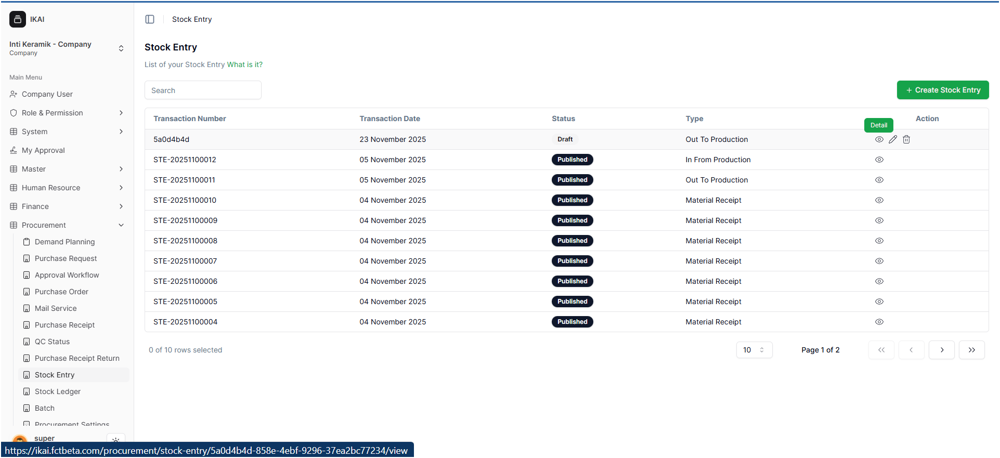
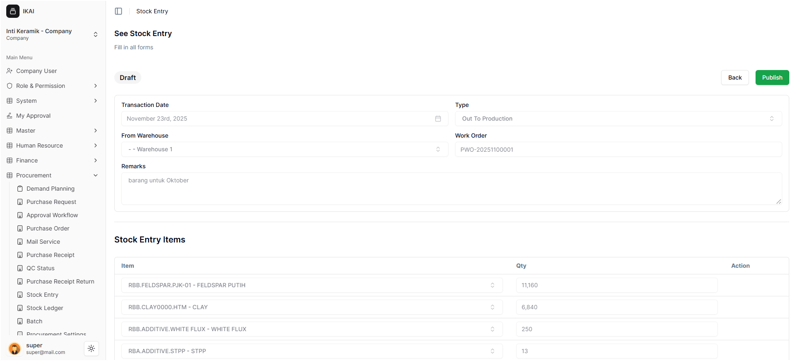
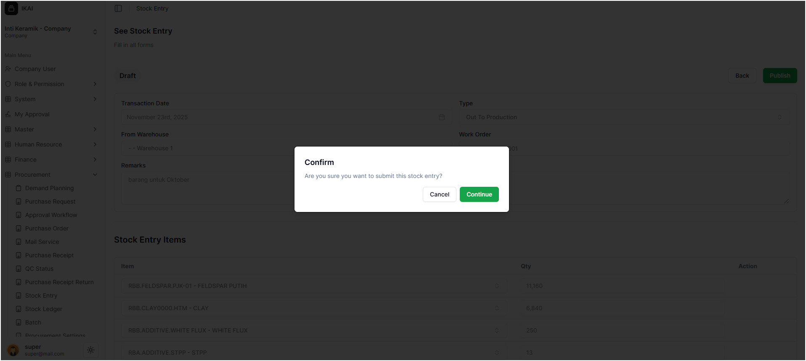
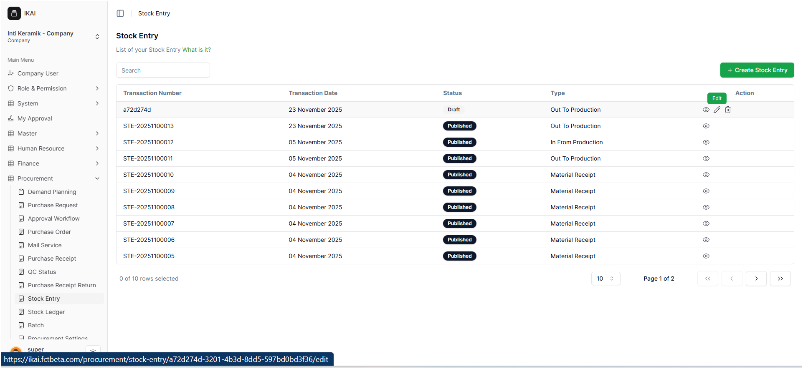
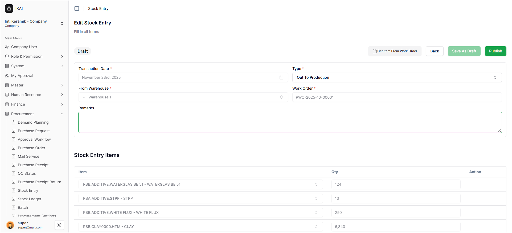
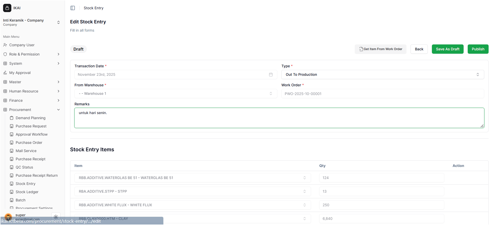
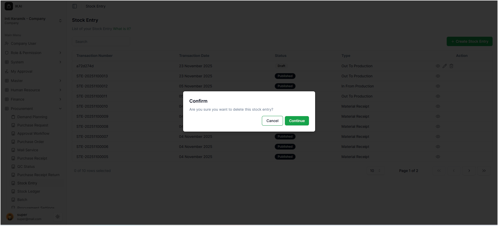
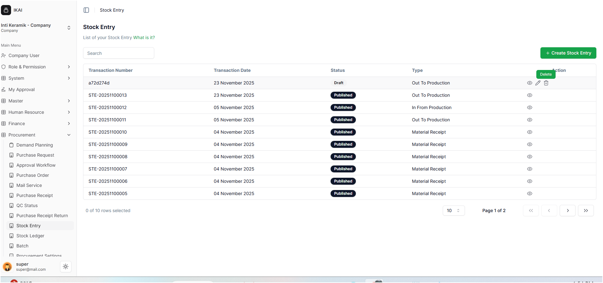
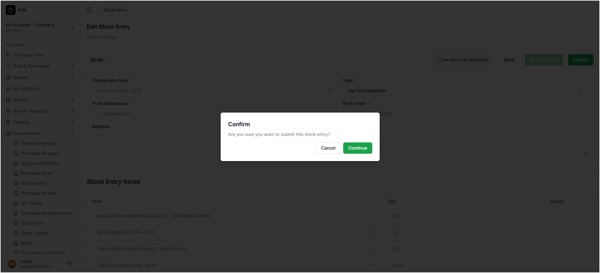
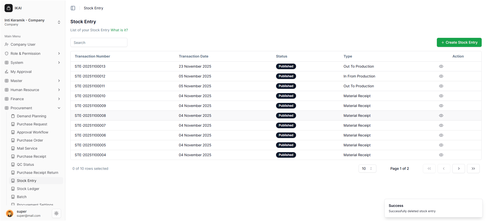

# melakukan perubahan  Proses Out to Production
## 1. cara melihat view atau detel
- setelah kembali ke **Stock Entry** terdapat ikon mata (detel)pada bagian ini user dapat melihat Proses Out Production

- setelah itu user masuk ke halaman **See Stock Entry**  pada halaman ini user tidak dapat mengisi atau mnegedit yang sudah ada user hanya dapat meneken tombol cancel untuk kembali ataupun publihs untuk menyimpan Out to Production

- setelah menekan tombol publihs akan di arahkan menuju pop-up yang berisi 
Confirm
Are you sure you want to submit this stock entry?
jika user menekan Cancel akan kembali ke halaman **See Stock Entry** 
jika menekan Continue data yang di simpan akan outomatis tersimpan sesuai yang di buat.

setelah selesai akan kembali ke halaman **Stock Entry**

## 2. mengubah dengan edit
- setelah kembali ke halaman  **Stock Entry** user dapat mengubah Proses **Out To Production** pada **Stock Entry** dengan menekan ikon pensil atau edit
 
- setelah itu user akan di arahkan kembali ke halaman **Edit Stock Entry** pada halaman ini user dapat menekan bagian **Save As Draft** dan **Publish** user dapat mengisi bagian Remarks setelah di edit

setelah mengubah atau mengisi bagian  Remarks user dapat menyimpan dengan cara menekan bagian **Save As Draft** dan **Publish**. jika user ingin meyimpan user dapat menyimpan terlebih dahulu jika tidak ingin di publish.

 jika di publish user akan mendapatkan pop-up yang berisi
 Confirm
Are you sure you want to submit this stock entry?

Cancel jika tidak ingin kembali
Continue jika yakin ingin melakukan Publish 

setelah selesai akan kembali ke halaman **Stock Entry**

## 3. menghapus Out to Production
- setelah kembali ke halaman  **Stock Entry** user dapat mengubah Proses **Out To Production** pada **Stock Entry** dengan menekan ikon tempat sampah atau delete

setelah menekan ikon delet terdapat pop-up user kan mendapatkan informasi 
Confirm
Are you sure you want to delete this stock entry?

Cancel untuk kembali ke halaman awal 
Continue untuk menghapus Out to Production yang ingin di buat. 

setelah menekan  Continue  user akan di arahkan menuju halaman utama dan mendapatkan notivikasi suscsessful deleted  stok entry

setelah selesai akan kembali ke halaman **Stock Entry**
