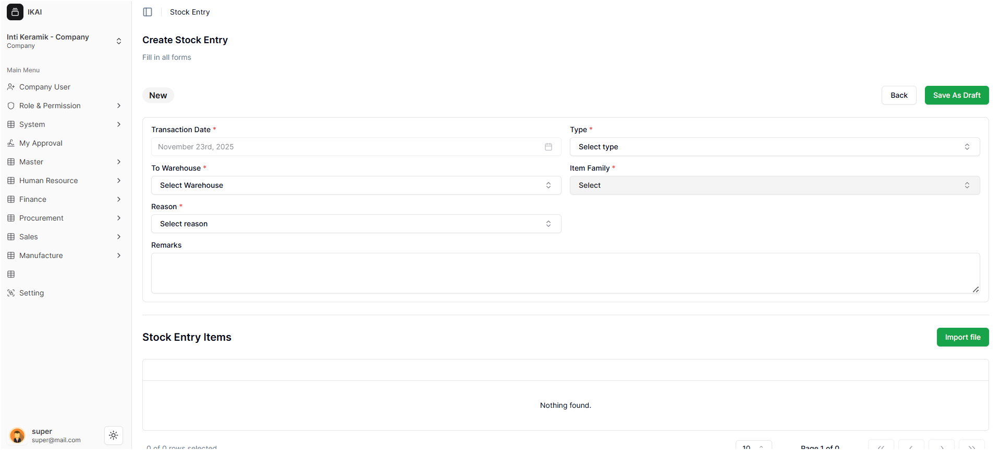
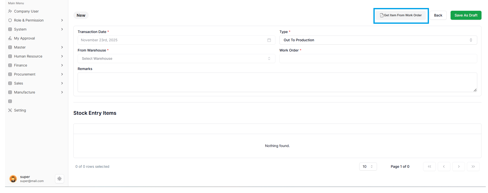
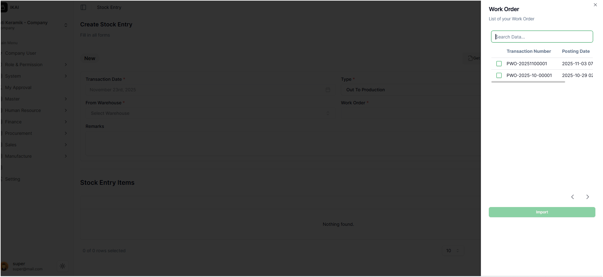
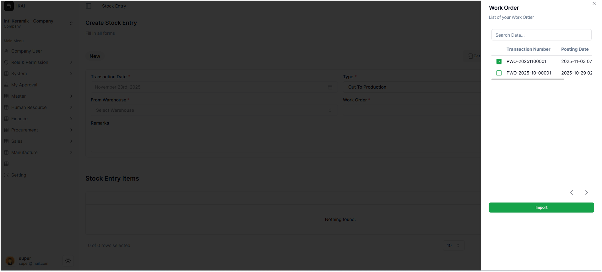
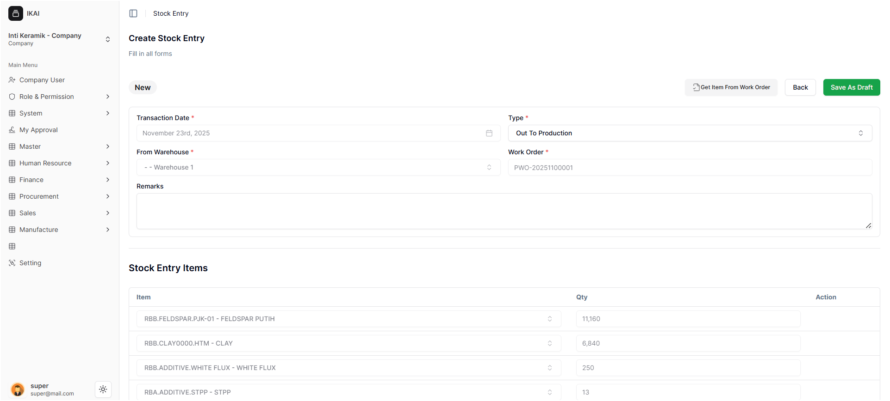
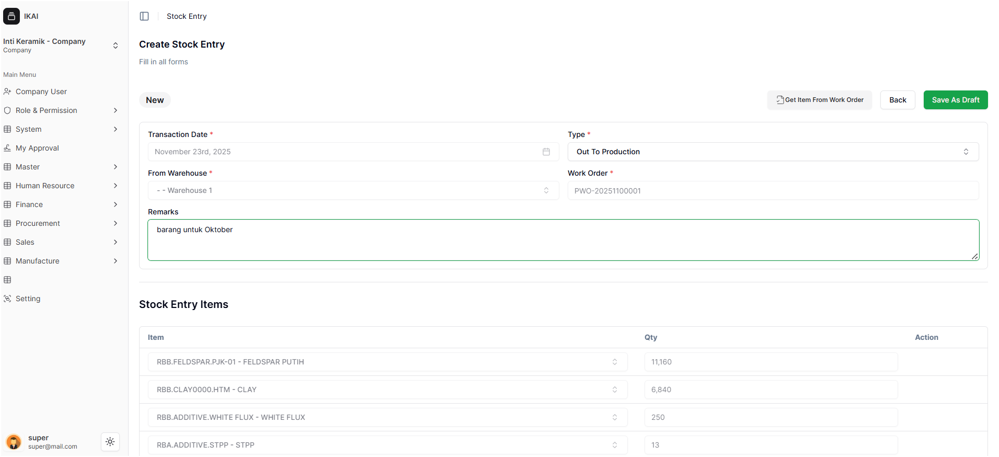
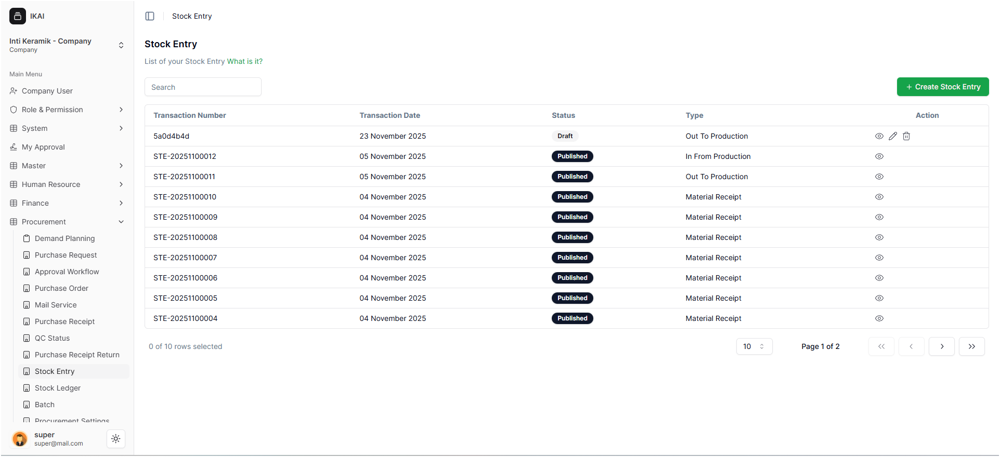

#  Masuk ke Halaman Stock Entry

Pada halaman **Create Stock Entry**, user dapat melakukan proses pengeluaran material ke produksi (*Out To Production*) berdasarkan Work Order yang sudah dibuat sebelumnya.

---

 1. Transaction Date

- Bagian **Transaction Date** **tidak dapat diedit** oleh user.
- Sistem otomatis mengisi tanggal sesuai hari saat dokumen dibuat.
- Fitur ini memastikan pencatatan transaksi tetap akurat sesuai waktu proses dilakukan.

---

 2. Memilih Jenis Transaksi (Type)

- Pada bagian **Type**, user harus memilih **Out To Production**.
- Jenis transaksi ini digunakan untuk mengeluarkan material dari gudang menuju proses produksi berdasarkan Work Order.

---

 3. Mengambil Item dari Work Order

Setelah memilih *Out To Production*, user perlu menekan tombol:

### **Get Item From Work Order**

Tombol ini ditandai dengan **kotak biru** pada gambar berikut:

Ketika tombol diklik, sistem akan menampilkan *pop-up* daftar Work Order yang tersedia.

---

 4. Memilih Work Order yang Ingin Digunakan

Pada pop-up tersebut, user akan melihat daftar Work Order yang telah dibuat sebelumnya.

### Langkah-langkahnya:
1. Beri centang pada Work Order yang ingin digunakan.
2. Klik tombol **Import**.

---

 5. Data Stock Entry Terisi Otomatis

Setelah menekan **Import**, user akan kembali ke halaman **Create Stock Entry**.

Pada tahap ini:

- **Transaction Date** → tidak bisa diubah  
- **Type** → tidak bisa diubah  
- **From Warehouse** → otomatis terisi  
- **Work Order** → otomatis sesuai pilihan  
- **Stock Entry Items** → otomatis mengikuti Work Order  

Semua data terkunci karena sistem mengambil informasi langsung dari Work Order untuk menjaga akurasi proses produksi.

---

 6. Bagian yang Masih Bisa Diubah

Meskipun sebagian besar data terkunci, **user masih dapat mengedit bagian Remarks** jika diperlukan.

Contoh penggunaan Remarks:

- Catatan tambahan
- Nomor dokumen pendukung
- Informasi operator atau shift
- Instruksi internal

---

 7. Menyelesaikan Stock Entry

Setelah semua sesuai, user dapat **melakukan submit** dokumen.  
Setelah itu, sistem akan mengarahkan kembali ke halaman **Stock Entry List**.

Dokumen Stock Entry sekarang tercatat dan material resmi dikeluarkan ke proses produksi sesuai Work Order terkait.
