## Cara Membuat dan Mengatur Role & Permission

Berikut adalah langkah-langkah untuk mengatur Role dan Permission pada sistem:

---

### 1. Masuk ke menu “Role & Permission”

Akan tampil dua submenu:
- **Role**
- **User Role**

Klik **Role** terlebih dahulu.

---

### 2. Membuat Role Baru

Setelah masuk ke halaman **List Role**, klik tombol **Create Role**.

---

### 3. Mengisi Form Role

Isi **Role Name** dan pilih **List Permission** yang ingin diberikan.

---

### 4. Contoh Mengisi Role

Sebagai contoh, Role diberi nama **Procurement**, lalu pilih permission terkait modul Procurement.

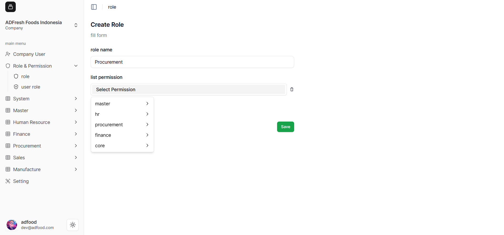

---

### 5. Menentukan Permission Turunan

Anda dapat memilih satu atau lebih permission turunan sesuai kebutuhan.

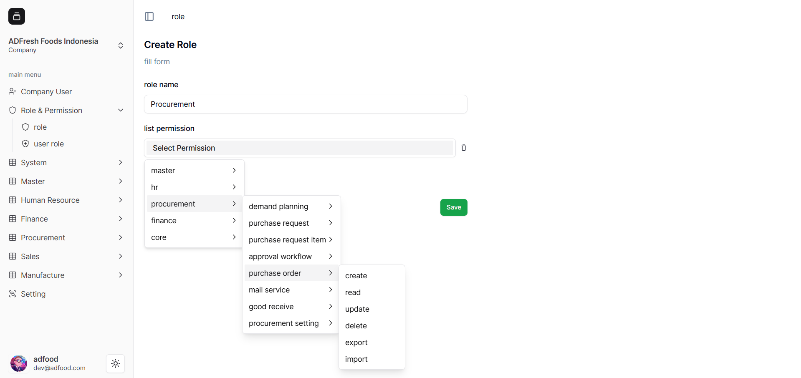

---

### 6. Menyimpan Role

Setelah permission dipilih, klik **Save**.

---

### 7. Hasil Role yang Telah Dibuat

Role akan masuk daftar **List Role**, lengkap dengan aksi:
- Edit Permission  
- Edit Data  
- Delete  

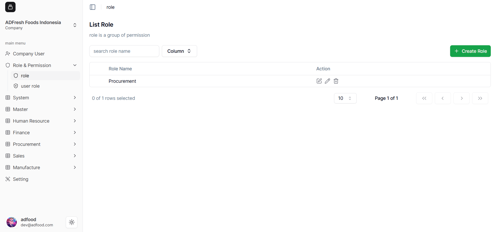

---

## Mengatur User Role

### 8. Masuk ke menu “User Role”

Klik **Assign User** untuk memberikan role ke user.

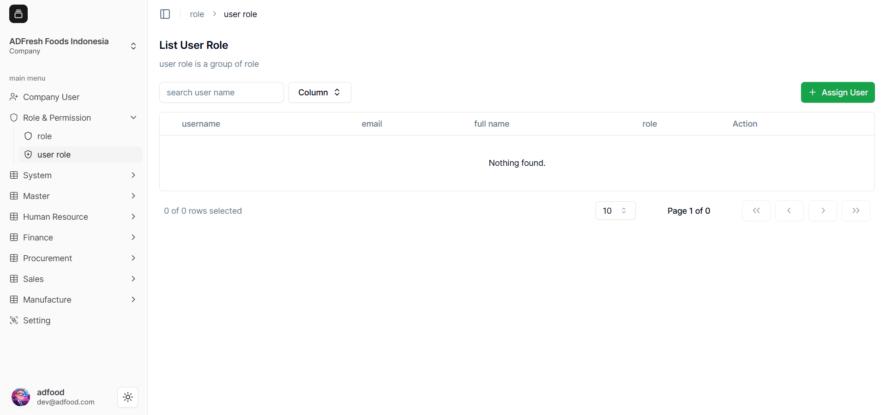

---

### 9. Halaman Assign User

Pilih user dan role yang ingin diberikan.

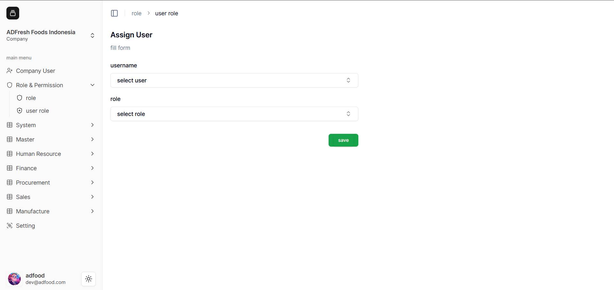

---

### 10. Contoh Pengisian

Pilih user, misalnya **azka.aulia**, lalu pilih Role **Procurement**.

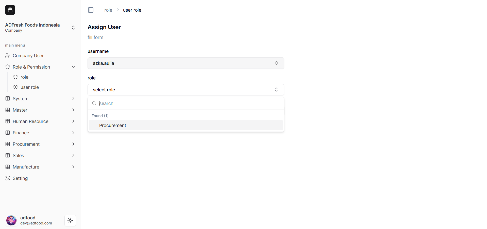

---

### 11. Simpan User Role

Klik **Save**.

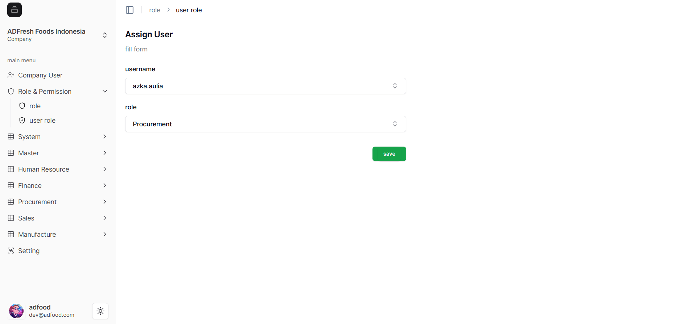

---

### 12. Hasil User Role

User akan muncul pada daftar **List User Role**.

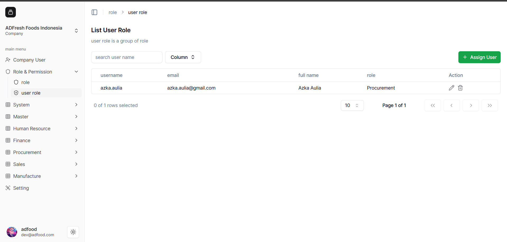

---

##  Uji Coba Role & Permission

### 13. Login sebagai user terkait

User akan melihat menu sesuai permission yang diberikan.

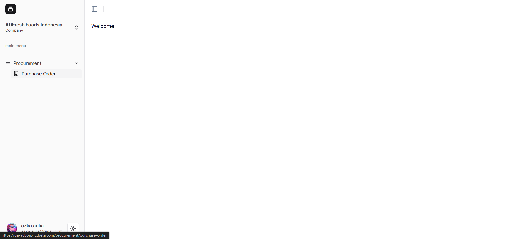

---

## Mengedit Permission Role

### 14. Klik “Edit Permission” pada Role

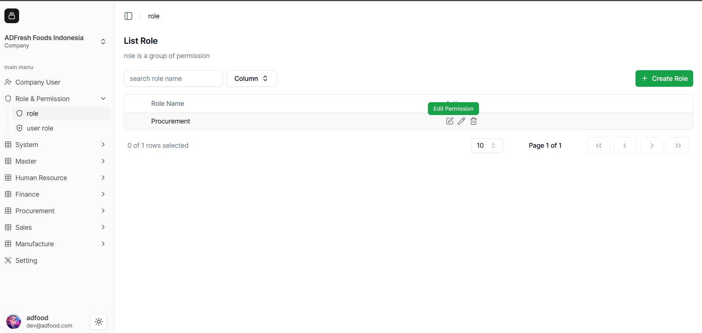

---

### 15. Pop-up Edit Permission

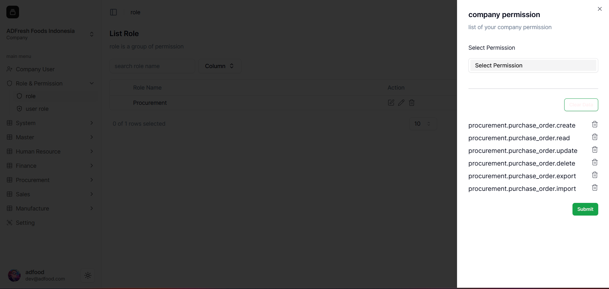

---

### 16. Menambahkan Permission Baru

Pilih modul atau submodul tambahan.

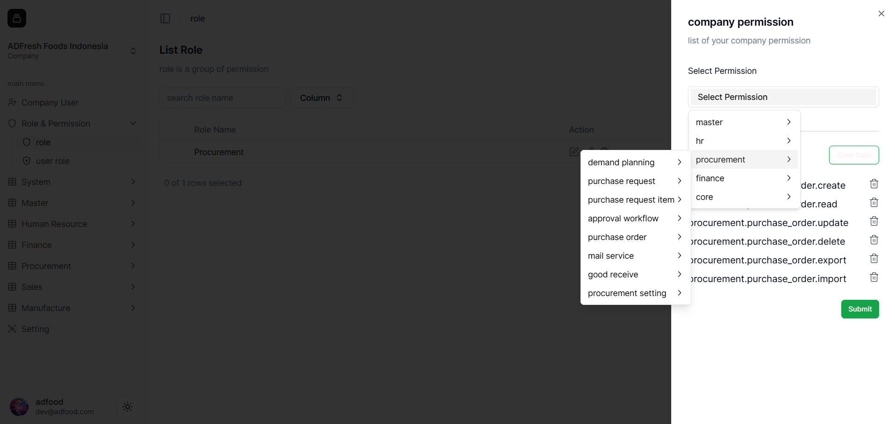

---

### 17. Klik modul untuk menambahkan permission

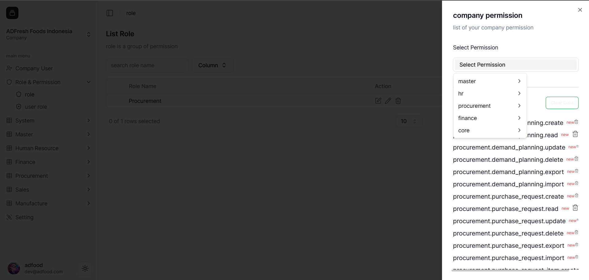

---

### 18. Klik Submit

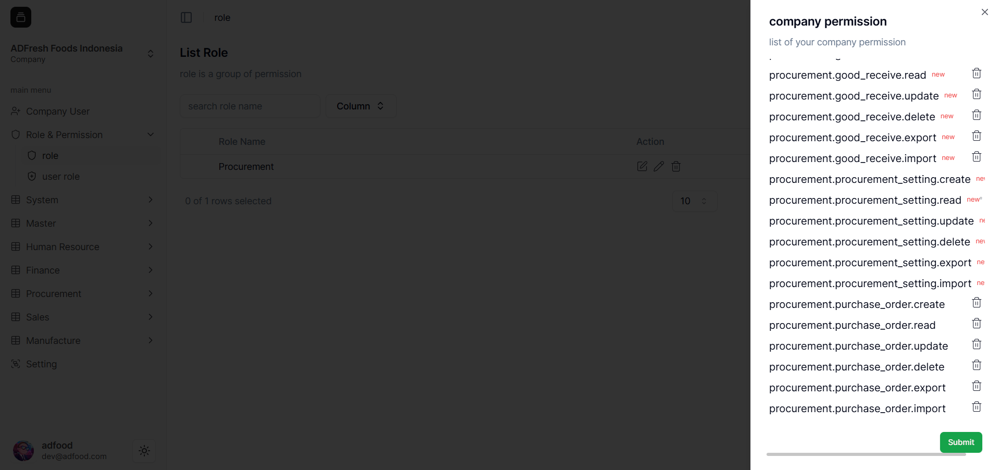

---

### 19. Notifikasi Berhasil

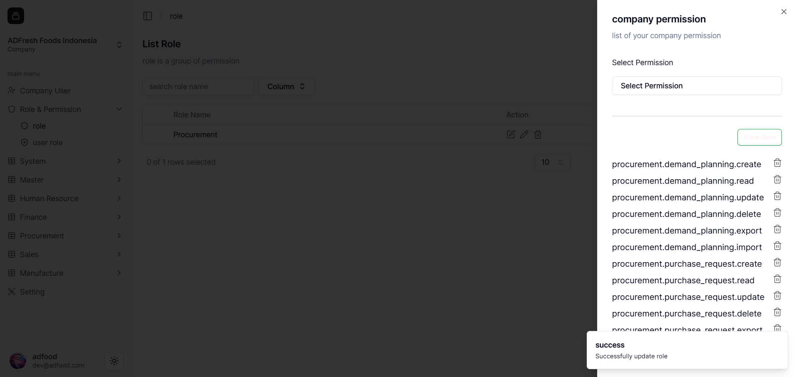

---

### 20. Login kembali sebagai user untuk mengecek perubahan

User sekarang bisa melihat seluruh modul Procurement.

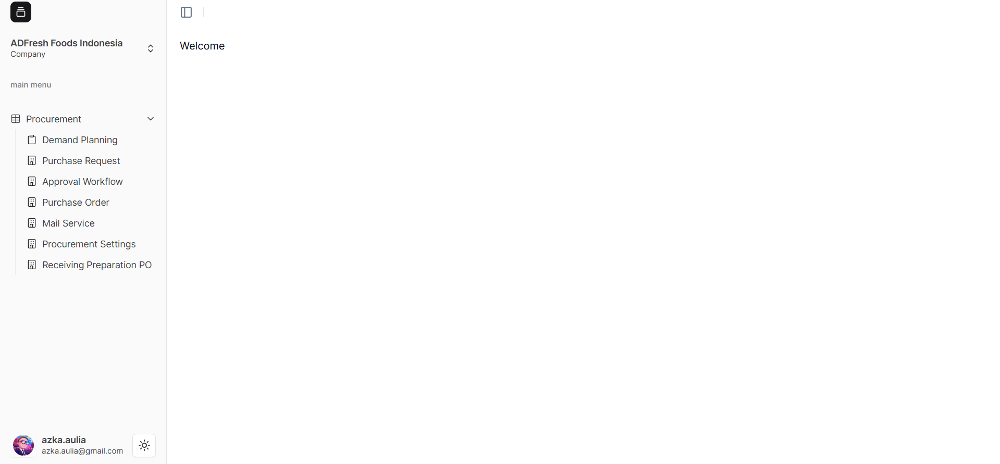