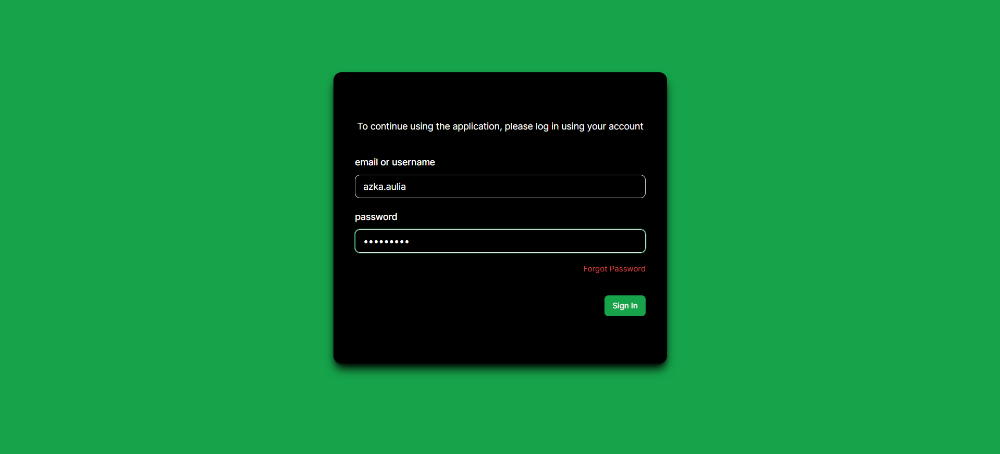
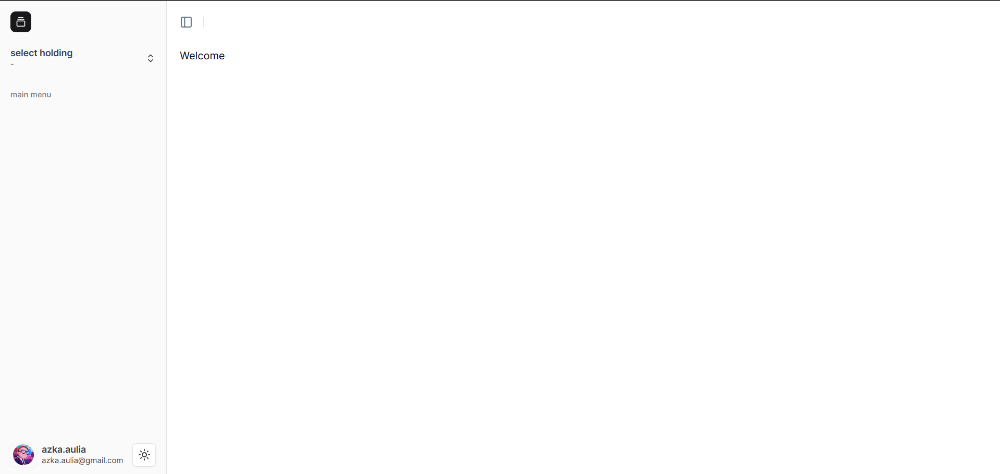
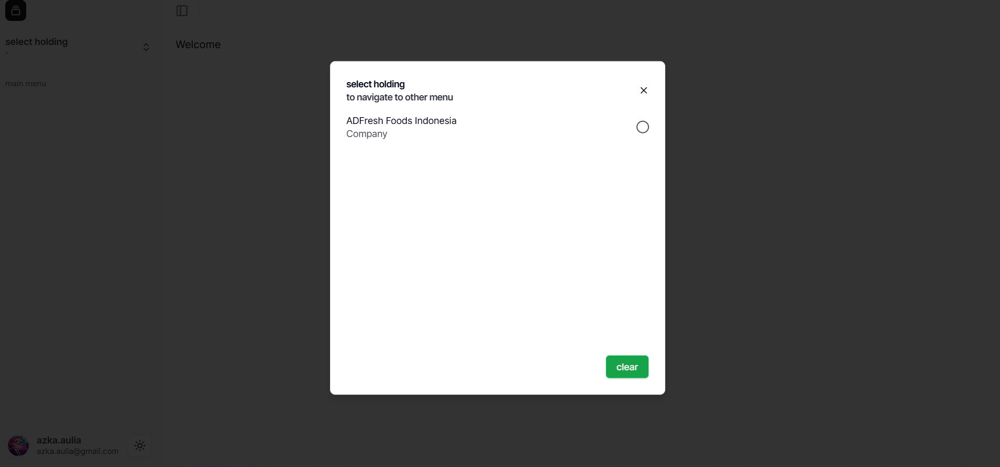

##  Cara Login Sebagai User Baru

Di bawah ini adalah contoh tampilan login menggunakan User yang baru dibuat.

-  Masukkan **Username** dan **Password**, lalu klik **Sign In**.

-  Jika berhasil login, pada bagian kiri bawah terlihat nama user yang sedang aktif.

-  Untuk memilih Workspace, buka **Menu Navigasi Sidebar** di kiri atas. Workspace yang tersedia akan muncul sesuai dengan Company yang telah di-*assign*.

- Setelah masuk ke Workspace Company, tampilan akan seperti berikut. Jika Role dan Permission belum diatur, menu pada sidebar masih kosong.

