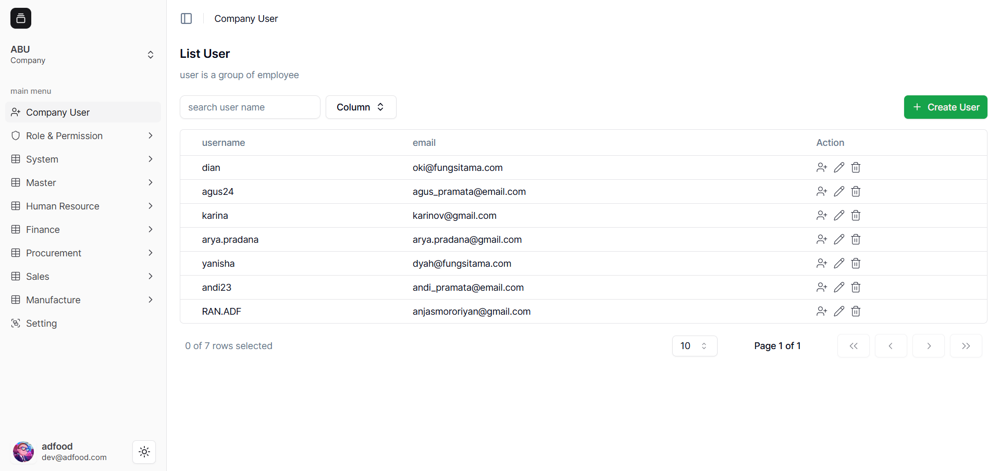
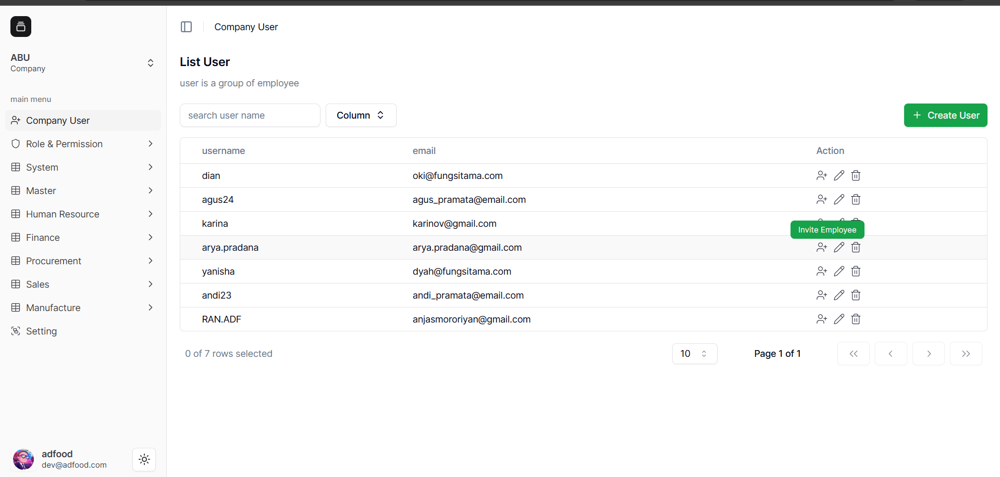
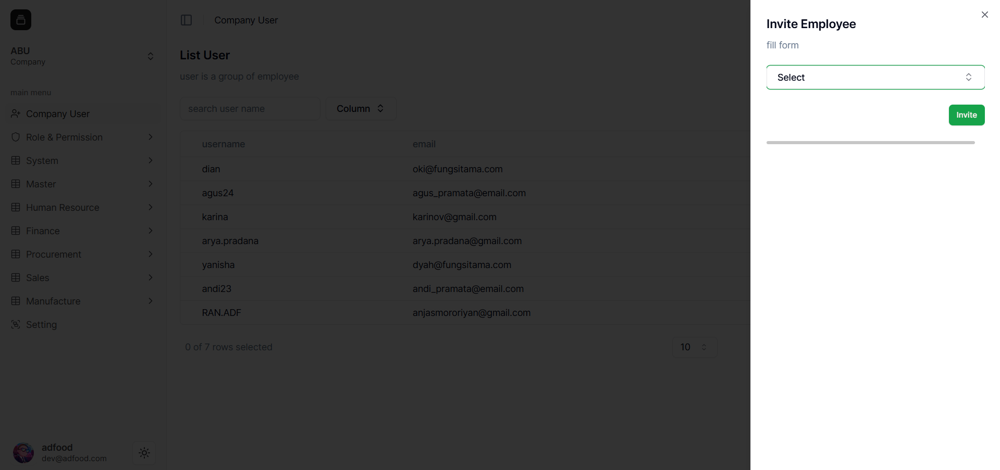
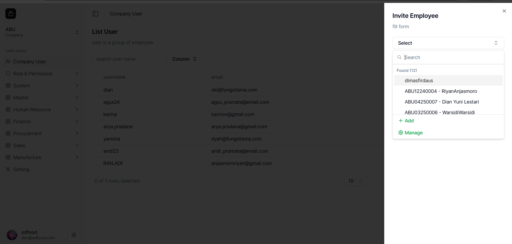
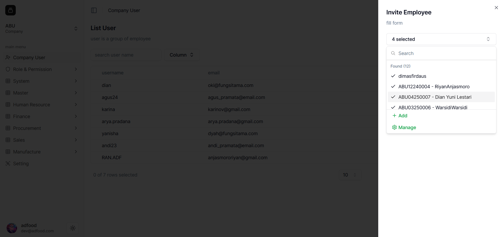
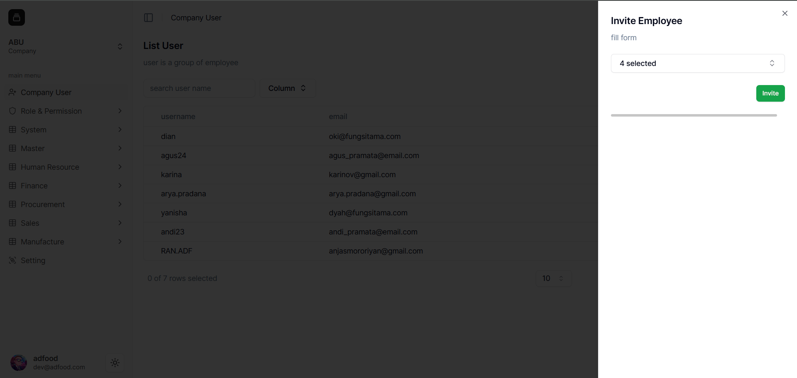

## cara Mapping User ke Employee

**Mapping User ke Employee** adalah proses menghubungkan akun User dengan data karyawan, sehingga setiap User memiliki identitas dan hak akses sesuai perannya.

1. Buka menu **Company Name** pada navigasi sidebar untuk melihat daftar User.

2. Pada menu **Action**, klik ikon **Invite Employee** untuk mengundang karyawan ke User.

3. Akan muncul jendela **Invite Employee**. Pilih employee yang ingin Anda hubungkan.

4. Daftar employee akan tampil. Anda juga akan melihat opsi **Add** dan **Manage Employee**.

5. Pilih employee yang diinginkan. Misalnya, 4 employee dipilih (ditandai dengan checklist).

6. Setelah selesai memilih, klik **Invite** untuk menyimpan proses.

