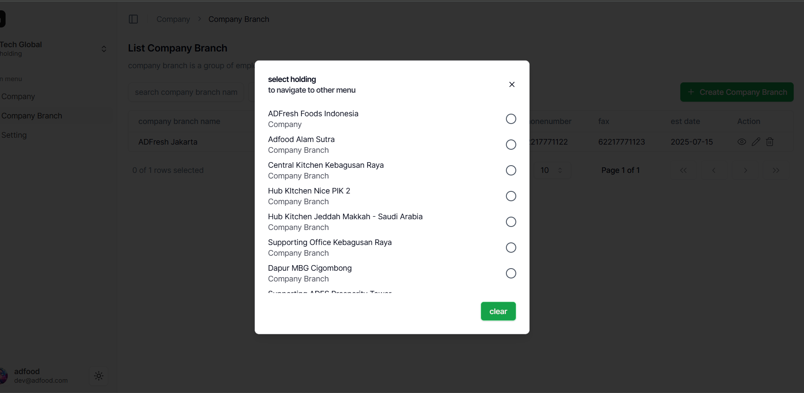
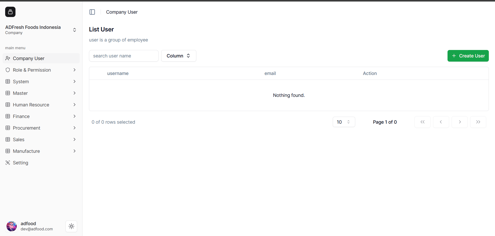
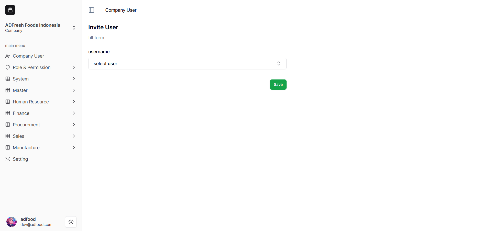
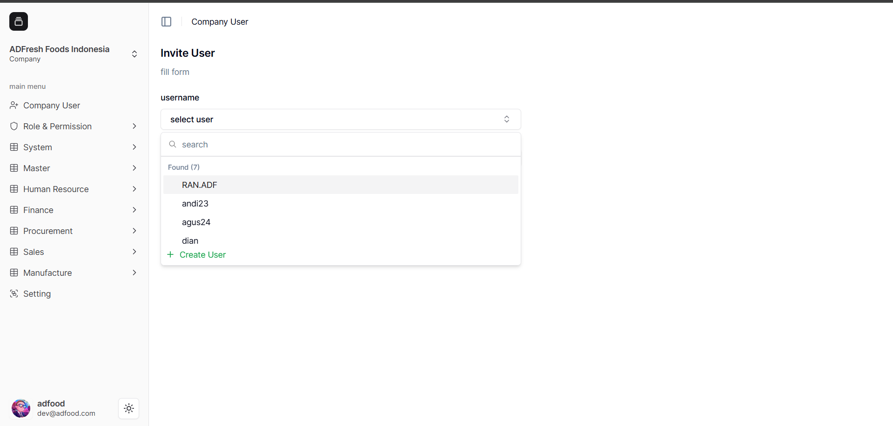
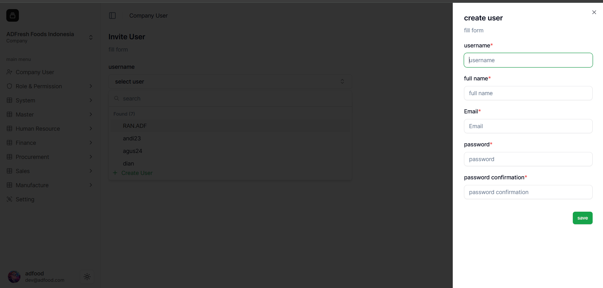
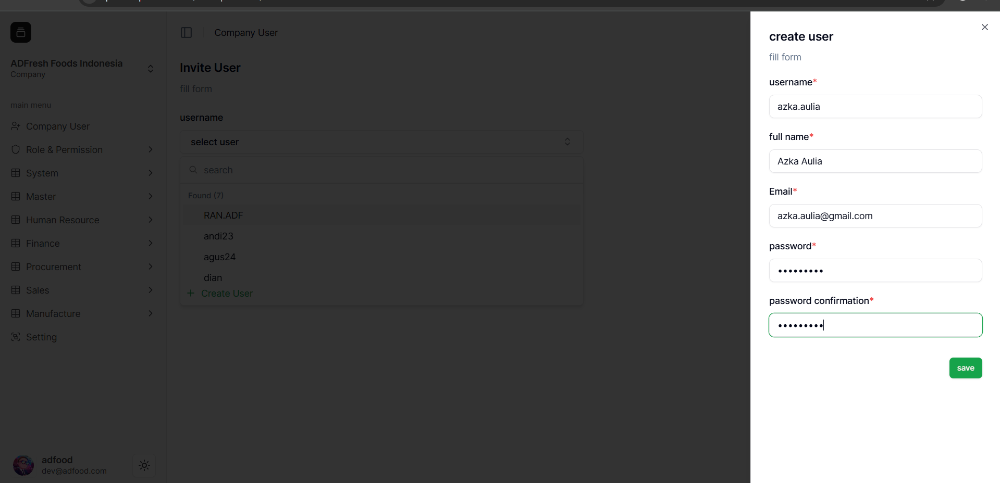
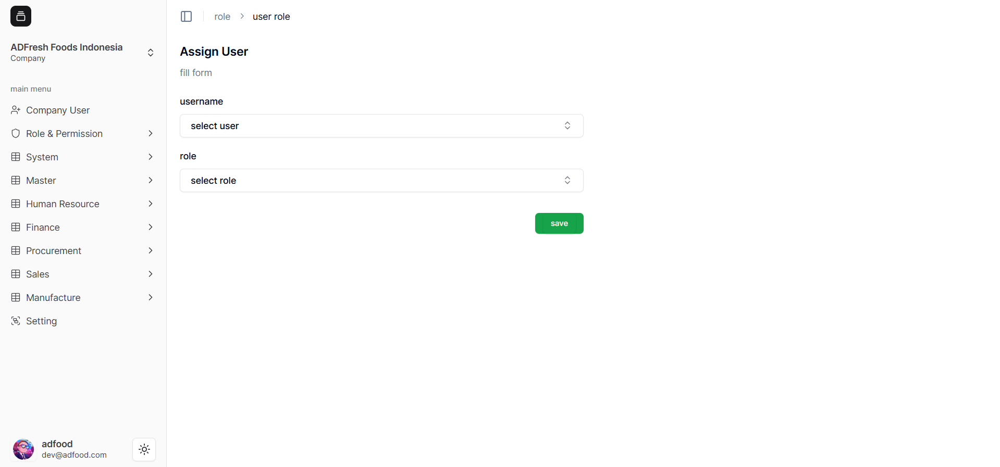
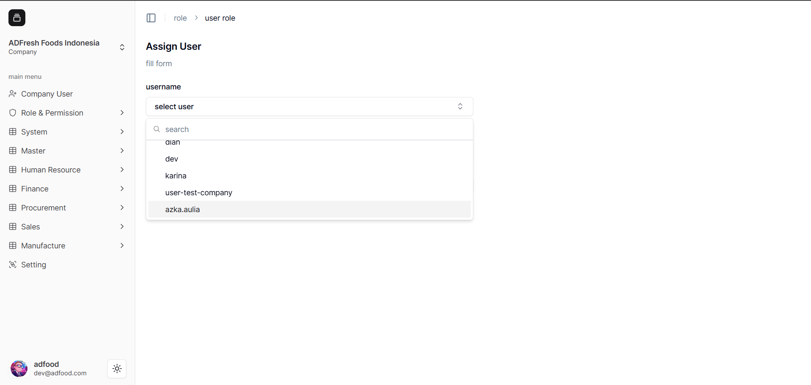
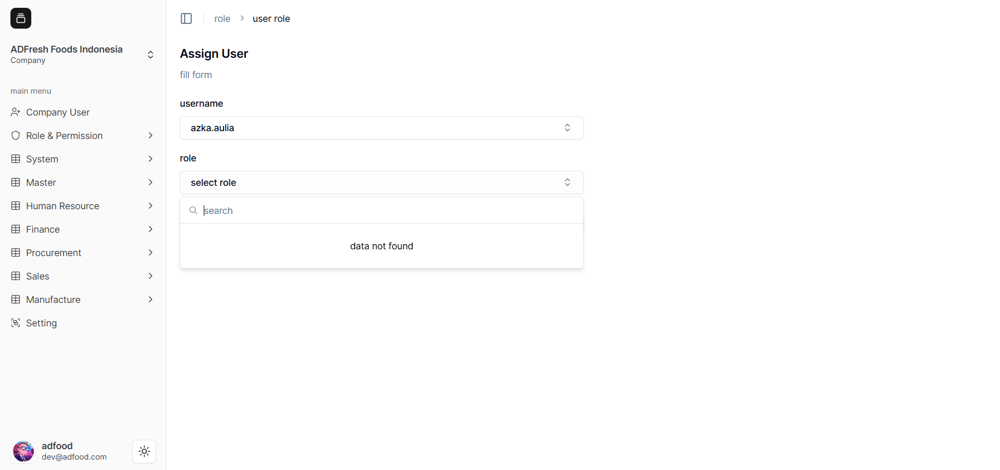
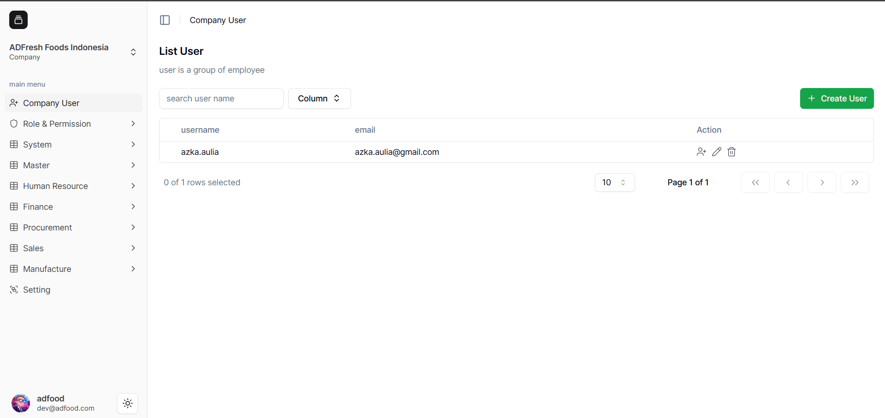

- Untuk membuat User, masuk terlebih dahulu ke **Company** yang ingin Anda kelola.

- Setelah masuk, Anda akan berada pada **Workspace** Company tersebut. Untuk membuat User, pilih menu **Company User** pada sidebar.

-  Akan tampil halaman **List User**. Klik tombol **Create User** untuk menambah user baru.

-  Pada halaman **Invte User**, pilih **Username** yang akan dimasukkan ke dalam Company.

- Untuk membuat user baru, pilih opsi **Create User** pada dropdown.

- Akan muncul **Pop-Up Sidebar Window** untuk mengisi data User.

- Isi data User dari **Username** hingga **Password Confirmation**, lalu klik **Save**.

- Selanjutnya Anda akan diarahkan ke halaman **Assign User**, tempat untuk memilih User dan menentukan **Role**.

- Pilih User yang baru dibuat dari dropdown.

- Jika belum ada Role, Anda bisa melewati bagian ini dan langsung klik **Save**.

- Setelah tersimpan, user baru akan muncul pada **List User** di Company.

![user-added]

**Catatan:**  
Proses pembuatan User di **Company Branch** sama seperti langkah di atas, hanya berbeda pada Workspace yang dipilih.
