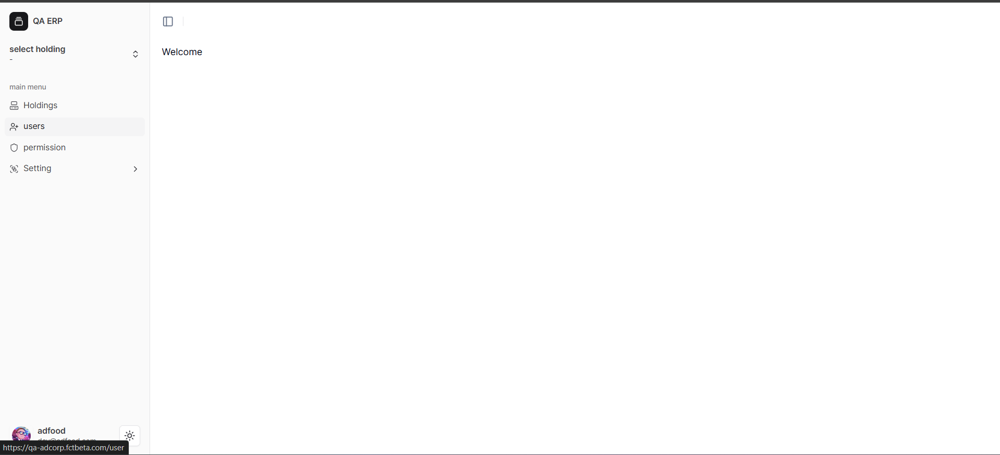
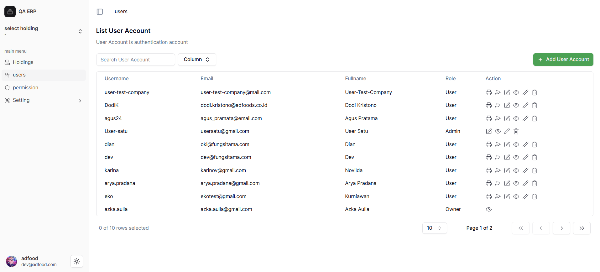
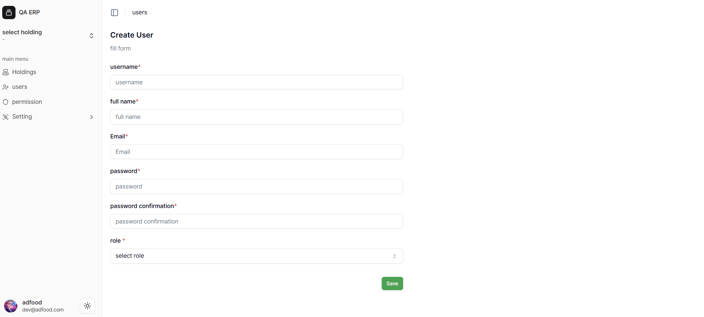
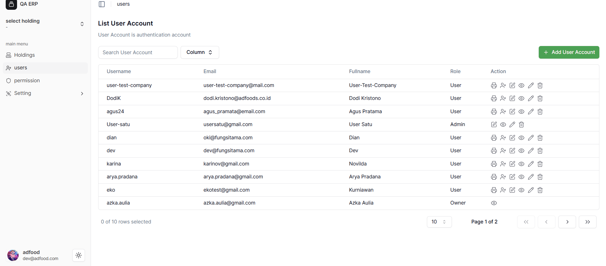
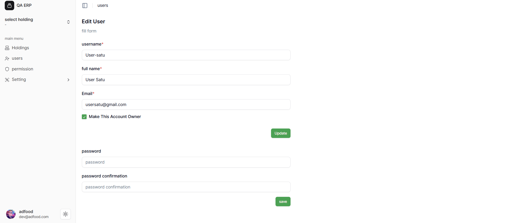

# List User Account Workspace

Menu **Workspace** digunakan untuk melihat dan mengelola semua akun pengguna di setiap workspace.  
Bagian ini menjelaskan cara membuka menu *List User Account Workspace* dan mengatur akun pengguna dengan mudah.

---

###  Login ke Sistem
Masuk ke **sistem ADFood** menggunakan akun Anda.  
Setelah berhasil login, Anda akan masuk ke **halaman utama**.  
Klik menu di **sidebar kiri**, lalu pilih **User**.

---

###  Buka Menu List User Account
Setelah memilih menu **User**, akan muncul halaman **List User Account** seperti gambar di bawah.  
Halaman ini menampilkan semua akun pengguna yang sudah terdaftar.  
Untuk menambah akun baru, klik tombol hijau **Add User Account** di sisi kanan.

---

###  Membuat Akun Baru
Pada halaman **Create User**, Anda bisa menambahkan akun baru.  
Pilih peran (**Role**) sebagai **User** atau **Admin** sesuai kebutuhan.  
Isi semua data dengan benar, lalu klik **Save** untuk menyimpan akun.

---

###  Mengelola Akun Pengguna
Gunakan menu **Action** untuk mengatur akun yang sudah ada:

- **User**: tersedia 6 aksi → *Print Label Operator*, *Invite Employee*, *Assign To Workspace*, *View*, *Edit*, *Delete*  
- **Admin**: tersedia 4 aksi → *Assign To Workspace*, *View*, *Edit*, *Delete*  
- **Owner**: hanya 1 aksi → *View*  

---

###  Mengubah Peran atau Password
Untuk menjadikan akun sebagai **Owner**, buka menu **Edit**, centang **Make This Account Owner**, lalu klik **Update**.  
Jika ingin mengganti password, isi kolom **Password** dan **Password Confirmation** dengan kata sandi baru yang sama, lalu klik **Save**.

