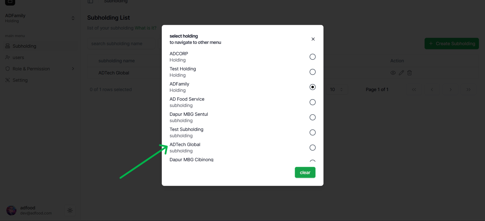
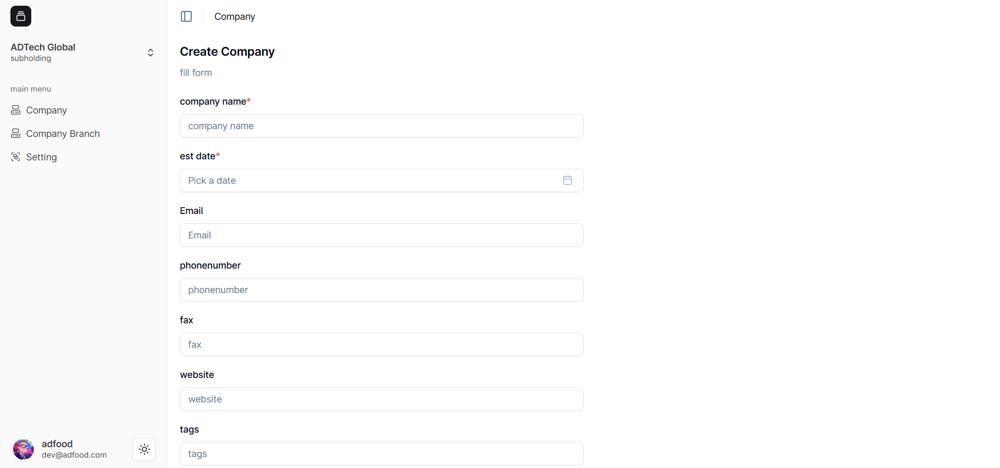
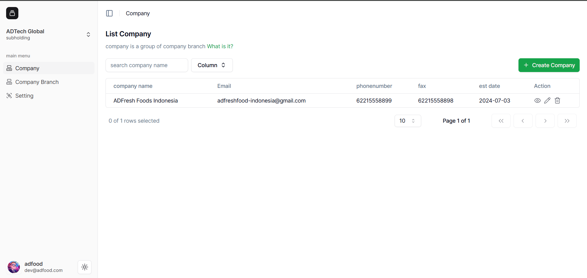
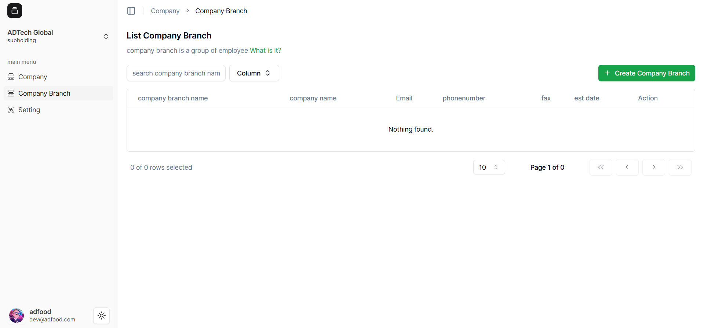
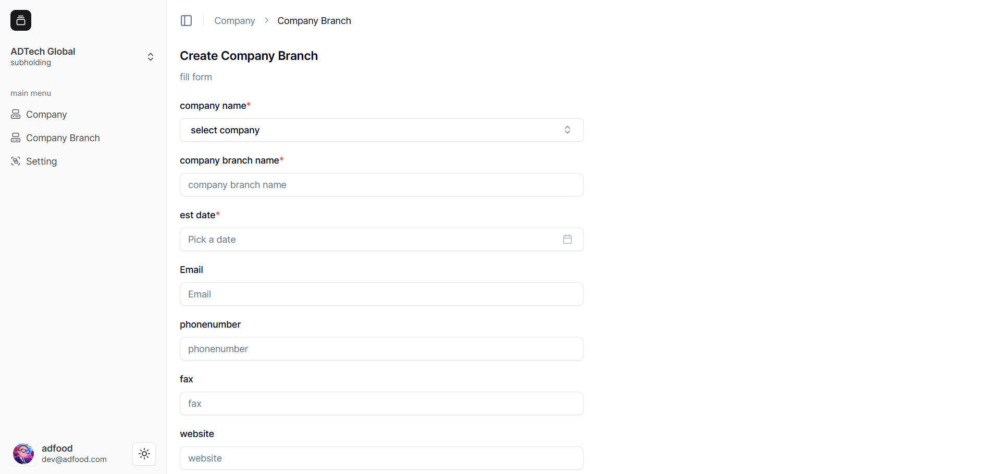
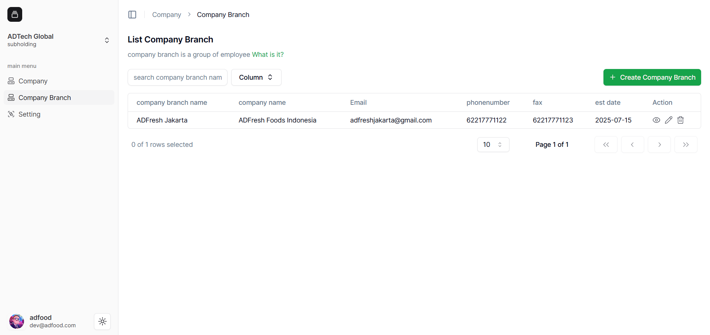

# Membuat Company & Branch

### Membuat Company

1. Masuk ke **Workspace Subholding “ADTech Global”**.  
2. Klik menu **“Company”** di Sidebar, lalu klik tombol **“Create Company”**.
   
3. Isi semua input seperti:
   - **Company Name**
   - **Est. Date**
   - Dan kolom lain yang diperlukan  
4. Klik **“Save”** untuk menyimpan.

Data yang tersimpan akan tampil di daftar **List Company** seperti berikut:

---

### Membuat Company Branch

1. Klik menu **“Company Branch”** di Sidebar.  
2. Klik tombol **“Create Company Branch”**.
   
3. Isi semua data yang diperlukan, lalu klik **“Save”**.
   
    .png>)
4. Jika berhasil, data akan tampil di **List Company Branch** seperti berikut:
   
