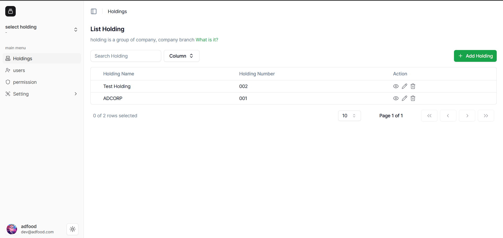
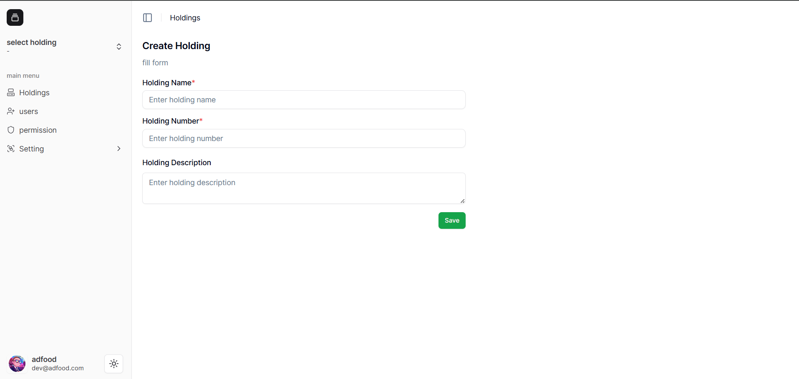
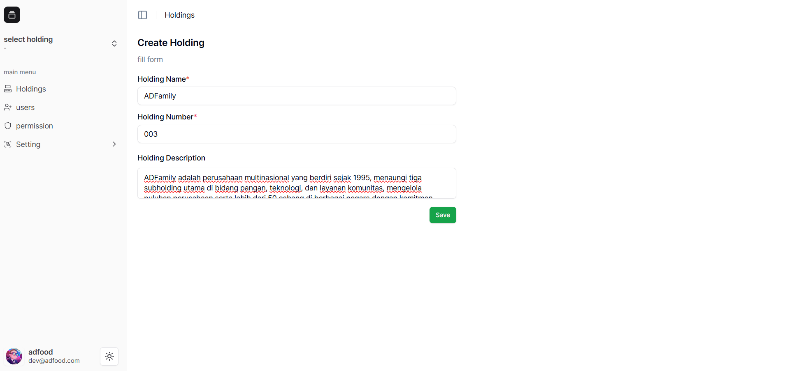
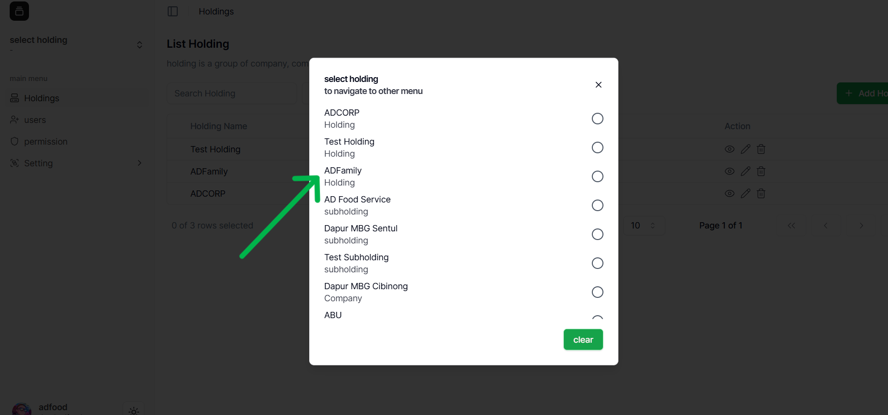
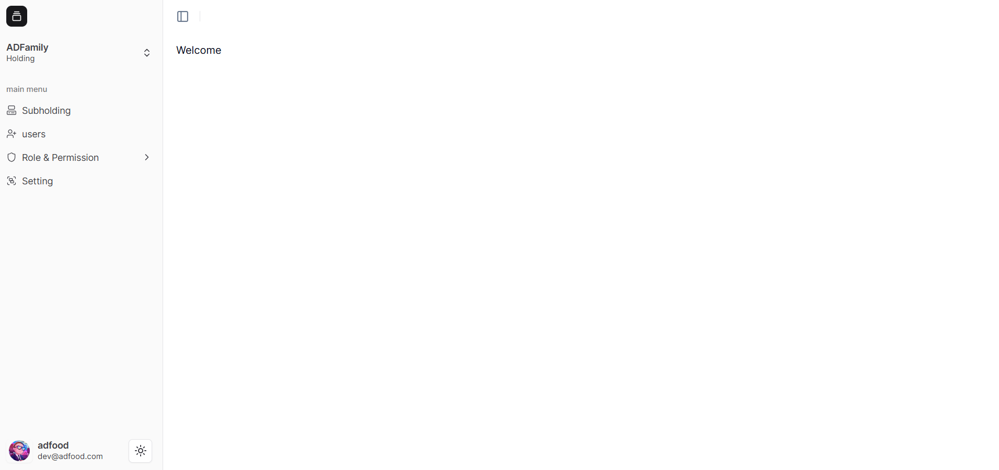
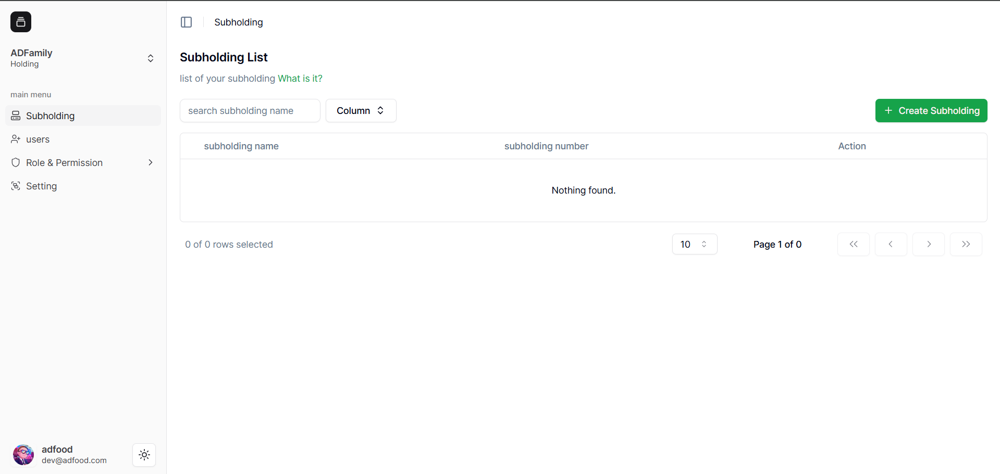
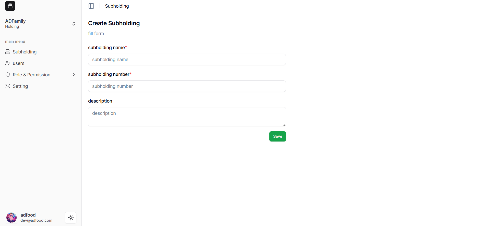
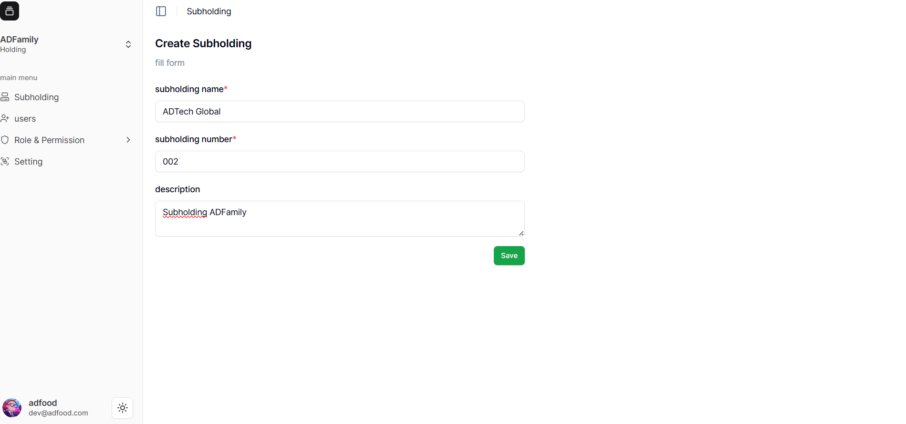
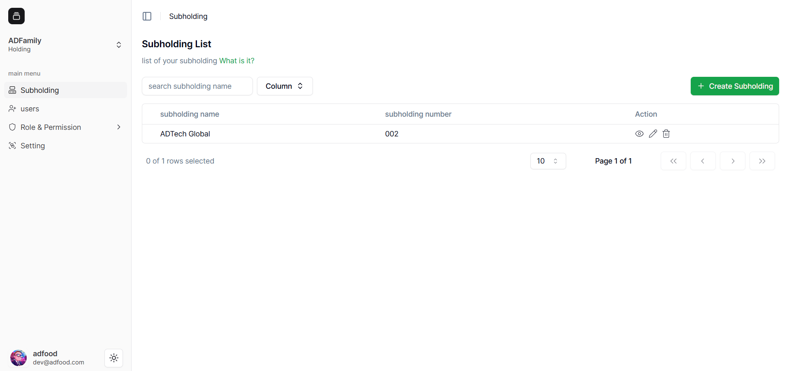

# Membuat Holding & Subholding

###  Membuat Holding Baru

Untuk menambah data baru:

1. Klik tombol **“Add Holding”** di kanan atas yang berwarna hijau.
   
2. Setelah tombol diklik, Anda akan diarahkan ke halaman **Halaman Create Holding**.  
   Isi data sesuai kebutuhan perusahaan Anda.  
   

> ⚠️ **Catatan:**  
>  Isi semua kolom yang memiliki tanda **`*` merah** (**wajib diisi**).  
>   Kolom tanpa tanda bintang bersifat **opsional**.

- Setelah diisi, klik tombol **“Save”**.

---

### Melihat Daftar Holding

Setelah disimpan, data **Holding “ADFamily”** akan muncul pada daftar **List Holdings**.

Pada setiap baris data tersedia beberapa aksi:
- 👁️ **View / Detail** – Melihat data yang sudah dibuat  
- ✏️ **Edit** – Mengubah data yang ada  
- 🗑️ **Delete** – Menghapus data (akan muncul pop-up konfirmasi)

> Pastikan Anda memilih baris (*row*) yang sesuai dengan data Holding yang ingin diubah atau dilihat.

---

### Membuat Subholding

Setelah membuat Holding, lanjutkan dengan membuat **Subholding**.

1. Klik menu **“Select Holding”** di Sidebar kiri.
   
2. Pilih Holding **“ADFamily”** dengan menekan **radio button** di sebelah namanya.
3. Anda akan diarahkan masuk ke **Workspace Holding** seperti berikut:
   
4. Lalu, klik menu **“Subholding”** di Sidebar untuk membuka halaman Subholding.
   

---

###  Membuat Subholding Baru

1. Klik tombol **“Create Subholding”**.
   
2. Isi data yang dibutuhkan, lalu klik **“Save”**.
   

> **Tips:**  
> Nomor **Subholding** akan otomatis menyesuaikan dengan data yang sudah ada di sistem.

Setelah tersimpan, data akan muncul di **List Subholding** seperti di bawah ini:

